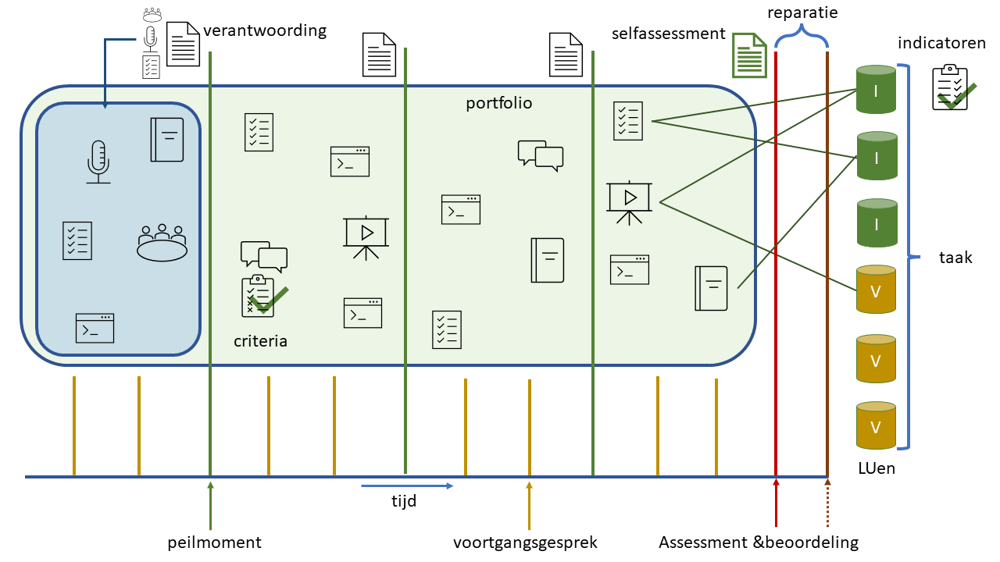

# Portfolio Items

### Inhoud
<!-- markdown-link-check-disable -->
- [Portfolio Items](#portfolio-items)
    - [Inhoud](#inhoud)
  - [Een introductie](#een-introductie)
  - [Aanbevolen Portfolio Items \<\>](#aanbevolen-portfolio-items-)
<!-- markdown-link-check-enable -->
---

**v0.1.1 ** Portfolio items voor Semester 4 TI door HU IICT.

---

## Een introductie

Wat zijn portfolio items? Met portfolio items bedoelen we onderdelen waarmee je kunt laten zien dat je voldoet aan een [leeruitkomst(en)](./README.md#leeruitkomsten). Dat hoeft geen 1 op 1 relatie te zijn. In veel gevallen heb je meerdere portfolio items nodig om aan te tonen dat je voldoet aan een leeruitkomst, en kunnen portfolio items voor meerdere leeruitkomsten gebruikt worden.

Voor dit semester van Technische Informatica dragen we een aantal voorgedefineerde [portfolio items](./Verantwoordingsdocument_TI_S4.md) aan. We hebben deze beschreven en geven daarbij ook de beoordelingscriteria. De lijst is niet onuitputtelijk je mag ook, in samenspraak met de docent, eigen portfolio items aandragen. Geef dan een goede beschrijving van dit portfolio item met bijbehorende criteria. Ga hierover in discussie met je docent.

Verschillende portfolio items kunnen bijdragen aan verschillende leeruitkomsten.

Wanneer je een portfolio item gebruikt in je [verantwoordingsdocument](./Verantwoordingsdocument_TI_S4.md) zorg dan dat voor elk portfolio item er altijd is aangeven wat de eigen bijdrage is.
Lees in detail over deze algemene inlevercriteria op de pagina [portfolio items en feedback](./organisatorisch/portfolio_items_en_feedback.md).

## Aanbevolen Portfolio Items <<Needs Work leeruitkomsten moeten we nog formuleren>>

Zie het verantwoordingsdocument template voor aanbevolen portfolio items. 