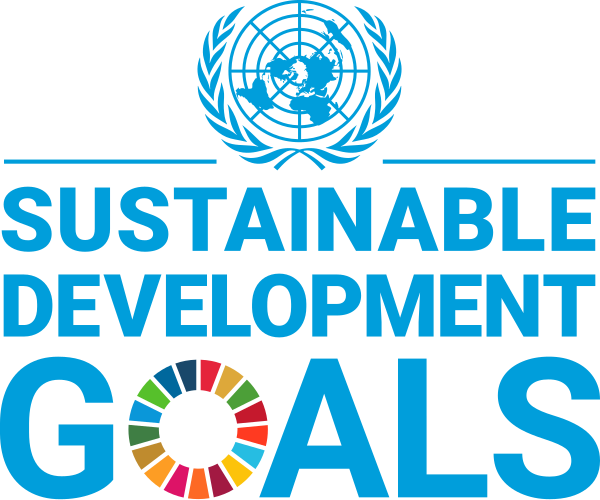

 

# Sustainable Development Goals

### Inhoud
<!-- markdown-link-check-disable -->
- [Sustainable Development Goals](#sustainable-development-goals)
    - [Inhoud](#inhoud)
  - [Een introductie](#een-introductie)
  - [Referenties](#referenties)
<!-- markdown-link-check-enable -->
---

**v0.1.0 ** Semester 2 TI SDG start document door HU IICT.

---

## Een introductie

De Sustainable Development Goals (SDG's) zijn de wereldwijde doelstellingen voor duurzame ontwikkeling. De SDG's zijn van 2016 tot 2030 van kracht. Er zijn [17 doelstellingen en 169 onderliggende targets](https://sdgs.un.org/goals) om deze doelen te operationaliseren (omzetten van iets abstracts in meetbare kenmerken).

## Referenties

* Waarom SDG's in het onderwijs? (<https://husite.nl/duurzaam/duurzame-hu-onderwijs-onderzoek-sdgs-in-het-onderwijs/waarom-sdgs-in-het-onderwijs/>)
* Duurzameontwikkelingsdoelstellingen (<https://nl.wikipedia.org/wiki/Duurzameontwikkelingsdoelstellingen>)
* Wereled statistieken (<https://www.worldometers.info/nl/>)
* Wereldvoedselprogramma (<https://www.wfp.org/>)
* Verenigde Naties (<https://sdgs.un.org/>)