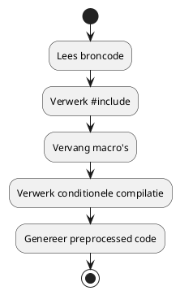
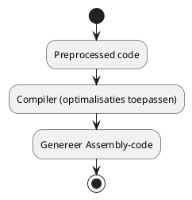
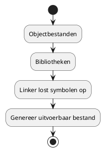

# Een applicatie bouwen

- Buildproces in C++: Preprocessen, Compileren, Assembleren & Linken
- Devcontainers en ontwikkelomgeving
- Introductie tot CMake
- Basis debug technieken

<!--
Speaker notes:
Welkom bij deze les over het bouwen van een applicatie in C++. Vandaag nemen we je stap voor stap mee door het buildproces, laten we zien hoe je een consistente ontwikkelomgeving kunt opzetten met devcontainers, hoe CMake hierbij een rol speelt en wat de basisprincipes van debuggen zijn.
-->

---

# Overzicht Buildproces

**Stappen in het buildproces:**

- **Preprocessen:** Macro-expansie, include-bestanden en conditionele compilatie.
- **Compileren:** Vertalen van preprocessed code naar assembly.
- **Assembleren:** Omzetten van assembly code naar objectcode.
- **Linken:** Samenvoegen van objectbestanden tot een uitvoerbaar bestand.
- **Debuggen:** Fouten opsporen en oplossen tijdens runtime.

<!--
Speaker notes:
Deze slide geeft een overzicht van alle stappen die betrokken zijn bij het bouwen van een C++ applicatie. We zullen elk van deze stappen verder uitsplitsen in de volgende slides.
-->

---

# Preprocessing: Introductie

**Wat doet de preprocessor?**

- Vervangt macro’s en constante expressies.
- Verwerkt `#include` statements: voegt header-bestanden in.
- Verwerkt conditionele compilatie, zoals `#ifdef`.

**Voorbeeld:**

```cpp
// main.cpp
#include <iostream>
#define SQUARE(x) ((x) * (x))

int main() {
    std::cout << "Square of 5 is " << SQUARE(5) << std::endl;
    return 0;
}
```

<!--
Speaker notes:
De preprocessor zorgt ervoor dat alle macro’s worden vervangen en dat header-bestanden worden ingevoegd. Dit is de eerste stap in het buildproces en zorgt ervoor dat de code klaar is voor de compiler.
-->

---

# Preprocessing: Uitgebreid Voorbeeld & Diagram

**Macro-expansie in actie**

Bekijk hoe de preprocessor de macro uitbreidt:

```cpp
// Na pre-processing (vereenvoudigd voorbeeld)
#include <iostream>

int main() {
    std::cout << "Square of 5 is " << ((5) * (5)) << std::endl;
    return 0;
}
```

**Diagram: Preprocessor Flow**



<!--
Speaker notes:
Hier zie je zowel een codevoorbeeld als een diagram dat laat zien hoe de preprocessor werkt. Het doel is om de broncode klaar te maken voor de volgende stap, het compileren.
-->

---

# Compileren: Introductie

**Wat gebeurt er bij compileren?**

- De compiler zet de preprocessed code om in assembly-code.
- Optimalisaties worden toegepast.
- Er ontstaan waarschuwingen en fouten indien er syntaxfouten in de code zitten.

**Codevoorbeeld:**

```cpp
// main.cpp
#include <iostream>
int main() {
    std::cout << "Hello, World!" << std::endl;
    return 0;
}
```

**Compiler opdracht (GCC):**

```bash
g++ -S main.cpp -o main.s
```

<!--
Speaker notes:
In deze stap vertaalt de compiler de preprocessed code naar assembly. De flag `-S` zorgt ervoor dat de compiler de assembly-code genereert, zodat je kunt zien hoe de hoge niveau code wordt omgezet.
-->

---

# Compileren: Diagram en Uitleg

**Diagram: Compilatieproces**



<!--
Speaker notes:
Dit diagram toont het compilatieproces, waarbij de preprocessed code wordt omgezet in assembly. Deze tussenstap is belangrijk om de werking van de compiler en de optimalisaties te begrijpen.
-->

---

# Assembleren: Introductie

**Wat gebeurt er bij assembleren?**

- De assembly-code wordt omgezet in objectcode (machinecode).
- Het resultaat is een objectbestand (.o of .obj) dat nog niet zelfstandig uitvoerbaar is.

**Voorbeeld:**

Na compilatie krijg je een bestand `main.s`. De assembler zet dit om naar `main.o`.

```bash
as main.s -o main.o
```

<!--
Speaker notes:
Assembleren is de stap waarin de assembly-code wordt vertaald naar objectcode, wat een directe representatie van machine-instructies is. Dit objectbestand is later nodig voor de linking stap.
-->

---

# Linking: Introductie

**Wat gebeurt er bij linken?**

- Meerdere objectbestanden en bibliotheken worden samengevoegd tot één uitvoerbaar bestand.
- De linker zorgt voor het oplossen van symbolen (bijvoorbeeld functies en variabelen die in verschillende bestanden gedefinieerd zijn).

**Voorbeeld:**

```bash
g++ main.o -o my_application
```

**Diagram: Linkproces**



<!--
Speaker notes:
Linken is de laatste stap in het buildproces. De linker zorgt ervoor dat alle losse objectbestanden en bibliotheken correct samenkomen tot een volledig uitvoerbaar programma.
-->

---

# Devcontainers & Ontwikkelomgeving

**Wat zijn devcontainers?**

- Docker containers die als complete ontwikkelomgeving fungeren.
- Bieden een consistente setup voor alle teamleden.
- Verminderen "it works on my machine" problemen.

**Hoe werken ze?**

- Gebruik de **Remote - Containers** extensie in VSCode.
- Start een devcontainer via de command palette.
- Gebruik de "Dev Container: New C++ Project" template als basis.


<!--
Speaker notes:
Devcontainers zorgen voor een uniforme en reproduceerbare ontwikkelomgeving. Dit is vooral handig in teamverband en voor het delen van setups. Met de VSCode extensie kun je snel een nieuwe C++ devcontainer opzetten.
-->

---

# CMake Basics

**Waarom CMake?**

- Cross-platform build systeem.
- Beheert buildprocessen via `CMakeLists.txt`.
- Integreert met VSCode voor betere code-completion en debugging.

**Voorbeeld van een CMakeLists.txt:**

```cmake
cmake_minimum_required(VERSION 3.10)
project(HelloWorld)

# Zorgt voor het genereren van compile_commands.json voor IntelliSense
set(CMAKE_EXPORT_COMPILE_COMMANDS ON)

add_executable(hello main.cpp)
```

<!--
Speaker notes:
CMake vereenvoudigt het buildproces door een uniforme configuratie te bieden. De instelling voor `compile_commands.json` is essentieel voor een optimale ontwikkelervaring in VSCode.
-->

---

# Configuratie CMake voor Autocomplete

**Stap-voor-stap:**

1. **CMakeLists.txt aanpassen:** Voeg `set(CMAKE_EXPORT_COMPILE_COMMANDS ON)` toe.
2. **Build directory maken:**

   ```bash
   mkdir build && cd build
   cmake ..
   ```

3. **VSCode instellen:**  
   Open de Command Palette (`Ctrl+Shift+P`) en kies `C/C++: Edit Configurations (UI)` om het pad naar `build/compile_commands.json` in te stellen.

<!--
Speaker notes:
Deze configuratie zorgt ervoor dat VSCode de juiste compileeropties gebruikt voor code-completion en linting. Dit is een cruciale stap voor een efficiënte ontwikkelworkflow.
-->

---

# Debuggen in C++

**Basisprincipes:**

- **Breakpoints:** Stop de uitvoering op een specifieke regel.
- **Step Over/Into:** Voer code regel voor regel uit.
- **Variabelen inspecteren:** Bekijk de waarde van variabelen tijdens runtime.

**Voorbeeldcode:**

```cpp
#include <iostream>

int main() {
    int a = 5;
    int b = 0;
    // Zet hier een breakpoint
    int c = a / b; // Fout: deling door nul
    std::cout << "Result: " << c << std::endl;
    return 0;
}
```


<!--
Speaker notes:
Debuggen is essentieel voor het opsporen en oplossen van fouten. In dit voorbeeld laten we zien hoe een simpele fout (deling door nul) met behulp van breakpoints en variabele inspectie kan worden opgespoord.
-->

---

# Debugging Tools & Demonstratie

**Wat kun je doen in de debugger?**

- **Inspectie:** Bekijk de waarde van variabelen.
- **Call Stack:** Begrijp de volgorde van functie-aanroepen.
- **Watch Expressions:** Houd specifieke variabelen in de gaten.

**Voorbeeld debug sessie:**

```cpp
// Dezelfde code als eerder, maar nu met een focus op de debugger output
```


<!--
Speaker notes:
In deze slide bespreken we de tools die je binnen VSCode ter beschikking hebt voor het debuggen van je code. Neem de tijd om te experimenteren met breakpoints, watch expressions en de call stack.
-->

---

# Samenvatting & Vragen

**Vandaag hebben we behandeld:**

- Het volledige buildproces: Preprocessen, Compileren, Assembleren en Linken.
- Hoe devcontainers een consistente ontwikkelomgeving bieden.
- De basis van CMake en het genereren van `compile_commands.json`.
- Basis debugging technieken in C++.


