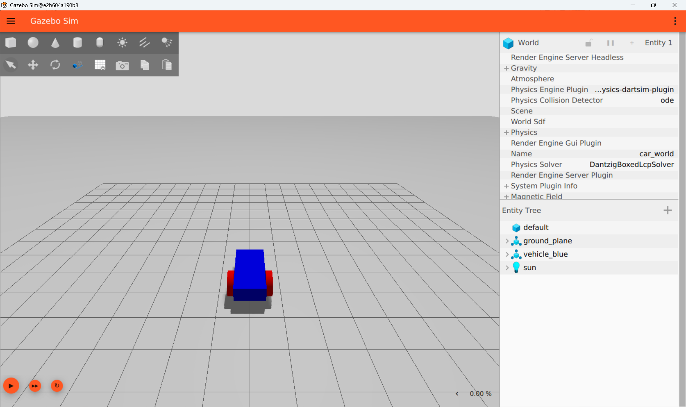
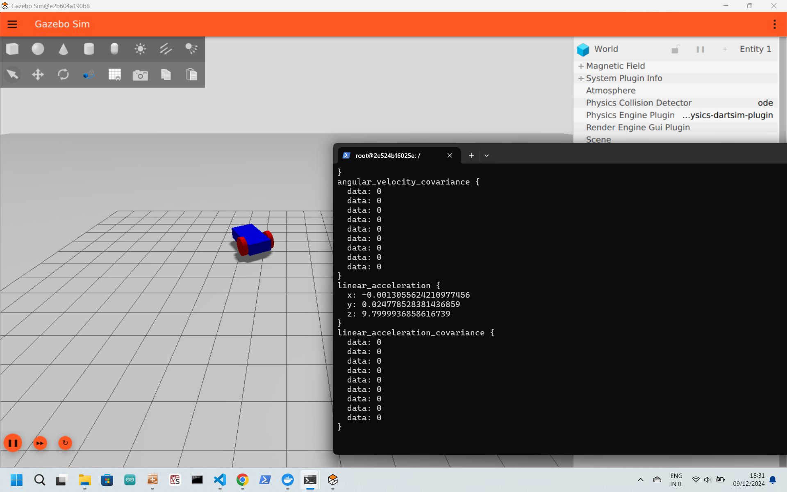

# 2. Building our first robot
*source: https://gazebosim.org/docs/latest/building_robot/*

In this step we will build our first robot and move it using commands in the command editor window. 

Below the following environments are used: 
1 The prompt of the power shell environment 
2 The prompt of the docker container 
3 Inside the docker container, inside the vi editor

## Build the robot.sdf (simulation description format) 
Follow the steps in https://gazebosim.org/docs/latest/building_robot/ and save the file as robot.sdf in your pc environment. The end result should look something like this [robot.sdf](./files/robot.sdf). 

We will now try to run the robot.sdf with gz sim. First:
- start dockers for desktop in your windows environment.
- run vcxsrv in your windows environement.
- run the powershell

In the powershell type1:
~~~ 
docker run -it -e DISPLAY=host.docker.internal:0  gazebo
~~~

We will first install the tooling we need2:
~~~
apt-get install vim
~~~

We will make a directory in which we will save our robot.sdf2:
~~~
mkdir ~/gz_transport_tutorial
cd ~/gz_transport_tutorial
~~~

Study the manual of the VI editor: 
https://www.redhat.com/en/blog/introduction-vi-editor

Open vi2:
~~~
vi robot.sdf
~~~

Paste the content of the robot.sdf (on your dekstop) inside the vi editor.
To save and exit3:
~~~
:w
:q 
~~~

Type2:
~~~
gz sim robot.sdf
~~~
You should see:

Are you proud? I hope so!  
Close the gz sim window.
We will now exit the container2:
~~~
exit
~~~
and save it. First we need to  find the id1:
~~~
docker ps -a
~~~
You need to find the id of the container you just exited (so the last one). 
Copy the id & paste it in the below command1:
~~~
docker commit <container_id> gazebo
~~~
This may take some time. Patience is virtue.

## Moving our robot
*Source: https://gazebosim.org/docs/latest/moving_robot/*

We will now try to move our robot. We are going to execute the instructions in the chapter Diff_drive pluging form https://gazebosim.org/docs/latest/moving_robot/. Follow the instructions below to implement the code in our robot.sdf in our docker container.

Insert the following code (see Diff_drive plugin chapter) in your robot.sdf on your pc (see below for the exact location):
~~~
<plugin
    filename="gz-sim-diff-drive-system"
    name="gz::sim::systems::DiffDrive">
    <left_joint>left_wheel_joint</left_joint>
    <right_joint>right_wheel_joint</right_joint>
    <wheel_separation>1.2</wheel_separation>
    <wheel_radius>0.4</wheel_radius>
    <odom_publish_frequency>1</odom_publish_frequency>
    <topic>cmd_vel</topic>
</plugin>
~~~

insert it below the following lines:
~~~
      <model name='vehicle_blue' canonical_link='chassis'>
         <pose relative_to='world'>0 0 0 0 0 0</pose>
~~~

Save it under robot_move.sdf on your pc. The end result should look something like this [robot_move.sdf](./files/robot_move.sdf). 

We get back into the container1:
~~~ 
docker run -it -e DISPLAY=host.docker.internal:0 gazebo
~~~

We will go to our directory2:
~~~
cd ~/gz_transport_tutorial
~~~

We will make a new sdf file2:
~~~
vi robot_move.sdf
~~~ 
Copy the code from the robot_move.sdf on your pc to the robot_move.sdf in vi. 

To save and exit3:
~~~
:w
:q 
~~~

Run the following code in your container2:
~~~
export GZ_PARTITION=test
gz sim robot_move.sdf
~~~
(the export gz_partition is needed to acces the simulation from a different container)   
Press run in the gz sim (the orange triangle in the bottom left corner)

Open a new powershell and open another instance of the container1:
~~~ 
docker run -it -e DISPLAY=host.docker.internal:0 gazebo
~~~

Run the following code in this container2:
~~~
export GZ_PARTITION=test
gz topic -t "/cmd_vel" -m gz.msgs.Twist -p "linear: {x: 0.5}, angular: {z: 0.05}"
~~~
Hopefully the robot should start moving!!!

## Adding a sensor to the robot
*Source: https://gazebosim.org/docs/latest/sensors/*

We will add a IMU sensor to the robot. A IMU sensor can measure acceleration.  

Add the following code to the robot_move.sdf (below the previously inserted plugin code) and rename to robot_with_imu.sdf: 
~~~
<plugin filename="gz-sim-imu-system"
        name="gz::sim::systems::Imu">
</plugin>
~~~

Add the following code below the
~~~
</collision>
~~~
tag:
~~~
<sensor name="imu_sensor" type="imu">
    <always_on>1</always_on>
    <update_rate>1</update_rate>
    <visualize>true</visualize>
    <topic>imu</topic>
</sensor>
~~~

Use vi to save the file also in your docker container under robot_with_imu.sdf.
The end result should look something like this [robot_with_imu.sdf](./files/robot_with_imu.sdf). 
Start the robot in gz sim, press also run and use the other container to make it "walk" with the following command2
~~~
export GZ_PARTITION=test
gz topic -t "/cmd_vel" -m gz.msgs.Twist -p "linear: {x: 0.5}, angular: {z: 0.05}"
~~~

Type the following command2:
~~~
gz topic -e -t /imu
~~~
We now see the logging of the moving robot:

How cool is that!!!

Stop the simulation and now exit the container in which you have saved all the sdf files2:
~~~
exit
~~~
We will save this version. First we need to  find the id1:
~~~
docker ps -a
~~~
You need to find the id of the container you just exited (so the last one). 
Copy the id & paste it in the below command1:
~~~
docker commit <container_id> gazebo
~~~
This may take some time. Patience is virtue.

For the next step:  
[3_Connect_with_c++](./3_Connect_with_c.md)

