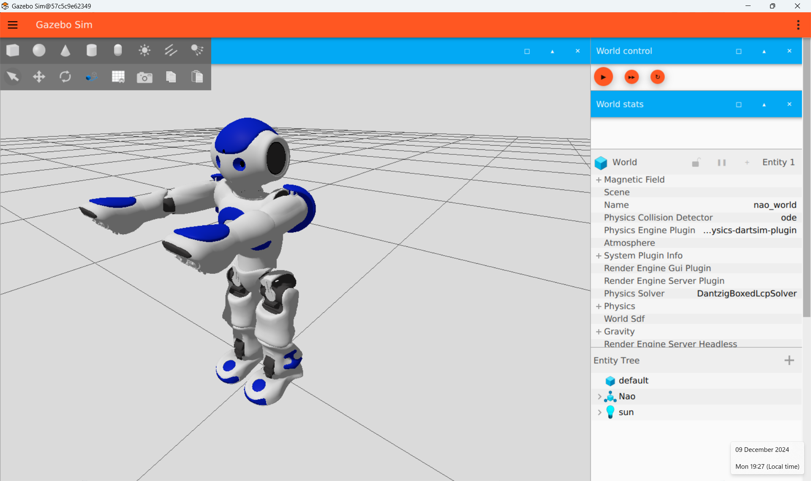

# 1. Installing Gazebo
Gazebo is a modelling/simulation framework. In this guide we will learn how to install it. 

Below the following environments are used: 
1 The prompt of the power shell environment 
2 The prompt of the Docker container 

## Installing gazebo in a Docker container
Although you can install Gazebo on native Windows that specific version is broken, it malfunctions. Therefore we will install Gazebo in a Docker container on Ubuntu.

### Install Gazebo inside the container:
Start the container from the [previous chapter](0_Installing_ROS.md).  
*Source: https://gazebosim.org/docs/harmonic/install_ubuntu/ *
To install type the following2:
~~~
sudo apt-get update
sudo apt-get install lsb-release gnupg

sudo curl https://packages.osrfoundation.org/gazebo.gpg --output /usr/share/keyrings/pkgs-osrf-archive-keyring.gpg
echo "deb [arch=$(dpkg --print-architecture) signed-by=/usr/share/keyrings/pkgs-osrf-archive-keyring.gpg] https://packages.osrfoundation.org/gazebo/ubuntu-stable $(lsb_release -cs) main" | sudo tee /etc/apt/sources.list.d/gazebo-stable.list > /dev/null
sudo apt-get update
sudo apt-get install gz-harmonic
~~~~
We will now exit the container2:
~~~
exit
~~~
and save it as an image. First we need to  find the id1:
~~~
docker ps -a
~~~
You need to find the id of the container you just exited (so the last one). 
Copy the id & paste it in the below command1:
~~~
docker commit <container_id> gazebo_ros
~~~
This may take some time. Patience is virtue.

### First time running Gazebo

We will now start the container again (make sure you also have the vcxsrv running).  
First we need to  find the id1:
~~~
docker ps -a
~~~
You need to find the id of the container you just exited (so the last one). 
Copy the id & paste it in the lines below1:
~~~
docker start <container_id>
docker exec -it -e DISPLAY=host.docker.internal:0 <container_id> bash
~~~

We can test it by running2:
~~~
gz sim
~~~
We should see:

Select the robot and press run. You should see the robot in a new window (some errors/warnings could be present in the container window):

If you want to take a break with this manual this would be a nice time to do so. You've committed the container so everything is nicely saved! 

### Running after a reboot or exiting the powershell:

- start dockers for desktop in your windows environment.
- run vcxsrv in your windows environment.
- run the powershell

First we need to  find the id1:
~~~
docker ps -a
~~~
You need to find the id of the container you just exited (so the last one). 
Copy the id & paste it in the lines below1:
~~~
docker start <container_id>
docker exec -it -e DISPLAY=host.docker.internal:0 <container_id> bash
~~~

Type2:
~~~
source /opt/ros/jazzy/setup.bash
gz sim
~~~

### Creating a new container from our image:
We could also create a new container from our image (the disadvantage is that you will accumulate containers very quickly!)
Run our previously commited image, this will create a new container1:
~~~
docker run -it -e DISPLAY=host.docker.internal:0  gazebo_ros
~~~

For the next step:  
2 [Building our first robot](./2_Building_our_first_robot.md)