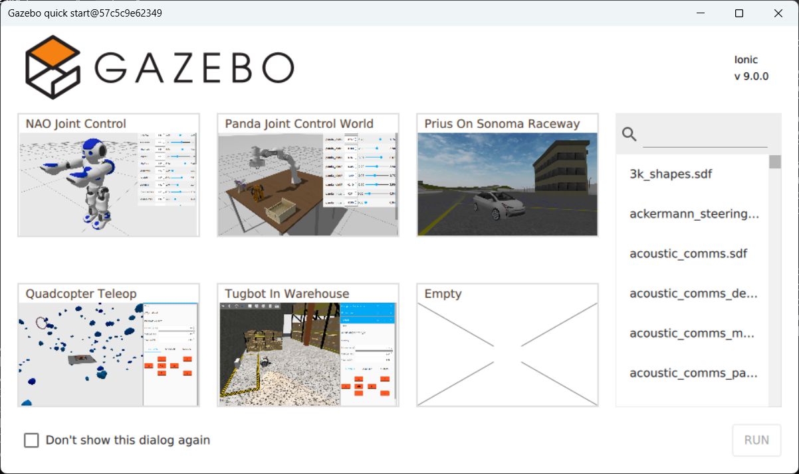
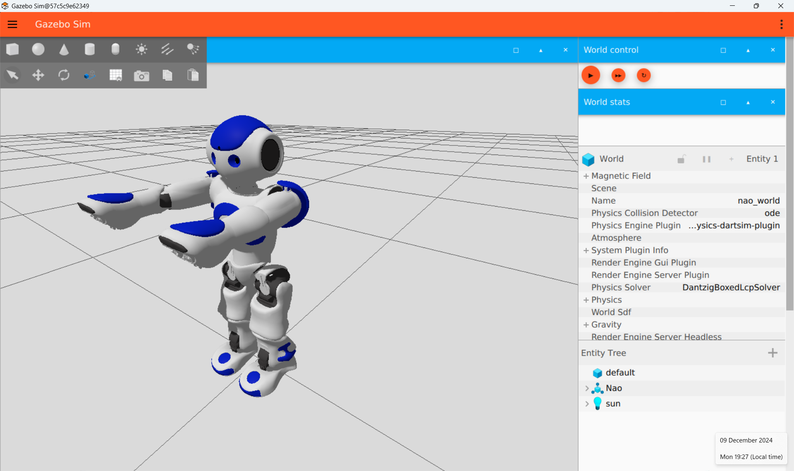

# 1. Installing Gazebo

Gazebo is a modelling/simulation framework. In this guide we will learn how to install it. 

Below the following environments are used: 
1 The prompt of the CMD 
2 The prompt of the Docker container 

### Install Docker Desktop on Windows:
If you have not done this already we first install [Docker Desktop](https://www.docker.com/products/docker-desktop/). Please note, you need approximatly 10Gb of diskspace to install it. You can download it from Docker's official site.

Make sure to choose WSL as the default option. Follow the installation steps to set it up. Please note, it could be that you need to [enable hardware virtualization in your bios to make it run](https://forums.docker.com/t/hardware-assisted-virtualization-and-data-execution-protection-must-be-enabled-in-the-bios/109073).   
Docker Desktop provides a LinuxKit-based virtual machine (VM) that runs Linux inside Windows. 

Make sure Docker Desktop is running. 

Download the image.tar file from canvas (canvas -> hoofdpagina -> linkje bij planning). Make sure you save the file at the same place as where your CMD prompt opens. 

Open the CMD prompt and type the following1:

~~~
docker load -i s4_2026.tar
~~~
This will load the docker container as an image, please note this will take some time.
Double check if the image was loaded by going to the docker desktop gui and see if in the images tab the gazebo_s4 image is displayed. 

### Installing X server
*Source:  [https://vcxsrv.com/](https://mobaxterm.mobatek.net/download-home-edition.html)* <!-- markdown-link-check-disable-line -->

We have to install a X server (to enable a graphical user interface in Ubuntu). Go to (https://mobaxterm.mobatek.net) [https://mobaxterm.mobatek.net/download-home-edition.html] and install the server on your windows computer. <!-- markdown-link-check-disable-line -->

Run mobaxterm (via the start menu of windows).

Set the environment display variable in your cmd window 1:
~~~
set DISPLAY=host.docker.internal:0
~~~

### First time running

We will now start a container based on the image. It is a little bit like classes. The container is an instance based on the image template.
First we need to make the container, we do this by1:
~~~
docker run -it --rm -e DISPLAY=host.docker.internal:0 s4_2026 bash
~~~
Double check if the container was started by going to the docker desktop gui and see if in the container tab if a new containere (based on gazebo_s4 image) is displayed. We will now continue working in this container. You can make a new image of your work (for security, in case your container is corrupted) but do not do this too often as it will consume a lot of disk space. We will explain later how you can make an image of a container (you do this with the docker commit command). 

We can test it by running2:
~~~
gz sim
~~~
We should see:

Select the robot and press run. You should see the robot in a new window (some errors/warnings could be present in the container window):

### Running after a reboot or exiting the powershell:

- start dockers for desktop in your windows environment.
- run MobaXterm in your windows environment.
- run the cmd window

First we need to  find the id1:
~~~
docker ps -a
~~~
You need to find the id of the container you exited the last time (so the last one). 
Copy the id & paste it in the lines below1:
~~~
docker start <container_id>
docker exec -it -e DISPLAY=host.docker.internal:0 <container_id> bash
~~~

### END OF THIS MD...
For the next step:  
[2_Building our first robot](./2026_2_Building_our_first_robot.md)
