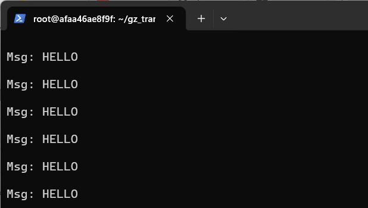
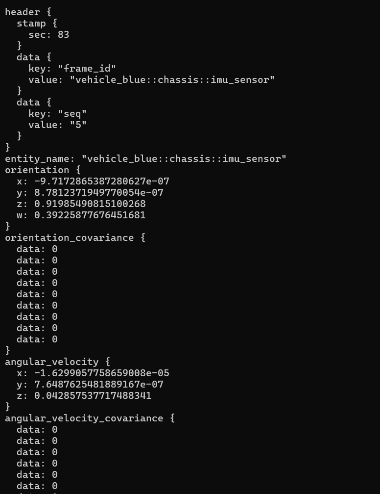
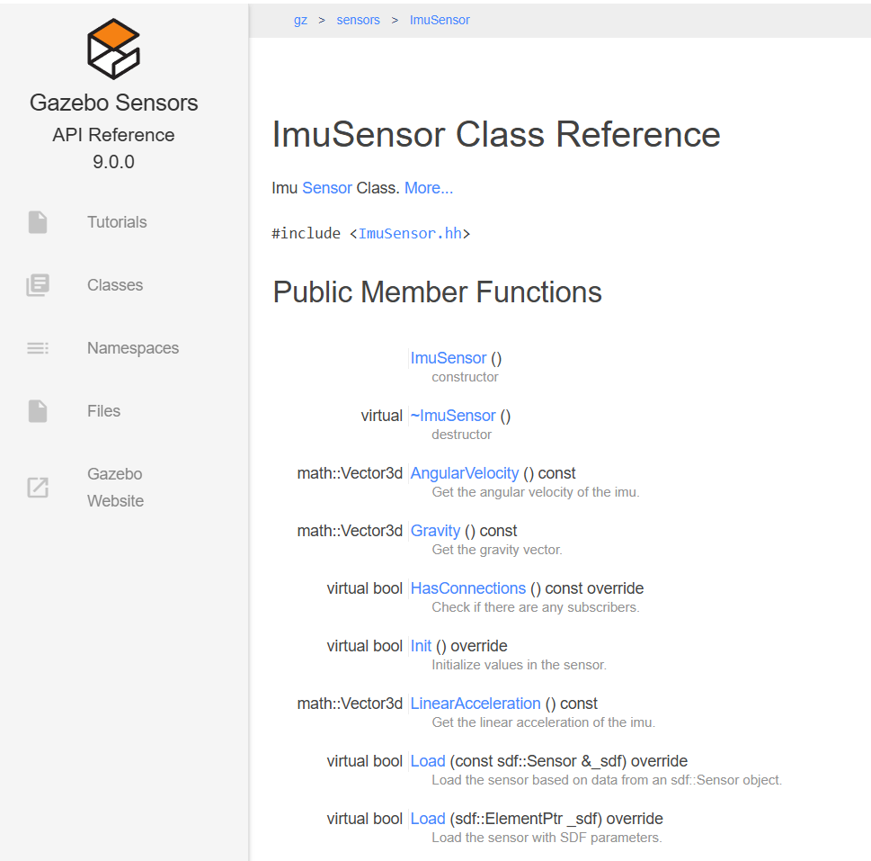
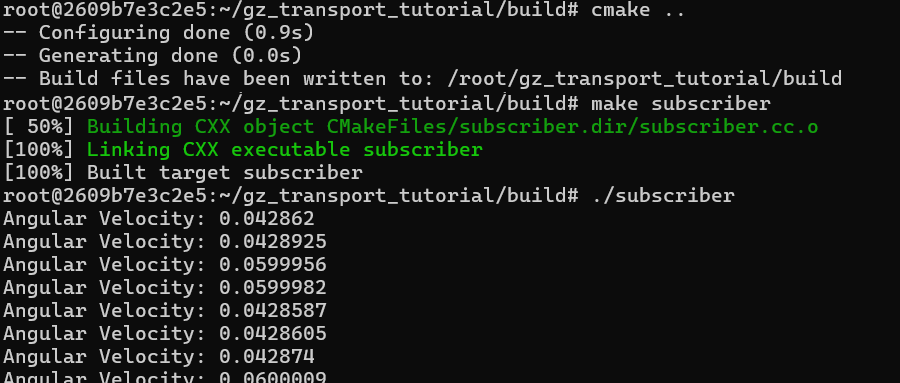

# 3. Connect with C++

We would like to be able to interact with Gazebo via C++. The next steps enable this.<br>
if you did not open your container yet<sup>1</sup>:
~~~
docker ps -a
~~~
You need to find the id of the container you just exited (probably the first one on the list).<br>
Copy the id & paste it in the lines below<sup>1</sup>:
~~~
docker start <container_id>
docker exec -it -e DISPLAY=host.docker.internal:0 <container_id> bash
~~~

We will first install the tooling we need<sup>2</sup>:
~~~
sudo apt install cmake g++ -y
~~~

Download 
- publisher.cc 
- subscriber.cc
- CMakeLists.txt

from [https://github.com/gazebosim/gz-transport/blob/gz-transport13/tutorials/04_messages.md](https://github.com/gazebosim/gz-transport/blob/gz-transport13/tutorials/04_messages.md)


Make a new file with the vi editor with<sup>2</sup>:
~~~
vi publisher.cc
~~~
Copy the text from publisher.cc (the one you have downloaded earlier) and paste it in the vi editor. 
Type the following commands in the vi editor<sup>3</sup>:
~~~
:w
:q
~~~
This will save the file and exit the vi editor. 

Do the same for the **subscriber.cc** and **CMakeLists.txt**

Next we will make a new dir<sup>2</sup>:
~~~
mkdir build
cd build
~~~

Type the following commands<sup>2</sup>:
~~~
cmake ..
make publisher subscriber
~~~
We have now compiled the subscriber.cc and publisher.cc file!

Read the description in *https://github.com/gazebosim/gz-transport/blob/gz-transport13/tutorials/04_messages.md* to understand what happens in the subscriber and publisher code. 

## Running our first test with the transport layer!

We will start the publisher<sup>2</sup>:
~~~
export GZ_PARTITION=test
./publisher
~~~

We should see something like this:


We start a new powershell and re-enter the container.

We will first go to the correct directory<sup>2</sup>:
~~~
cd ~/build
~~~
Then we start the subscriber<sup>2</sup>:
~~~
export GZ_PARTITION=test
./subscriber
~~~
You should now receive the hello message:



## Connecting with the robot!

Start a new session of your container. 

We will start our moving robot with the IMU sensor again!  
Type<sup>2</sup>:
~~~
export GZ_PARTITION=test
gz sim robot_with_imu.sdf
~~~
Start the robot in the gz gui.

Open a new 
instance of the container and use it to move the robot<sup>2</sup>.
~~~
export GZ_PARTITION=test
gz topic -t "/cmd_vel" -m gz.msgs.Twist -p "linear: {x: 0.5}, angular: {z: 0.05}"
~~~

Subsribe to the IMU topic:
~~~
gz topic -e -t /imu
~~~
You will see logging something simular like this: 


Go to the website : https://gazebosim.org/home <!-- markdown-link-check-disable-line -->

Click DOCS -> Library Reference -> Sensors -> Classes -> List -> ImuSensor

You should see something like this:


You see that the items the gz topic -e -t /imu spits out are simular to the public member functions of the ImuSensor class.

The next step we will try is to change the subscriber.cc to make the subscriber listen to the imu sensor (you could use the vi editor or change the file in your windows environment and copy it to your subscriber.cc by rm subscriber.cc  and vi subscriber.cc). 

Add the following function to your subscriber.cc:

```c++
void OnIMUMessage(const gz::msgs::IMU &msg)
{
    // Output the data to the console
    std::cout << "Angular Velocity: " << msg.angular_velocity().z() << std::endl;
}
```

Change the following lines:

```c++
int main(int argc, char **argv)
{
  gz::transport::Node node;
  std::string topic = "/foo";

  // Subscribe to a topic by registering a callback.
  if (!node.Subscribe(topic, cb))
  {
    std::cerr << "Error subscribing to topic [" << topic << "]" << std::endl;
    return -1;
  }

  // Zzzzzz.
  gz::transport::waitForShutdown();

  return 0;
}
```

to:

```c++
int main(int argc, char **argv)
{
  gz::transport::Node node;
  std::string topic = "/imu";

  // Subscribe to a topic by registering a callback.
  if (!node.Subscribe(topic, OnIMUMessage))
  {
    std::cerr << "Error subscribing to topic [" << topic << "]" << std::endl;
    return -1;
  }

  // Zzzzzz.
  gz::transport::waitForShutdown();

  return 0;
}
```
What we are doing is subscribing to a different topic (/imu iso /foo) and change the callback function so that we can call the public member functions of the IMU class..

compile subscriber.cc and run it (see the first section of this manual). 

The result should be: 


As you see we can now access the data generated by the sensor of our driving robot with a c++ program...   Pretty cool...

Next step:
[4_Assignment_knowing_your_robot_and_sensors](./4_Assignment_knowing_your_robot_and_sensors.md)
