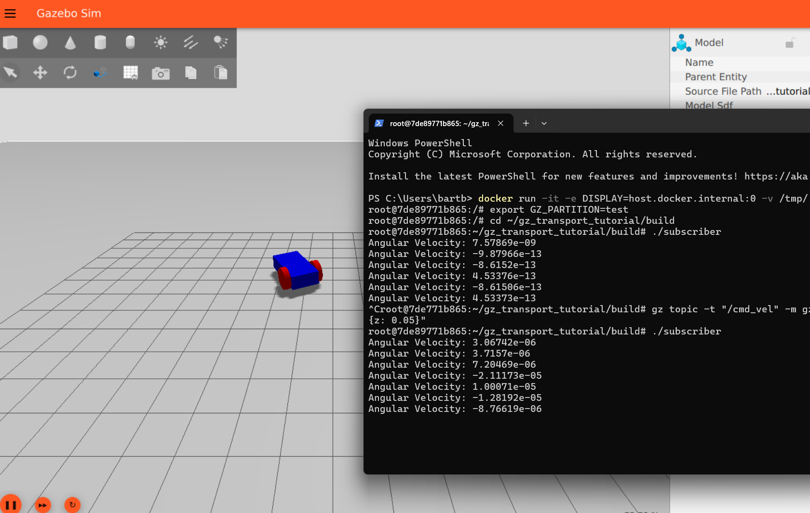

# 4. Assignment: getting to know your robot & sensors


Run the following code in your favorite python editor to determine your personal assignment:

```python
# -*- coding: utf-8 -*-
number= input ('What is your student number? ')
print ('\n-------Your Assignment: --------')
tens=int(int(number)/10)%3
dimens=('- Make the robot 3 x as long, make sure the wheels are still at the front and at the back of your robot.','- Make the robot two time as high, make also the wheels bigger.','- Make the robot three times as wide, also move the wheels so they are still at the side of the robot.')
print (dimens[tens]) 
ones=int(number)%4
sensors=['air speed sensor :  read out differential pressure & temperature value (no direct air speed given)','air pressure sensor','altimeter sensor','magnetometer sensor']
print ('- Implement also a ',sensors[ones])
color=int(number)%10
colors=['RED','YELLOW','LIGHTGREEN','PURPLE','YELLOW','PINK','CRIMSON','ORANGE','KHAKI','BROWN']
print ('- Make the body of the robot the color : ',colors[color])
print ('\nMake sure you can read out the sensor with a subscriber.cc YOU have made/adapted.')
print ('Make a screenshot of your running robot (so it has left its start position) with the container showing the values of your subscriber')
```
The code will print out your personal assignment. 

steps:
1) deduce the correct filename and name of the sensor. Use this link https://robotics.stackexchange.com/questions/103881/gazebo-plugin-location-and-documentation/103884#103884 to help you find the correct naming convention. Please note if you open a repository (as mentioned in the post) make sure you select the lastest (default) commit! <!-- markdown-link-check-disable-line -->
2) insert the code for the sensor in a new sdf. The code will (like mentioned in the md file "connect with c++") consist of two parts. In the first part you insert the correct plugin. In the second part you change the name of the topic and type of the sensor.
3) you can also change the shape of the robot and the color (for the color see: https://classic.gazebosim.org/tutorials?tut=color_model) 
3) run the gz sim with your sdf (don't forget to set the GZ_PARTITION variable and to start the robot)
4) check which topics are published by gz sim (gz topic -l) in a new instance of the container (again the GZ_PARTITION).
5) is your topic not in the list? Go back to step 1...
6) subscribe to your topic to see what is the data it is producing.
7) change your subscribe.cc to subscribe to your new topic with the right callback function.
8) build and run your subscribe.
9) if everything works you need to save it in your container (please note, you probably have two containers open, you will probably need to save it after step 2 and redo the other steps with the new container and then save it again at the end).

What to hand in @ canvas?
1) a screenshot of a walking/running robot with in the same screenshot a cmd screen with the logging of your sensor (read out with the subscriber you wrote). Like so:

2) the code of the robot you made/adapted (the sdf)
3) the code of your subscriber.cc

Have fun & Learn!!!

### END OF THIS MD...
For the next step:  
[6_Using_thrusters_and_camera](./6_Using_thrusters_and_camera.md)


