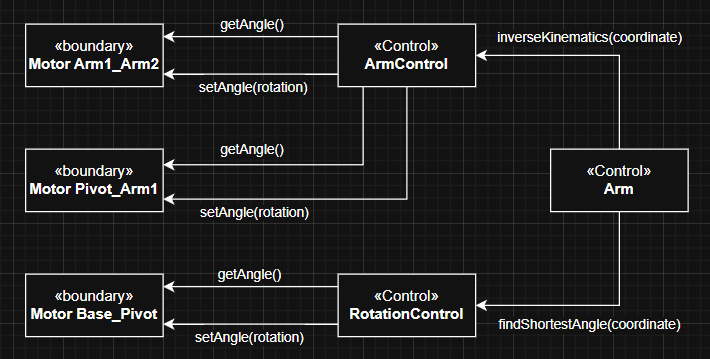
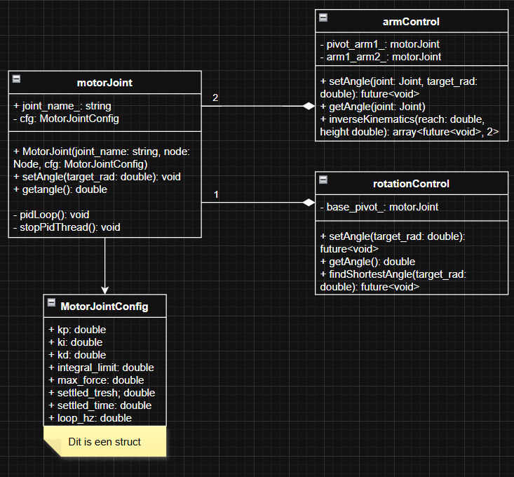

``Tussen backticks als deze staan cues voor het invulling geven aan de topics. Verwijder ze uiteindelijk. Dit ontwikkeldocument is bedoeld als overdrachtsdocument en naslagwerk, voor de opdrachtgever, voor eventuele toekomstige teams die verder werken aan het product, maar ook tijdens de ontwikkeling voor het huidige team. Probeer de huidige staat van de ontwikkeling altijd zo goed mogelijk gesynct te houden met het ontwikkeldocument, zodat die ook helder is voor alle teamleden. Belangrijke Tip: Een valkuil om op verdacht te zijn, is dat het ontwikkeldocument een losse verzameling van ingevulde hoofdstukjes wordt. Dat willen we dus niet. Er dient overal voldoende en heldere tekst toegevoegd te zijn die logica en samenhang (zoals tussen de opeenvolgende hoofdstukken, of voor wat betreft gemaakte keuzes) uitlegt. Tot en met het ontwerp moet het zonder extra mondelinge toelichting duidelijk, samenhangend en makkelijk leesbaar zijn voor een gemiddelde persoon met slechts lichte it-kennis. Een deel van de ontwikkeldocumentatie is afgesplitst van dit document: documentatie t.a.v. het ontwerp en realisatie van het web-subysteem (flask, mongodb, html, css, javascript) is afgesplitst in een apart, ietwat ander type ontwikkeldocument. Ander belangrijk ding: gebruik alleen links naar publieke websites of relatieve links (dus binnen de team-repo, NIET naar je persoonlijke repo), zodat uiteindelijk uit de team-repo een zip gemaakt kan worden voor de opdrachtgever, waarvan de links (nog) werken.``

Zie [plantuml tutorial in S3](https://github.com/HU-TI-DEV/TI-S3/blob/main/software/modelleren/plantuml/README.md) voor de tutorial in S3 ove plantuml. 

# Ontwikkeldocument Project ``projectnaam``

Versie ``bla.bla.bla``
Team ``naam``

## Inhoudsopgave

- [Ontwikkeldocument Project ``projectnaam``](#ontwikkeldocument-project-projectnaam)
  - [Inhoudsopgave](#inhoudsopgave)
  - [Inleiding](#inleiding)
  - [Leeswijzer](#leeswijzer)
  - [Uitgangspunten](#uitgangspunten)
    - [Systeem Context](#systeem-context)
    - [Identificatie en prioritering van Key Drivers](#identificatie-en-prioritering-van-key-drivers)
  - [Requirements](#requirements)
    - [Functionele Requirements](#functionele-requirements)
    - [Niet-Functionele Requirements](#niet-functionele-requirements)
    - [Constraints](#constraints)
    - [Use Cases](#use-cases)
    - [Activity Diagrammen](#activity-diagrammen)
  - [Ontwerp](#ontwerp)
    - [Functionele decompositie of sub(systems) and interfaces](#functionele-decompositie-of-subsystems-and-interfaces)
    - [Objectmodellen](#objectmodellen)
      - [Lijst met Objecten](#lijst-met-objecten)
    - [Taakstructurering](#taakstructurering)
      - [Taaksoort en deadline](#taaksoort-en-deadline)
      - [Taken samenvoegen](#taken-samenvoegen)
    - [Klassediagrammen](#klassediagrammen)
    - [STD's](#stds)
  - [Realisatie](#realisatie)
    - [Fysieke View](#fysieke-view)
    - [Code](#code)
    - [Unit Tests](#unit-tests)
    - [Integratie Tests](#integratie-tests)
    - [Eindresultaat](#eindresultaat)
  - [Conclusie en Advies](#conclusie-en-advies)
  - [Appendices](#appendices)
    - [Appendix 1: Mindmaps](#appendix-1-mindmaps)
    - [Appendix 2: Gespreksverslagen](#appendix-2-gespreksverslagen)
      - [Notities bij Kickoff-Meeting](#notities-bij-kickoff-meeting)
    - [Appendix 3: Upgradeonderzoeksverslagen](#appendix-3-upgradeonderzoeksverslagen)
    - [Appendix 4: Referenties](#appendix-4-referenties)

## Inleiding
Het doel van dit project was om een productielijn te simuleren voor het bedrijf Atum3d. De simulatie bevat een virtuele benadering van de M-16iB robotarm op rails en meerdere verwerkingsstations. Dit document is bedoeld om op heldere wijze overzicht en samenhang te geven voor ons team (Luna, Katerina, Fridtjof en Bosse) tijdens de ontwikkeling. Daarnaast dient het na afloop als overdrachtsdocument voor eventuele follow-ups, zodat duidelijk is hoe de besturingstechnologieën en het veiligheidssysteem (met objectdetectie) zijn geïmplementeerd voor de verdere automatisering van de productielijn.

## Leeswijzer
Dit document behandelt de volgende hoofdonderwerpen en hoe deze met elkaar in verband staan:
*   **Project Overview & Repository Structure:** Geeft de algemene kaders en de mappenstructuur van het project weer.
*   **Robot Arm:** Behandelt de fysieke aansturing van de arm, inclusief wiskundige modellen zoals PID-controllers, het berekenen van de optimale draaihoek en inverse kinematica.
*   **Computer Vision & YOLO:** Richt zich op de waarneming binnen de simulatie. Dit omvat de datasetgeneratie (10k afbeeldingen) en de logica om de positie van een menselijke acteur te bepalen, zodat de arm kan stoppen uit veiligheidsoverwegingen.
*   **Running the Project & Known Issues:** Levert stap-voor-stap instructies voor een schone setup en benoemt openstaande problemen voor toekomstig werk.

Deze onderdelen vormen samen het volledige systeem: de gesimuleerde Gazebo-omgeving faciliteert de fysieke acties van de robotarm, terwijl de computer vision zorgt voor de benodigde actieve veiligheidsmaatregelen binnen diezelfde omgeving.

## Uitgangspunten
Dit hoofdstuk inventariseert de uitgangspunten voor de requirements. Onze implementatiekeuzes zijn veelal gebaseerd op onderzoek en gesprekken met de opdrachtgever en onze docent/expert, Bart Bozon. Zo is er gekozen voor torque-based joint control omdat dit een meer realistische benadering van echte servomotoren is, en is de arm gesimplificeerd naar een 3-jointed model. Wij verwijzen naar de appendix voor de genoteerde input van de opdrachtgever en de gespreksverslagen.

### Systeem Context
Hieronder is de Systeem Context gemodelleerd om de interacties met externe actoren weer te geven. Onderdelen van binnen ons *System of Interest* (zoals de interne Python-scripts, *gz.transport* communicatie, of de specifieke camera-sensoren) zijn weggelaten om het overzicht te bewaren.

## Requirements

### Key drivers

*Prioriteitenschaal 1-5, met 1 hoogste prioriteit, 5 laagste prioriteit.*

| Naam                | 01 Intelligentie                                           |
| ------------------- | ------------------------------------------------------- |
| Omschrijving        | Elk groepslid heeft gewerkt aan intelligentie           |
| Stakeholder         | Hasan                                                   |
| Business prioriteit | 1                                                       |

| Naam                | 02 Automatisering                                          |
| ------------------- | ------------------------------------------------------- |
| Omschrijving        | De opstelling heeft zo min mogelijk menselijke onderhoud nodig.|
| Stakeholder         | Atum3D, Hasan                                           |
| Business prioriteit | 2                                                       |

| Naam                | 03 Productie efficientie                                   |
| ------------------- | ------------------------------------------------------- |
| Omschrijving        | De productie is zo efficient. mogelijk                  |
| Stakeholder         | Atum3D                                                  |
| Business prioriteit | 3                                                       |

| Naam                | 04 Ruimtelijke efficientie                                 |
| ------------------- | ------------------------------------------------------- |
| Omschrijving        | De productie neemt zo weinig mogelijk ruimte in.        |
| Stakeholder         | Atum3D                                                  |
| Business prioriteit | 4                                                       |

| Naam                | 05 Schaalbaarheid                                          |
| ------------------- | ------------------------------------------------------- |
| Omschrijving        | Het gemaakte product kan worden overgenomen door het volgende projectgroepje.|
| Stakeholder         | Atum3D, Hasan                                           |
| Business prioriteit | 5                                                       |

### Functionele Requirements

| Naam                | F01 - Robot arm                                     |
| ------------------- | ------------------------------------------------------- |
| Omschrijving        | Er wordt een robot arm gesimuleerd                                                        |
| Rationale           | KD02 |
| Business prioriteit | Must |

| Naam                | F02 - Mobiliteit                                       |
| ------------------- | ------------------------------------------------------- |
| Omschrijving        | Arm kan zich door de ruimte verplaatsen   |
| Rationale           | KD02  |
| Business prioriteit | Must                                              |

| Naam                | F03 - Oppakken                                       |
| ------------------- | ------------------------------------------------------- |
| Omschrijving        | De arm kan een object oppakken en weer neerleggen                                                         |
| Rationale           | KD02 |
| Business prioriteit | Must 

| Naam                | F04 - Documentatie voor overname        |
| ------------------- | ------------------------------------------------------- |
| Omschrijving        | De documentatie is voldoende duidelijk dat een andere groep het project kan overnemen   |
| Rationale           | KD05 |
| Business prioriteit | must |                                          |

| Naam                | F05 - Omgeving simuleren                                       |
| ------------------- | ------------------------------------------------------- |
| Omschrijving        | Om de printer heen wordt de benodigde apparatuur gesimuleerd voor de workflow   |
| Rationale           | KD03, KD04 |
| Business prioriteit | should |

| Naam                | F06 - Workflow optimalisatie |
| ------------------- | ------------------------------------------------------- |
| Omschrijving        | Er wordt gekeken naar hoe de simulatie kan verlopen met zo min mogelijk tijd verlies   |
| Rationale           | KD03, KD04 |
| Business prioriteit | could |

| Naam                | F07 - Printer    |
| ------------------- | ------------------------------------------------------- |
| Omschrijving        | De printer produceert producten |
| Rationale           | KD03, KD04 |
| Business prioriteit | Must |

| Naam                | F08 - Productietijd van een batch |
| ------------------- | ------------------------------------------------------- |
| Omschrijving        | De simulatie meet hoelang het duurt om een volledige batch te voltooien |
| Rationale           | KD03 |
| Business prioriteit | Should |

| Naam                | F09 - Rails. en non functional bij maken met X waarden |
| ------------------- | ------------------------------------------------------- |
| Omschrijving        | De arm moet zich kunnen verplaatsen op een rails |
| Rationale | F02 |
| Business prioriteit | Must |

| Naam                | F10 - Gripper |
| ------------------- | ------------------------------------------------------- |
| Omschrijving        | De arm bevat een gripper die dingen kan oppakken |
| Rationale | KD02 |
| Business prioriteit | Could |

| Naam                | F11 - Project overdraagbaarheid |
| ------------------- | ------------------------------------------------------- |
| Omschrijving        | Het project moet na afloop overdraagbaar zijn door een ander groepje |
| Rationale | KD05 |
| Business prioriteit | should |

| Naam                | F12 - Persoonsherkenning |
| ------------------- | ------------------------------------------------------- |
| Omschrijving        | De simulatie bevat een camera die mensen kan herkennen |
| Rationale | KD01 |
| Business prioriteit | must |

| Naam                | F13 -  | Botsvoorkoming |
| ------------------- | ------------------------------------------------------- |
| Omschrijving        | De verplaatsing van de arm stopt als er een persoon wordt herkend |
| Rationale | KD02 |
| Business prioriteit | could |

### Niet-Functionele Requirements

| Naam                | NF09 - Rails snelheid |
| ------------------- | ----------------------- |
| Omschrijving        | De rails moet de arm met minimaal X km/u kunnen verplaatsen |
| Rationale           | F09 |
| Business prioriteit | Should |

| Naam                | NF10 - PID control bij rails |
| ------------------- | ----------------------- |
| Omschrijving        | De rails moet PID gebruiken om de arm te verplaatsen |
| Rationale           | F09 |
| Business prioriteit | Must |

| Naam                | F11 - Gripper grijp snelheid |
| ------------------- | ------------------------------------------------------- |
| Omschrijving        | De gripper moet objecten binnen X seconden kunnen oppakken |
| Rationale | F10 |
| Business prioriteit | Could |

| Naam                | NF01 - Assen |
| ------------------- | ----------------------- |
| Omschrijving        | De arm kan op 3 assen bewegen |
| Rationale           | F01 |
| Business prioriteit | Must |

| Naam                | NF02 - Reach |
| ------------------- | ------------------------------------------------------- |
| Omschrijving        | De arm moet een reach van 1.885 meter hebben |
| Rationale | F01 |
| Business prioriteit | Must |

| Naam                | NF04 - PID control arm verplaatsing |
| ------------------- | ------------------------------------------------------- |
| Omschrijving        | De arm moet op de rails worden aangestuurd doormiddel van PID |
| Rationale | F02 |
| Business prioriteit | Must |

| Naam                | NF07 - Afmetingen apparatuur |
| ------------------- | ------------------------------------------------------- |
| Omschrijving        | De afmetingen van de apparatuur komen overeen met de afmetingen in de STEP - files |
| Rationale | F05 |
| Business prioriteit | should |

| Naam                | NF08 - Quota |
| ------------------- | ------------------------------------------------------- |
| Omschrijving        | De opstelling produceert 50.000 eenheden per maand |
| Rationale | F05 |
| Business prioriteit | should |

| Naam                | NF08 - Ruimte |
| ------------------- | ------------------------------------------------------- |
| Omschrijving        | Het moet passen in de 7 x 9 x 2.3 meter ruimte |
| Rationale | F05 |
| Business prioriteit | Must |

| Naam                | NF09 - Mensherkenning |
| ------------------- | ------------------------------------------------------- |
| Omschrijving        | De persoon moet herkend worden op minimale afstand van 3 meter |
| Rationale | F12 |
| Business prioriteit | could |

| Naam                | NF010 - Botsvoorkoming |
| ------------------- | ------------------------------------------------------- |
| Omschrijving        | De arm stopt met verplaatsen op een afstand van 3 meter voor de persoon |
| Rationale | F13 |
| Business prioriteit | could |

## Ontwerp

### Objectmodellen

### Klassediagrammen

