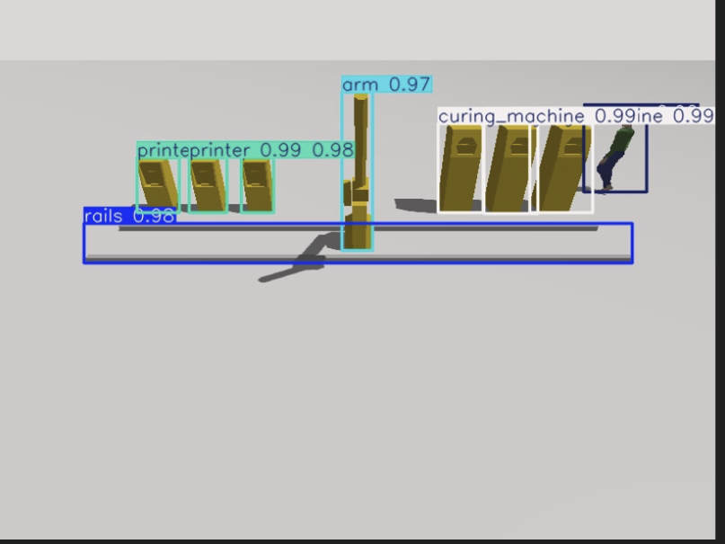
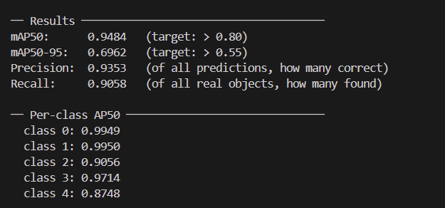
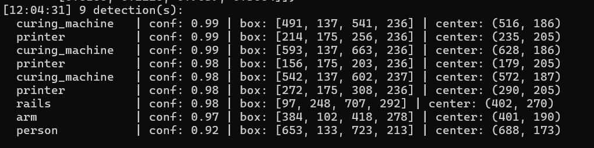
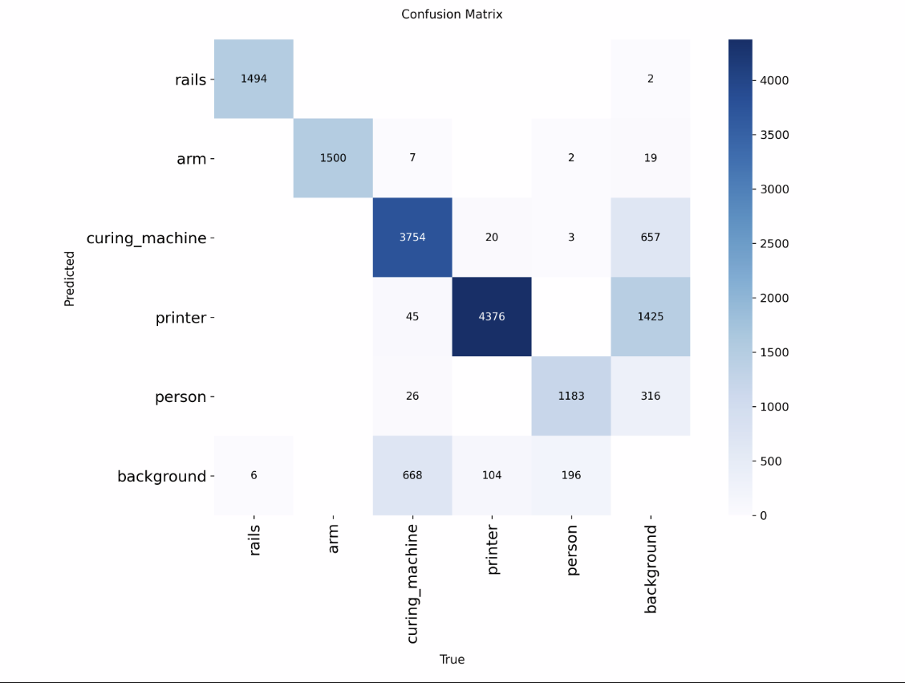

# Megaknight atum3d simulation

## Table of Contents

- [Project Overview](#project-overview)
- [Repository Structure](#repository-structure)
- [Robot Arm](#robot-arm)
- [Computer Vision](#computer-vision)
- [Running the Project](#running-the-project)


---

## Project Overview

The goal of this project was to simulate a production line for the company [Atum3d](https://atum3d.com). The simulation hosts a robot arm on rails and multiple processing stations. The group assigned this project is made up of 4 people:

- [Luna Vallecillo](https://github.com/lunaurVc)
- [Katerina Mamasakhlisova](https://github.com/Couckie1)
- [Fridtjof van Aartrijk](https://github.com/Voltiique)
- [Bosse van der Krogt](https://github.com/BossevdK)

### Contributions to the project

| Name | Contributions |
|---|---|
|Luna Vallecillo | Dataset generation, Proximity detection, Scene |
|Katerina Mamasakhlisova | Yolo training, Object detection, Scene |
|Fridtjof van Aartijk | Inverse kinematics, Code refactoring, Scene|
|Bosse van der Krogt | PID, Shortest path logic for pivot |


The simulation was made in [Gazebo sim version Jetty](https://gazebosim.org/home).

**Course:** Technische Informatica <br>
**Academic year:** 2025/26 


---

## Repository Structure

```
ProjectFinal/
├── Arm/
├── DatasetGeneration/
├── Detection/
├── Proximity/
├── YoloTraining/
├── Scene/
└├─ scene.sdf
 └─ meshes
```

---

## Robot Arm

### What it does

The Robot arm was implemented as an approximate virtual replica of the M-16iB Series robot-arm by Fanuc Robotics. The goal was to design a system that mimics how the M-16iB would behave in a real world environment, so that we could design and test several control technologies, with the end result of automating a production line of 3D-Printers. Full automation has not been realised, however the control technologies have been implemented.

## Research

### PID Controller
To control the movement of the joints, we used a [Proportional-Integral-Derivative (PID) controller](https://www.ni.com/en/shop/labview/pid-theory-explained.html). A PID controller is a system that continuously checks the difference between where the joint is and where it needs to be, and then corrects the position (National Instruments, 2024). It uses three parts to do this:

* **Proportional (Kp):** Reacts to the current error. A higher value makes the joint move faster, but it might move past its target ([overshoot](https://en.wikipedia.org/wiki/Overshoot_(signal))).
* **Integral (Ki):** Adds up past errors to fix small, continuous offsets. We added a limit to this so the system doesn't overcompensate (called [integral windup](https://en.wikipedia.org/wiki/Integral_windup)) if a joint gets stuck.
* **Derivative (Kd):** Reacts to how fast the error is changing. This acts like a brake to stop the joint from shaking ([oscillating](https://en.wikipedia.org/wiki/Damping)) and keeps it stable.

Together, these parts ensure the joint smoothly reaches its target. Because every joint in our [Gazebo simulation](https://gazebosim.org/) has a different weight and size, we tested and tuned these Kp, Ki, and Kd values for each joint individually.

### Optimal Pivot Angle
To point the robot's base at a target object, we need to turn the object's X and Y coordinates into an angle. We do this using a math function called [`atan2`](https://en.wikipedia.org/wiki/Atan2) (Wikimedia Foundation, 2024). We use `atan2` instead of regular `atan` because it looks at all four [quadrants](https://en.wikipedia.org/wiki/Quadrant_(plane_geometry)) (a full 360 degrees) to give us the exact right direction. We then send this angle to our shortest path code so the robot turns efficiently.

### Shortest Path Logic
When a joint needs to turn to a new angle, it can rotate clockwise or counterclockwise. Without smart logic, the joint might take the long way around—for example, rotating 300° when a quick 60° turn in the other direction would be enough. 

To fix this, our code adjusts the angle difference to stay within a range of -180 to +180 degrees, or [-pi, pi] [radians](https://en.wikipedia.org/wiki/Radian) (Siciliano et al., 2009). If the final number is positive, the joint turns counterclockwise. If it is negative, it turns clockwise. This ensures the joint always takes the shortest possible route.


### Inverse Kinematics
Inverse kinematics is the industry standard method for finding joint positions for a robotic limb, however the methods of implementation depend on the dynamics of the robot-arm. Because we used an approximation of the actual M-16iB series, the most suitable implementation for inverse kinematics was an analytical method which uses trigonometry to find an exact solution for the arm's joint position. Because we know the joint lengths, and the distance between the origin and the destination we can calculate the triangle with the law of cosines, and arctangent to find the associated angle of the triangle (Fridtjof van Aartrijk, 2026). 

### References
* National Instruments. (2024). *PID theory explained*. https://www.ni.com/en/shop/labview/pid-theory-explained.html
* Siciliano, B., Sciavicco, L., Villani, L., & Oriolo, G. (2009). *Robotics: Modelling, planning and control*. Springer Science & Business Media.
* Wikimedia Foundation. (2024). *Atan2*. Wikipedia. https://en.wikipedia.org/wiki/Atan2
* Fridtjof van Aartrijk. (2026). *Inverse Kinematics Deepdive*. https://github.com/2025-TICT-TV2SE4-24-3-V/personal-VoItiique/blob/main/Logboek/Documenten/Inverse%20Kinematics%20Deepdive.pdf


## Implementation choices

- **3-jointed approximation** - A simplification of the real M-16iB's joints, but is considered a good simplifcation suggested by Bart Bozon.
- **PID control technology** - PID is a large subject in our course, and PID control is flexible enough to handle the changing dynamics of a robot-arm, according to Bart Bozon.
- **Torque-based joint control** - Torque based joint-control is the most realistic approximation of real-life servo motors, though it is more difficult to implement, Bart Bozon said it was the cooler option.
- **Optimal pivot-angle** - Joint control was sepperated into two programs, with an arctangent based formula to find the pivot-angle of the arm.
- **2 joint 2D Inverse Kinematics** - The outer two joints are controlled by inverse kinematics. We use a 2-dimensional implementation, as these joints act in the same axis.
- **Analytical Methodology for IK** - Calculating the angle is done with analytical inverse kinematics, using the rule of cosines, alongside arctangents.

### Setup & getting it running

Step by step instructions for a fresh setup. Assume the reader has never seen the project before.

1. **Prerequisites** — CMake, gz sim in docker or local on linux

2. **Run & commands**
```
Build:
   mkdir build && cd build
   cmake ..
   make -j$(nproc)
Run:
   gz sim model.sdf&
   ctrl+c
   cd build
   ./arm_controller
```

### Recommendations

| What | How |
| --- | --- |
| **Model refinement** | The current model used of the arm is an approximate representation in almost every facet. It uses a .STEP file provided by the client, which was then used to make a to-scale model in blender. However, there is no certainty this model is actually to-scale. Additionally it is almost a certainty the exact positioning of the joints, and the lengths of the links in the arm are not to-scale with the real life M-16iB robot-arm.  |
| **Joint count** | The current model utilizes three joints, whilst the M-16iB seems include more than that. We were never able to learn the exact joint count and axis of the real model. Researching how many joints and what sorts of joints the real-world model actually includes, and implementing those in a new model will improve the accuracy of the simulation. |
| **Inverse kinematics** | Currently the inverse kinematics designed for two joints in only two dimensions, this is perfectly fine for our arm with it's approximation of the actual joints. However, switching to an iterative system such as the jacobian method for inverse kinematics, would allow the system to include more joints in a modular fashion. Implementing any sort inverse kinematics logic that handles more than two joints would be ideal. |

---

# Computer Vision

## Dataset generation

### What it does

This part of the project aims to streamline the dataset generation process. If you want to simply generate a dataset for the currect setup all you need to do is run the gazebo scene in the given folder and the DatasetGenerator.py script. This will automatically generate a dataset of 10k images with the appropriate labels. To make it easier to generate a custom dataset with this program, every part was made modular to have it be as easy as possible to make changes to the scene and the parameters of the dataset.


### Research

1. To draw the bounding boxes around the objects in the simulation i chose to use the bounding box camera sensor from the gazebo Development libraries. I found this sensor by simply looking at all the available camera sensors on the [gazebo documentation website](https://gazebosim.org/libs/sensors/). To get the bounding box camera working i followed the [official guide](https://gazebosim.org/api/sensors/9/boundingbox_camera.html). <br>I chose this sensor because it is very easy to add a new object that gets tracked with the bounding boxes. All you have to do is add 4 lines of code for the label plugin in the objects sdf declaration. This way if the user wants to track a new object they can do so effortlesly.

2. For the images themselves i chose the simple rgb camera sensor type from (once again) the [gazebo documentation website](https://gazebosim.org/libs/sensors/). I didnt have any special reason for choosing this sensor, it's just the simplest way to get images out of the gazebo simulation.

3. As for the parameters of the dataset we generated, most of the research came from conversations i had with Bart Bozon. Bart is our professor with alot of background knowledge on the topic of neural networks, computer vision and specifically YOLO. 

### Implementation choices

- **RGB camera sensor**  - Chosen because it was simple, easy to use and had all the functionality i needed.
- **Bounding box camera sensor** - Chosen because it was very easy to add more objects to get tracked with bounding boxes.
- **Gz.transport** - Chosen because i've had bad experiences with ROS in the past and the functionality ROS adds was not needed for this part of the project. ROS was also discouraged by my professors this semester.
- **Campositions.py helper functions** - I chose to hide some helper function in CamPositions.py because the user really doesnt have to change anything about those functions except maybe the cam positions themselves. It would just clutter up the main file and make it harder to manage the things that will need constant updating if you want to generate a custom dataset.
- **Labeling everything in the scene** - I chose to add a label to all of the objects in the scene because it was really no extra effort and it wouldnt have an impact on the accuracy or the training time so i didnt really see a reason not to. This is not at all necessary however since the only object that really *needs* to be labeled is the actor.
- **Showing the user the camera output** - During the generation of the dataset i chose to open a window that shows the image with the bounding boxes drawn on it. I did this so it would be easier to check what exactly is being generated and because this would make it easier to debug or tweak certain things like the camera positions/angles.

### Dependencies

```
numpy=2.4.4
opencv-python=4.13.0.92
gz-transport
gz-msgs
os
time
math
```

### Setup & getting it running

1. **Prerequisites** 
- Gazebo Jetty
- Docker container that can run gazebo/Linux system
- Python 3.12.3

2. **Install dependencies**
   ```bash
   # If you're using the docker image provided by the HU: DO NOT INSTALL NUMPY 
   pip install numpy
   pip install opencv-python
   ```
3. **Run & commands**
   ```
   gz sim scene.sdf
   python3 DatasetGenerator.py
   ```

### Recommendations

| What | How |
| --- | --- |
| **Bounding boxes** | Currently the program generates bounding boxes that are appropriate for object detection. But for the proximity detection it would be way easier and better performance wise to use [instance segmentation](https://docs.ultralytics.com/datasets#instance-segmentation). This would mean that every pixel is labeled which would make it way easier for the depth camera to pick a pixel that belongs to the actor. This approach would make the generation and training process a bit harder but it should drastically improve performance. We didnt use this approach because we only found out about instance segmentation after we had already implemented object detection. |
| **Grayscale** | The generated dataset is currently in full colour. This means that if your actor is wearing a differently coloured shirt the model wont recognize them. Grayscaling the dataset would be very simple and it would mitigate this issue. We decided not do do this because we knew we were always just going to use this actor model so there would really not be an issue for our use case. |
| **Wrong scene** | The dataset generator now only works for an old version of our scene. It really is not that big of a deal but it's a bit odd to have it be done on a different scene. Maybe for the future it would be best to alter the final scene to have a bounding box camera and give every object the bounding box labels. |

---

## Proximity detection

### What it does
This part of the project aims to track the position of the actor in real time and calculate its proximity to the robot arm. It does this by listening in on the topic the detection script publishes bounding boxes of the actor to. It takes this bounding box and uses a depth camera to identify where the actor is in the simulation. It then compares the position of the actor to that of the arm and if it's within the threshold it sends a stop signal to a topic that the arm is subscribed to. Once it detects the actor has left the threshold, it sends a signal for the arm to resume operations. This part was made as a safety precaution so the arm doesnt put any people around it in danger.

### Research

1. [Wikipedia contributors. (2026). Pinhole camera model.](https://en.wikipedia.org/wiki/Pinhole_camera_model)
2. [Wikipedia contributors. (2026). Rotation matrix. Wikipedia.](https://en.wikipedia.org/wiki/Rotation_matrix)
3. [3Blue1Brown. (2016, August 7). Linear transformations and matrices | Chapter 3, Essence of linear algebra. YouTube. ](https://www.youtube.com/watch?v=kYB8IZa5AuE)
4. [3Blue1Brown. (2018, October 26). Quaternions and 3d rotation, explained interactively. YouTube.](https://www.youtube.com/watch?v=zjMuIxRvygQ)

I used these sources to understand the maths used to turn a depth camera pixel data into a 3d point in the simulation.

### Implementation choices

- **Depth camera**  - I decided to use the gazebo depth camera sensor because it was very simple to add to the sdf and oficialy supported by gazebo. Besides that i thought it would be the simplest way of identifying the location of an object inside a bounding box.
- **Isolated functions** - I decided to split up the calculations for the 3d point up in multiple functions to make it easier to troubleshoot and reuse certain parts of the code.
- **Gazebo topics for communication with the arm** - We decided to use the gz.transport module to communicate between files because it was by far the simplest way to do it. We were also already very familiar with using subscribers and publishers in gazebo so it was very effortless.
- **Live display** - I decided to make the script open a live feed of the bounding boxes it receives. I did this mostly for debugging for my own sake and decided to leave it in because it can provide some nice insight for the user. It's also nice for the demo so the professors can see what is going on better.
- **Boolean message type** - We decided to make the message type for the communication with the arm a boolean since we only needed an on and an off command. A boolean was the simplest option for this.

### Dependencies

```
Python standard library
gz-transport
numpy
opencv-python
```

### Setup & getting it running

1. **Prerequisites** 
- Gazebo Jetty
- Docker container/Linux system that can run gazebo
- Python 3.12.3
- Detect.py is working

2. **Install dependencies**
   ```bash
   # If you're using the docker image provided by the HU: DO NOT INSTALL NUMPY 
   pip install numpy
   pip install opencv-python
   ```
3. **Run & commands**
   ```
   cd Scene
   gz sim model.sdf
   python3 ../Detection/Detect.py
   python3 ../Proximity/ProximityDetection.py
   ```

### Recommendations

| What | How |
| --- | --- |
| **Live feed** | The way the live feed currently works is by updating it from the bounding box callback which is about 5-10hz depending on your cpu/gpu speed (running the yolo model on an image takes some computing power), so the display is quite choppy. This can be very easily remedied by making the feed update in the depth camera callback which is a smooth 60hz. The only pain would be that you have to save the bounding boxes globally and access the last one received in the depth callback. It will also look a bit jarring since the bounding boxes will be very choppy while the display itself runs at 60hz. |
| **Better Boxes** | Like i mentioned in the dataset generation, this whole script could be infinitely simpler and more accurate if you used [instance segmentation](https://docs.ultralytics.com/datasets#instance-segmentation). All of the logic to identify the actor within the bounding box would be simplified to one or two lines of code since every pixel in the box would belong to the actor. |
| **Trouble with actor moving behind objects** | The way the script currently works is by checking a line at chest height in the bounding box and then picking the closest pixel on that line, and that works really well! until the actor positions themselves behind an object... When the actor moves behind an object, part of that line will probably land on the object in front of the actor. That object will then be closer than the actor, leading the script to assumes thats the actors position. The upside is that this only leads to false positives and no false negatives. So the safety isn't at all diminished by this flaw. The only pain is that the arm will sometimes briefly stop due to a false positive. I have a solution that remedies the problem and one that completely fixes it. To easily remedy this you could put a cap on how many meters the actor can move in 1 frame. The actor doesnt move quickly enough to say, move 2 meters in 1 frame. But if for 1 frame the camera picks up the object that its standing next to, odds are that object is going to be 1 or 2 meters away from the actors last position. If you ignore that frame you could reduce the amount of false positives. The best way to fix this of course is to once again use [instance segmentation](https://docs.ultralytics.com/datasets#instance-segmentation) so the camera always picks up an actor pixel. |
| **Synchronization** | The way the synchronization currently works is by deleting boxes that are older than 500ms. This makes it so you dont try to find the actor inside of a box he is no longer in (this can happen because the boxes only update at 5-10hz whereas the depth camera updates at 60hz). It really does not happen often but i've seen it happen that the box is still too far behind, leading to the closest object being the floor behind the actor which can be quite far from the actors true position. To fix this you could for example send a timestamp along with each bounding box and try to compare it to a frame with the closest timestamp.
 |

---

## YOLO

### What it does

**Computer vision is responsible for detecting objects in the simulations - particularly detecting a human in the scene, for safety reasons. The goal was to stop the working of the arm when a human is detected within a certain proximity of the arm. 
This goal has not been realised, however the object detection works.**

### Research

The development of the Gazebo object detection part of the project required a couple of implementation choices.

A dataset of 10.000 images was suggested by Bart Bozon (Teamcoach, expert, our main teacher this semester). This amount would be considered a sufficient amount of data, according to Bart Bozon. This suggestion aligns with Ultralytics' recommendations for effective YOLO training (Ultralytics. (2026a, 4 juni). Tips for Best YOLOv5 Training Results. Ultralytics Docs).

The recommended starting point is training the model with 300 epochs, with the option to extend further if overfitting does not occur (Ultralytics. (2026b, juni 4). Machine Learning Best Practices and Tips for Model Training. Ultralytics Docs.). 

The choice of YOLOv11 as the detection model was made since one participant in the project had prior experience and had more background information on how it works (Luna Vallecillo, 2026).

The method of evaluation was originally mAP (mean average precision). (Ultralytics. (2026b, juni 4). Machine Learning Best Practices and Tips for Model Training. Ultralytics Docs. ) It was suggested by Bart Bozon to also implement a confusion matrix for the purpose of seeing exactly how and where the model has any kind of minor malfunctioning (Bart Bozon, 2026). 

Training on a CPU was found to be impractical: 10 epochs required 4-5 hours of continuous runtime. A singular 300 epoch run would require weeks (Author, 2026). The training was done on another member's computer, with an RTX 3060 12GB GPU. 300 epochs required 24 hours of non-stop runtime (Luna Vallecillo, 2026)

(Ultralytics. (2026b, juni 4). Machine Learning Best Practices and Tips for Model Training. Ultralytics Docs. ) 

### References

1. Ultralytics. (2026a, 4 juni). Tips for Best YOLOv5 Training Results. Ultralytics Docs. https://docs.ultralytics.com/yolov5/tutorials/tips_for_best_training_results#dataset

2. Ultralytics. (2026b, juni 4). Machine Learning Best Practices and Tips for Model Training. Ultralytics Docs. https://docs.ultralytics.com/guides/model-training-tips#other-techniques-to-consider-when-handling-a-large-dataset

### Implementation choices
- **Dataset of 10K images** - This would be considered a good amount of data. Suggested by Bart Bozon.
- **Training with 300 epochs** - 300 epochs would be considered the minimum starting point. We decided to not adjust this value, since 300 epochs is the minimum. The training process costs ~24 hours. This is a long time, so we decided to keep it at a bare minimum value. Training on for example 600 epochs would cost us too much time. 
- **Confusion matrix** Used for the evaluation of the accuracy, suggested by Bart Bozon.
- **YOLOV11** - A member of the group was familiar with this specific model. 
- **Using color** - Bart Bozon suggested collecting the data in black and white, however, we preferred the detection model to be able to detect objects that were not in black and white, so we neglected his suggestion. 


### Setup & getting it running

#### Setup on your device to train data on CPU, outside of docker container:

Step-by-step instructions for a fresh setup. Assume the reader has never seen the project before.

1. Open your terminal, change the directory to your desired path
```
cd C:\desiredPath
```
2. Make the directory Gazebo_detector
```
mkdir gazebo_detector
```
3. Go to the directory
```
cd gazebo_detector
```
4. Make a virtual environment. Don't work on this project outside of the virtual environment, to prevent unexpected issues.
```
python -m venv venv
```

After this, your cmd should look like this: 
```
(venv) C:\Users\username\gazebo_detector>
```
5. install torch-related dependencies
```
pip install torch torchvision torchaudio
```
6. Run following command so venv gets entered automatically when working on this project
```
venv\Scripts\activate
```
7. (optional) Verify installation is correct
```
python -c "import torch; print(torch.__version__); print('GPU available:', torch.cuda.is_available())"
```

my output: 
    2.12.0+cpu
    GPU available: False

This means the installation is correct. GPU should NOT be available, since once again, this setup guide is for running the training process on the CPU

8. Install ultralytics package
```
pip install ultralytics
```
9. (Optional) verify installation
```
verify: python -c "from ultralytics import YOLO; print('Ultralytics OK')"
```
10. Make following directories
```
mkdir dataset
```
```
mkdir custom weights. 
```
```
(venv) C:\Users\username\gazebo_detector>mkdir dataset
(venv) C:\Users\username\gazebo_detector>mkdir custom_weights
```
It should look something like this. 
11. 
Copy the 10K images and .txt files into the dataset folder. 

12. You're ready to retrain the data, using the following files:
```
01_split_dataset.py
02_init_weights.py
03_train.py
04_evaluate.py
```

#### Setup on your device to train model on GPU:

1. download the [cuda toolking](https://developer.nvidia.com/cuda-downloads). If the installer is failing, click custom install and deselect the Nsight VSE package.

2. Specifically use [python version 3.12.8](https://www.python.org/downloads/release/python-3128/)

3. Follow the CPU guide until this guide says to change a step

4. Replace the command in step 4 with 
```
[path to your python3.12.8.exe] venv venv
```

5. Replace step 5 with 
```
pip install torch torchvision torchaudio --index-url https://download.pytorch.org/whl/cu121
```

6. Step 7 should now say "GPU available: True"

7. In 03_train.py
```
device = '0'
```

8. If you want to pause the training and resume later you can simply press cntrl + c to stop the process. The latest epoch will get stored in last.pt. Then when you want to resume training simply change these 2 lines
```
WEIGHTS   = 'runs/detect/runs/detect/gazebo_scratch/weights/last.pt'
resume    = True
```

#### Setup to deploy model in gazebo:

The docker image provided by HU has a lot of packages preinstalled. With yolo, that causes some conflicts - the packages are installed on the OS, while ultralytics expects those packages to be installed using pip install.

To fix this issue, run the following commands:
```
apt purge python3-[package-name]
```
The packages that caused a conflict were kiwisolver and numpy. Depending on how HU adjusts the image, other problematic packages might appear. 

After the purge command has been executed, run:
```
pip install -U ultralytics --break-system-packages
```

The docker container should now be ready for the deployment of the model. 

Run the script in your docker container while the simulation running. 

### Results 

#### Object detection

After running the simulation and making a screenshot while implementing YOLO, you can clearly see what the confidence is of the object detection and which objects were detected. 

The following picture was made, to demonstrate the working of YOLO:



#### Evaluation

After running the evaluation script, an output was generated of the mAP:



When running Gazebo and Detect.py, the following results are seen:



The confusion matrix demonstrates exactly how often the model fails to detect an object correctly, and how it misinterprets the object:




### Recommendations

- Don't even attempt to train on CPU. The actual data training happened on my a groupmate's PC. Since training on a CPU with 300 epochs on a dataset with 10K images would take actual WEEKS non-stop. 10 epochs took 4-5 hours. 

- Think twice about contributing to this fraction of the project, since working on it while not being able to train on your own device might slow the process down. A lot of files are generated, so exchanging that might become a hustle, files can get desynchronized easily if 2 people are actively working on it. 

- Adjust the path within the source files. Some files have a custom path. Double check if that path is correct on your device/environment

- The current evaluation method is a confusion matrix. This works. Applying multiple evaluation methods is advised, to further see how accurate the custom weights are and improve them if desired. 

- Consider an evaluation method that shows where the flaws are, to making improvement optimal. 

- When training, the dataset should not have bounding boxes around the objects. We implemented this, which was a mistake. This mistake caused the model to be able to detect boxes around the objects, not the objects itself.

- Consider trying out training the data on a greyscale, since this was initially suggested by Bart Bozon and might optimize the results/weights even more.  

- Consider trainning with more than 300 epochs, to ensure more accurate results. 

---


## Running the Project

1. **Prerequisites** 
- Gazebo Jetty
- Docker container/Linux system that can run gazebo
- Python 3.12.3
- Follow the [build section for the Robot Arm setup](#setup--getting-it-running)
- Install the dependencies from the [Computer Vision setup](#setup--getting-it-running-1)
- Install the dependencies from the [Detection setup](#Setup-to-deploy-model-in-gazebo:)

2. **Run & commands**
   ```bash
   # Start from root
   # Start the simulation
   cd scene
   gz sim model.sdf

   # Run the arm controller
   cd ../Arm/build
   ./arm_controller

   # Run the computer vision scripts
   cd ../..
   python3 Detection/Detect.py
   python3 Proximity/ProximityDetection.py

---

