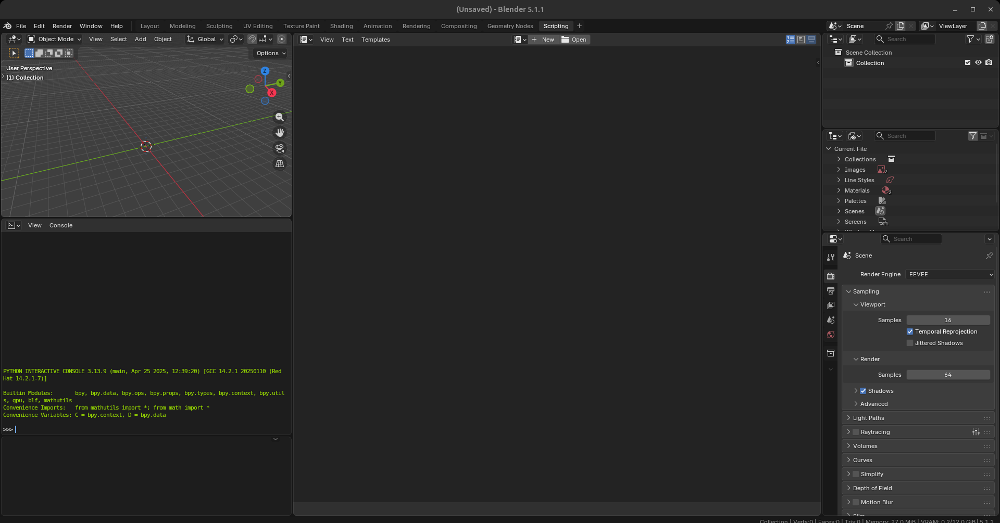
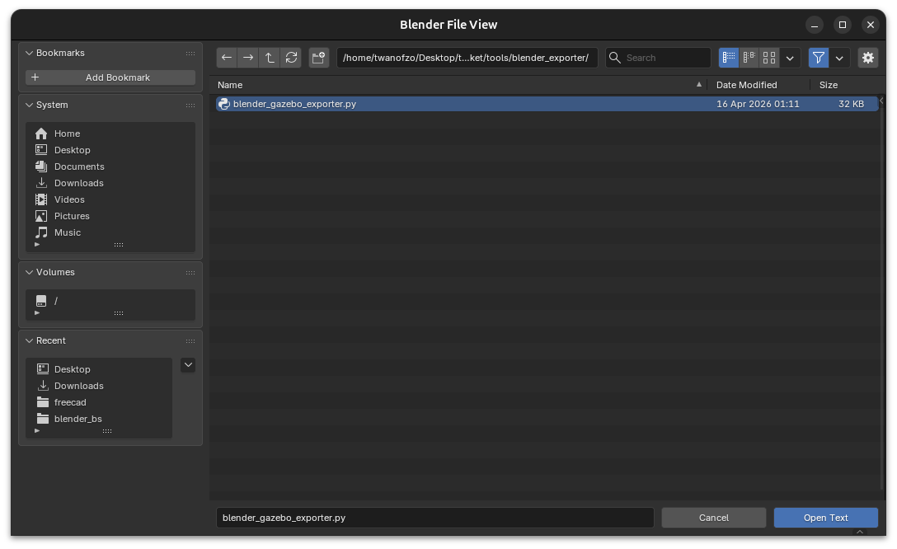
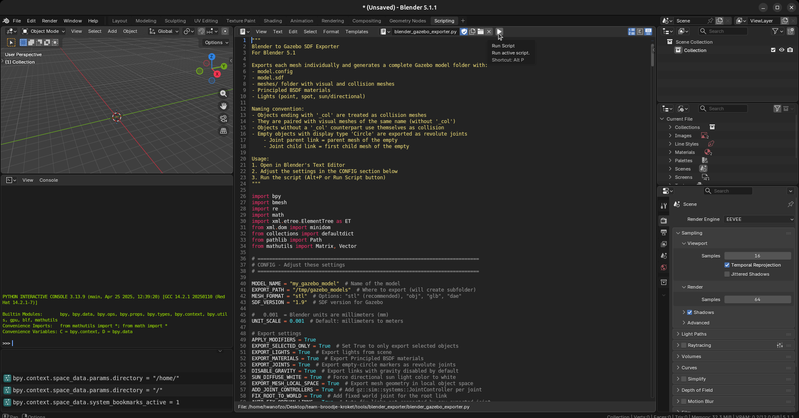

# Blender to Gazebo SDF Exporter

Exports Blender models to Gazebo SDF with meshes, collision geometry, lights, and revolute joints.
this exporter is for blender 5.1 (and maybe some other versions idk)

## Quick Start

1. Open `blender_gazebo_exporter.py` in Blender's Text Editor under scripting workspace

2. load the script

1. run it with the model you want to export selected( if enabled )


## Naming

- Objects ending with `_col` are collision meshes (paired with visual of same name)
- Empty circles are revolute joints (parent = empty's parent, child = first mesh child)
cause empty circles have no rotation they will always point 1 direction (-_-), change it in the sdf file(rotation in radians)

## Output

```
my_model/
├── model.config
├── model.sdf
└── meshes/
    ├── part1.stl
    ├── part1_col.stl
    └── part2.stl
```
