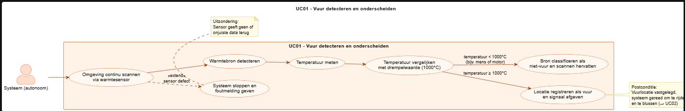
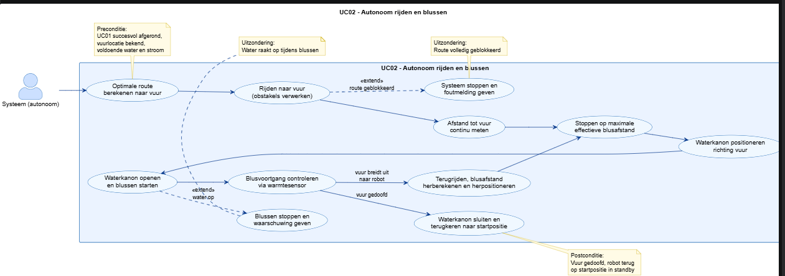

# Ontwikkeldocument Project ``De blussers``

Versie ``0.2``
Team ``De blussers``

## Inhoudsopgave

- [Ontwikkeldocument Project ``De blussers``](#ontwikkeldocument-project-de-blussers)
  - [Inhoudsopgave](#inhoudsopgave)
  - [Inleiding](#inleiding)
  - [Leeswijzer](#leeswijzer)
  - [Uitgangspunten](#uitgangspunten)
    - [Identificatie en prioritering van Key Drivers](#identificatie-en-prioritering-van-key-drivers)
  - [Requirements](#requirements)
    - [Functionele Requirements](#functionele-requirements)
    - [Niet-Functionele Requirements](#niet-functionele-requirements)
    - [Constraints](#constraints)
    - [Use Cases](#use-cases)
    - [Activity Diagrammen](#activity-diagrammen)

## Inleiding
Deze opdracht richt zich op het ontwikkelen van een autonoom navigatiesysteem voor een robottank in een gesimuleerde omgeving. Het doel van het project is dat de robot in staat is om zelfstandig warmtebronnen (vuur) te detecteren en hier autonoom naartoe kan navigeren.

Dit document dient als bron van informatie voor het ontwikkelteam. Het biedt een duidelijk overzicht van systeemarchitectuur, technische oplossingen en de onderliggende samenhang tussen de verschillende modules. Daarnaast is dit document bedoeld als overdrachtsdocument. Het geeft continuiteit van het project door toekomstige teams inzicht te geven over de implementatie en gemaakte ontwerpkeuzes.

## Leeswijzer

``leg uit wat er in de hoogste-niveau-hoofdstukken wordt behandeld en hoe deze onderwerpen met elkaar in verband staan``
Dit document biedt een overzicht van het ontwikkelproces voor het autonome navigatiesysteem van de robottank. De structuur volgt een logische lijn van doelstellingen.

- Key drivers en requirements: Hier worden de kritieke factoren en de functionele eisen beschreven die de richting van dit project hebben bepaald.
- Use cases: In dit hoofdstuk zij de requirements vertaald naar scenario's.
- Activity diagrammen: Hier is de logica van het systeem gevisualiseerd. Deze diagrammen laten zien hoe het systeem beslissingen neemt en hoe de verschillende sensoren met elkaar interacteren.

Elk technisch onderdeel is in de architectuur terug te herleiden naar een requirement. Hiermee zorgen we dat de uiteindelijke robottank voldoet aan de eisen van de opdrachtgever.

## Uitgangspunten
In dit hoofdstuk leggen we uit hoe we tot de requirements zijn gekomen. De basis voor dit project is gelegd in het overleg met de opdrachtgever.

Tijdens een start presentatie/meeting en diverse vervolggesprekken met de opdrachtgevers hebben we de wensen en technische eisen besproken en concreet gemaakt. Deze gesprekken vormen het beginpunt voor alle ontwerpkeuzes in dit document.

### Identificatie en prioritering van Key Drivers

| Prioriteit | Key Driver | Omschrijving |
| ---------- | ---------- | ------------ |
| 1 | Veiligheid voor de mede mens en de robot | De robot mag geen gevaar zijn voor omstanders, hulpverleners of zichzelf. |
| 2 | Betrouwbaarheid van vuurdetectie | Het systeem moet vuur consistent en correct herkennen. |
| 3 | Autonomie | De robot moet zonder menselijke besturing kunnen detecteren, navigeren, positioneren en blussen. |
| 4 | Robuust | De robot moet betrouwbaar zijn bluspositie bereiken en daarbij obstakels detecteren en vermijden.|
| 5 | Onderhoudbaarheid en uitbreidbaarheid | Het systeem moet modulair en goed gedocumenteerd zijn, zodat een ander team het kan overnemen en verder kan uitbreiden. |

## Requirements

``leg uit hoe de requirements opgesteld worden door de samenhang te verwoorden van de onderwerpen uit de sub-hoofdstukken.``
In dit hoofdstuk werken we de eisen van het project/systeem uit. De requirements komen voort uit de combinatie van de wensen van de opdrachtgever, functionele scenario's en technische randvoorwaarden.

### Functionele Requirements

``Beschrijf de relevante functionele requirements``

| Naam                | ``F01 - Robot kan de wartme van vuur detecteren en onderscheiden van andere warmte bronnen``                                       |
| ------------------- | ------------------------------------------------------- |
| Omschrijving        | ``De robot kan de warmte van vuur detecteren en onderscheiden van andere wartme bronnen zoals een auto, motor of mens.``                                                        |
| Rationale           | ``Reden, verband met key driver of parent-requirement.`` |
| Business prioriteit | ``M``                                              |

| Naam                | ``F02 - Het waterkanon kan uit zichzelf bewegen.``                                       |
| ------------------- | ------------------------------------------------------- |
| Omschrijving        | ``Het waterkanon kan bewegen om op de juiste positie te komen. Waardoor niet de hele robot hoeft te bewegen.``                                                        |
| Rationale           | ``Reden, verband met key driver of parent-requirement.`` |
| Business prioriteit | ``M``                                              |

| Naam                | ``F03 - De robot kan tussen positie a en positie b obstakels vermijden/overheen gaan.``                                       |
| ------------------- | ------------------------------------------------------- |
| Omschrijving        | `` Als de robot weet waar die heen moet rijden moet het rekening houden met obstakels. De robot moet detecteren waar de obstakels zijn en hoe die dat moet aanpakken. Rijdt die er omheen? Of eroverheen? ``                                                        |
| Rationale           | ``Reden, verband met key driver of parent-requirement.`` |
| Business prioriteit | ``M``                                              |

| Naam                | ``F04 - de robot kan autonoom rijden/blussen.``                                       |
| ------------------- | ------------------------------------------------------- |
| Omschrijving        | ``De robot moet uit zichzelf richting het vuur rijden en zich positioneren. De robot moet ook uit zichzelf weten hoe die het waterkanon moet positioneren om het vuur te raken. Dat is iets wat de robot uit zichzelf moet kunnen uitvoeren.``                                                     |
| Rationale           | ``Reden, verband met key driver of parent-requirement.`` |
| Business prioriteit | ``M``                                              |

| Naam                | ``F05 - De robot weet zelf op welke positie die staat.``                                       |
| ------------------- | ------------------------------------------------------- |
| Omschrijving        | ``De robot moet weten hoe die staat. Ligt die schuin? Dit moet de robot dat weten om het waterkanon goed af te stellen of om tijdens het rijden het waterkanon te corrigeren.``                                                     |
| Rationale           | ``Reden, verband met key driver of parent-requirement.`` |
| Business prioriteit | ``M``                                              |

### Niet-Functionele Requirements

``Beschrijf de relevante Niet-Functionele Requirements``
| Naam                | ``NF01 - De robot moet warmte kunnen detecteren van 1000 graden celsius.``                                                                   |
| ------------------- | ------------------------------------------------------------------------------------------------------------------------------------ |
| Omschrijving        | ``De robot moet vuur kunnen detecteren van 1000 graden celsius. ``                                                                            |
| Rationale           | ``Lagere temperaturen kunnen ervoor zorgen dat de robot op andere objecten water schiet dan vuur.``                                                                                               |
| Business prioriteit | ``M`` |

| Naam                | ``NF02 - De robot houdt een veilige afstand van de brand tijdens het blussen.``                                                                                                           |
| ------------------- | ------------------------------------------------------------------------------------------------------------------------------------ |
| Omschrijving        | ``De robot moet zich op de maximale afstand van de brand bevinden, terwijl het waterkanon de brand nog effectief kan bereiken.``                                                                            |
| Rationale           | ``Als de robot te dicht bij de brand komt dan kan het schade opleveren aan de robot.``                                                                                               |
| Business prioriteit | ``M`` |

| Naam                | ``NF03 - De robot kan over obstakels van maximaal 50 centimeter heen rijden.``                                                                                                           |
| ------------------- | ------------------------------------------------------------------------------------------------------------------------------------ |
| Omschrijving        | ``De robot moet in staat zijn obstakels te overbruggen, zodat die zo snel mogelijk zijn bluspositie kan bereiken.``                                                                            |
| Rationale           | ``Anders moet de robot te veel afwijken vanwege obstakels, wat leidt tot vertraging en desoriëntatie.``                                                                                               |
| Business prioriteit | ``M`` |

| Naam                | ``NF04 - Het waterkanon moet minimaal 180 graden kunnen draaien horizontaal en verticaa.l``                                                                                                           |
| ------------------- | ------------------------------------------------------------------------------------------------------------------------------------ |
| Omschrijving        | ``Het waterkanon moet voldoende beweeglijk zijn, zodat er meer controle is over het blusproces.``                                                                            |
| Rationale           | ``Anders zou de gehele tank moeten bewegen om de positie van het waterkanon aan te passen, wat tijd kost.``                                                                                               |
| Business prioriteit | ``M`` |

### Constraints

``Beschrijf de relevante Constraints``

| Naam         | ``C02 - Jaarlijkse onderhoudskosten``                     |
| ------------ | --------------------------------------------------------- |
| Omschrijving | ``quantificeerbare of anderszins meetbare omschrijving `` |
| Rationale    | ``reden: waarom kan het niet anders?``                    |

### Use Cases

`` Een of meerdere use case diagram(men) met bijbehorende use case beschrijvingen ``

| Naam           | ``UC04 - Lamp Selecteren``                                                                                                                                                                                                                 |
| -------------- | ------------------------------------------------------------------------------------------------------------------------------------------------------------------------------------------------------------------------------------------ |
| Actor          | ``gebruiker``                                                                                                                                                                                                                              |
| Samenvatting   | ``evt. een beschrijving, voor zover de naam het niet al voldoende dekt``                                                                                                                                                                   |
| Preconditie    | ``alleen voor zover niet triviaal. typisch alleen nodig indien onderdeel van een parent-usecase, bijvoorbeeld "Lamp Selectie Menu" is geselecteerd in het hoofdmenu``                                                                      |
| Scenario       | ``voorbeeld van een typische volgorde van interacties, bij voorkeur geschreven vanuit het gezichtspunt van het systeem.``                                                                                                                  |
| Scenario 2     | ``... indien nodig additionele``                                                                                                                                                                                                           |
| Invariant      | ``Iets waarvoor het systeem voortdurend zorgt, waardoor dat niet steeds herhaald hoeft te worden. (kan soms van toepassing zijn. Bijvoorbeeld: 'ten alle tijde kan "apply" worden geselecteerd om aangepaste eigenschappen op te slaan')`` |
| Postconditie   | ``alleen voor zover niet triviaal. typisch alleen indien onderdeel van parent-usecase. bijvoorbeeld teruggekeerd naar het parent menu``                                                                                                    |
| Uitzonderingen | ``alleen als er tijdens het scenario iets gebeurt wat niet in lijn is met de oorspronkelijke bedoeling van de usecase.``

### Use Cases
In dit hoofdstukt wordt er beschreven hoe de robot in de praktijk omgaat met de gestelde requirements. De use cases beschrijven hoe het er in de gesimuleerde omgeving er uit ziet.

| Naam           | UC01 - Vuur detecteren en onderscheiden |
| -------------- | --------------------------------------- |
| Actor          | Systeem (autonoom) |
| Samenvatting   | De robot scant continu de omgeving en detecteert of een warmtebron vuur is (≥1000°C), ter onderscheiding van mensen, voertuigen of andere warmtebronnen. |
| Preconditie    | De robot is ingeschakeld en bevindt zich in standby-modus. |
| Scenario       | 1. Het systeem scant continu de omgeving via de warmtesensor. 2. Het systeem detecteert een warmtebron in de omgeving. 3. Het systeem meet de temperatuur van de warmtebron. 4. Het systeem vergelijkt de gemeten temperatuur met de drempelwaarde van 1000°C. 5. De temperatuur overschrijdt de drempelwaarde: het systeem registreert de locatie als vuur. 6. Het systeem geeft een signaal af en start het autonoom rijden en blussen. |
| Scenario 2     | De gemeten temperatuur is lager dan 1000°C (bijv. een mens of motor): het systeem classificeert de bron niet als vuur en hervat het scannen. |
| Invariant      | Het systeem scant continu de omgeving, ook tijdens het rijden en blussen. |
| Postconditie   | De locatie van het vuur is vastgelegd en het systeem is gereed om te rijden en te blussen. |
| Uitzonderingen | De warmtesensor geeft geen of onjuiste data terug: het systeem stopt en geeft een foutmelding. |

| Naam           | UC02 - Autonoom rijden en blussen |
| -------------- | --------------------------------- |
| Actor          | Systeem (autonoom) |
| Samenvatting   | De robot rijdt zelfstandig naar het gedetecteerde vuur, positioneert zich op een veilige blusafstand, richt het waterkanon en blust het vuur. |
| Preconditie    | UC01 is succesvol afgerond: de vuurlocatie is bekend. De robot heeft voldoende water en stroom. |
| Scenario       | 1. Het systeem berekent de optimale route naar het vuur. 2. De robot rijdt naar het vuur en verwerkt eventuele obstakels onderweg. 3. Het systeem meet continu de afstand tot het vuur. 4. De robot stopt op de maximale effectieve blusafstand. 5. Het systeem bepaalt de huidige stand van de robot. 6. Het waterkanon wordt gepositioneerd richting het vuur. 7. Het waterkanon opent en het blussen start. 8. Het systeem controleert via de warmtesensor of het vuur afneemt. 9. Wanneer het vuur gedoofd is, sluit het waterkanon en keert de robot terug naar de startpositie. |
| Scenario 2     | Het vuur breidt zich uit richting de robot: het systeem rijdt terug, herberekent de blusafstand en herpositioneert. |
| Invariant      | De robot blijft gedurende het gehele blusproces op een veilige afstand van het vuur. De waterkanon-instelling wordt continu gecorrigeerd op basis van de stand van de robot. |
| Postconditie   | Het vuur is gedoofd. De robot bevindt zich terug op de startpositie in standby-modus. |
| Uitzonderingen | Het water raakt op tijdens het blussen: het systeem stopt het blussen en geeft een waarschuwing. De route naar het vuur is volledig geblokkeerd: het systeem stopt en geeft een foutmelding. |

### Activity Diagrammen
In dit hoofdstuk worden de use cases vertaalt naar concrete processtromen. De activity diagrammen visualiseert de beslisstappen die de robottank doorloopt om een taak uit te voeren.

### Diagram 1

### Diagram 2

# Apendix