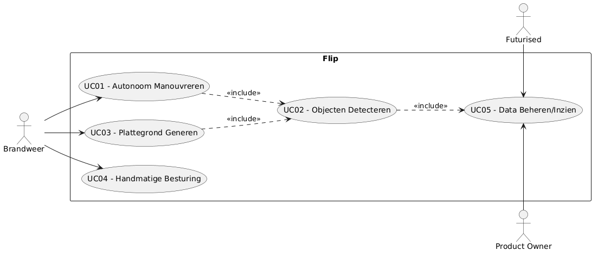
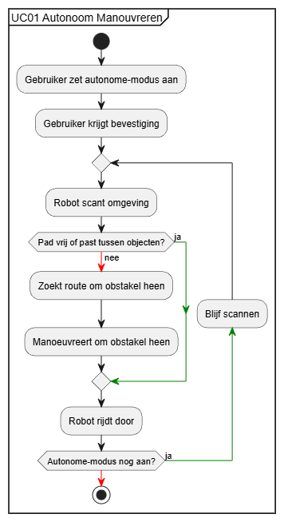
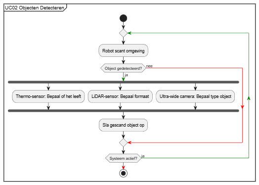
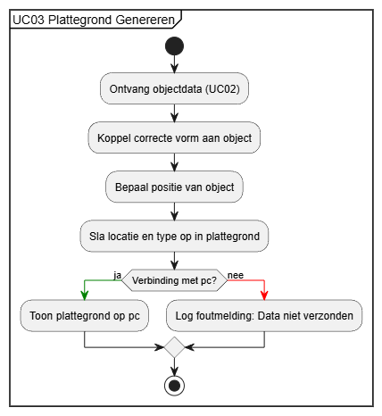
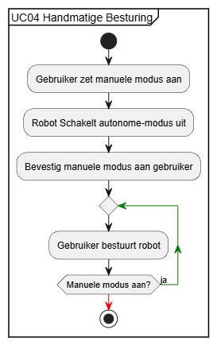
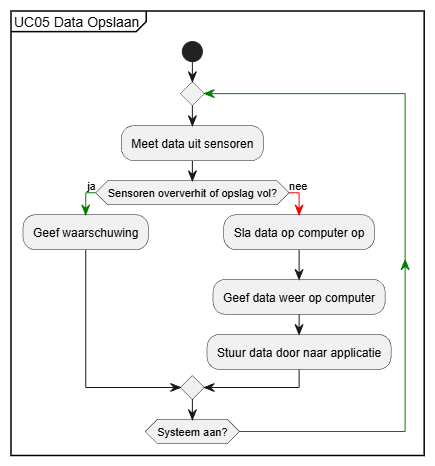

# Ontwikkeldocument Project Futurised-2

**Versie:** 2.0 \
**Team:** WaterBenders

## Inhoudsopgave

- [Ontwikkeldocument Project Futurised-2](#ontwikkeldocument-project-futurised-2)
- [Inhoudsopgave](#inhoudsopgave)
- [Inleiding](#inleiding)
- [Identificatie en prioritering van Key Drivers](#identificatie-en-prioritering-van-key-drivers)
- [Requirements](#requirements)
    - [Functionele Requirements](#functionele-requirements)
    - [Niet-Functionele Requirements](#niet-functionele-requirements)
- [Constraints](#constraints)
- [Use Cases](#use-cases)
- [Activity Diagrammen](#activity-diagrammen)

## Inleiding
In opdracht van het bedrijf FUTURISED gaat ons team aan de slag met de ontwikkeling van een autonoom robotsysteem. De kern van deze opdracht draait om het virtueel nabouwen van de robot *Flip* binnen een simulatieomgeving. Het doel is om deze robot uit te rusten met verschillende sensoren, waardoor het systeem in staat is om volledig autonoom te navigeren, beslissingen te nemen en taken uit te voeren. Door de integratie van deze sensoren en de ontwikkeling van de aansturingssoftware wordt de werkelijke robot zo nauwkeurig mogelijk nagebootst binnen de simulatie.

## Identificatie en prioritering van Key Drivers

Stakeholders:
- Gebruiker 
- Opdrachtgever (product owner)
- Klant (Futurised)

| Key Driver          | Stakeholders         | Beschrijving                                                                                                                                                                                                                                |
| ------------------- | -------------------- | ------------------------------------------------------------------------------------------------------------------------------------------------------------------------------------------------------------------------------------------- |
| Overdraagbaarheid   | Opdrachtgever        | Voor extra uitleg over het systeem is er documentatie in de vorm van comments in de code en diagrammen in het ontwikkel document. Daarnaast is de code overzichtelijk en goed leesbaar. Dit draagt bij aan de duurzaamheid van het product. |
| Onafhankelijkheid   | Opdrachtgever, klant | De robot kan uit zichzelf navigeren en bepaalde beslissing maken, waarbij geen hulp nodig is van een extra persoon.                                                                                                                         |
| Gebruiksvriendelijk | Gebruiker            | Het systeem moet ook voor niet-technische mensen goed bruikbaar zijn.                                                                                                                                                                       |

## Requirements

### Functionele Requirements

| F01 | Manouvreren |
| --- | --- |
| **Beschrijving** | De robot manouvreert om objecten heen. |
| **Rationele** | De robot kan hierdoor autonoom rijden in een omgeving, zonder zelf te kunnen manouveren valt het autonome weg. |
| **Prioriteit** | Must-have |

---
---

| F02 | Objecten Herkennen |
| --- | --- |
| **Beschrijving** | Als opdrachtgever wil ik dat de robot objecten kan herkennen in de simulatie.  |
| **Rationele** | Zodat hij die data kan gebruiken voor manouvreren, blussen en redden bijvoorbeeld. |
| **Prioriteit** | Must-have |

---
---

| F03 | Plattegrond Genereren |
| --- | --- |
| **Beschrijving** | Er wordt een plattegrond gegeneerd van de ruimte waar de robot zich in bevindt.  |
| **Rationele** | Hierdoor krijgt de bestuurder een beter inzicht van de omgeving en situatie. |
| **Prioriteit** | Must-have |

---
---

| F04 | Autonoom Rijden |
| --- | --- |
| **Beschrijving** | De robot kan zonder aangestuurd te worden, manouvreren om objecten heen.  |
| **Rationele** | Hierdoor hoeft de bestuurder niet constant handmatig te controleren op de robot. |
| **Prioriteit** | Must-have |

---
---

| F05 | Handmatig Besturen |
| --- | --- |
| **Beschrijving** | De robot kan ook handmatig bestuurd worden op afstand. |
| **Rationele** | Hierdoor kan er ingegrepen worden door de bestuurder wanneer dit nodig is. |
| **Prioriteit** | Must-have |

---
---

| F06              | Afstanden detecteren                                                                                                           |
| ---------------- | ------------------------------------------------------------------------------------------------------------------------------ |
| **Beschrijving** | De robot meet afstanden tot objecten.                                                                                          |
| **Rationele**    | Door afstanden te detecteren heeft de robot genoeg tijd om richting en snelheid aan te passen om om het object heen te rijden. |
| **Prioriteit**   | Must-have                                                                                                                      |

---
---

| F07              | Thermal Sensor                                                                            |
| ---------------- | ----------------------------------------------------------------------------------------- |
| **Beschrijving** | Als product ontwikkelaar wil ik dat de robot gebruik maakt van een thermal sensor.        |
| **Rationele**    | Hierdoor kan de robot de heat signature van een mens of een brandend object te herkennen. |
| **Prioriteit**   | Could-have                                                                                |

---
---

| F08              | Ultra-Wide Camera                                                             |
| ---------------- | ----------------------------------------------------------------------------- |
| **Beschrijving** | Als product ontwikkelaar wil ik dat de robot een ultra-wide camera gebruikt.  |
| **Rationele**    | Hierdoor heeft de robot een groot overzicht van zijn omgeving.                |
| **Prioriteit**   | Could-have                                                                    |

---
---

| F09              | Audio Communicatie                                                                                                 |
| ---------------- | ------------------------------------------------------------------------------------------------------------------ |
| **Beschrijving** | Als product ontwikkelaar wil ik dat de robot een microfoon en speaker heeft in de Gazebo simulatie.                |
| **Rationele**    | Hierdoor kan de robot geluid ontvangen en versturen, zodat communicatie met slachtoffers of operators mogelijk is. |
| **Prioriteit**   | Could-have                                                                                                         |

### Niet-Functionele Requirements

| NF01             | Maximale Afstand                                                                                                                                |
| ---------------- | ----------------------------------------------------------------------------------------------------------------------------------------------- |
| **Beschrijving** | De robot meet afstanden met een lidar sensor en kan een minimale afstand houden tot objecten en obstakels van Xcm wanneer de gebruiker dit wil. |
| **Rationele**    | Met een afstand van Xcm wordt botsing met objecten voorkomen.                                                                                   |

---
---

| NF02             | Bochten Maken                                                                                                                       |
| ---------------- | ----------------------------------------------------------------------------------------------------------------------------------- |
| **Beschrijving** | De robot kan een bocht maken van ? graden per seconde met rupsbanden. -> kan om eigen as draaien  Feedback: (bart: graden per s) |
| **Rationele**    | Door bochten te kunnen maken kan De robot om objecten heen bewegen zonder er tegenaan te botsen of snelheid te verliezen.           |

---
---

| NF03             | Visuele/Auditieve Feedback                                                                 |
| ---------------- | ------------------------------------------------------------------------------------------ |
| **Beschrijving** | De robot geeft een signaal naar bestuurder zodra een obstakel binnen 20cm is.              |
| **Rationele**    | Door visuele/auditieve feedback te geven, kan een mens ingrijpen wanneer nodig of gewenst. |

---
---

| NF04             | Dimensies Bepalen                                                                                                    |
| ---------------- | -------------------------------------------------------------------------------------------------------------------- |
| **Beschrijving** | Als product ontwikkelaar wil ik dat de dimensies van objecten bepaald kunnen worden met behulp van een lidar sensor. |
| **Rationele**    | Hierdoor kan het formaat van objecten ingeschat worden.                                                              |

---
---

| NF05             | Thermal Sensor                                                                                         |
| ---------------- | ------------------------------------------------------------------------------------------------------ |
| **Beschrijving** | De thermal camera heeft een beeldhoek van X graden en een resolutie van X pixels.                      |
| **Rationele**    | Hierdoor kan de robot de heat signature van een mens of een brandend object te herkennen en weergeven. |

---
---

| NF06             | Ultra-Wide Camera                                              |
| ---------------- | -------------------------------------------------------------- |
| **Beschrijving** | De ultra-wide camera heeft een beeldhoek van X graden          |
| **Rationele**    | Hierdoor heeft de robot een groot overzicht van zijn omgeving. |

---
---

| NF07             | Snelheid Plattegrond Genereren                                       |
| ---------------- | -------------------------------------------------------------------- |
| **Beschrijving** | De plattegrond moet binnen Xs worden gegenereerd.                    |
| **Rationele**    | Door dit snel te generen krijgt de bestuurder sneller een overzicht. |

---
---

| NF08             | Hoeveelheid Objecten Genereren                                                                                                                |
| ---------------- | --------------------------------------------------------------------------------------------------------------------------------------------- |
| **Beschrijving** | De plattegrond moet minimaal X objecten kunnen weergeven binnen een straal van Xm. -> filteren met een 'boundary'-box, zelf in kunnen stellen |
| **Rationele**    | Hierdoor weet de bestuurder door hoeveel objecten de robot moet manouvreren.                                                                  |

---
---

| NF09             | Objecten Vormgeven                                                      |
| ---------------- | ----------------------------------------------------------------------- |
| **Beschrijving** | Er worden vormen gebruikt om objecten op de plattegrond aan te tonen.   |
| **Rationele**    | Hierdoor kan de bestuurder en robot zien wat voor object is getecteerd. |

---
---

| NF10 | Data Opslaan |
| --- | --- |
| **Beschrijving** | De data van een object wordt opgeslagen in een database als het is gedetecteerd. |
| **Rationele** | Hierdoor hoeft de data in een keer maar eenmaal te generen en kan de situatie voor de toekomst worden geanalyseerd. |

---
---

| NF11             | Vooruit en Achteruit Rijden                                                                              |
| ---------------- | -------------------------------------------------------------------------------------------------------- |
| **Beschrijving** | De robot kan zowel vooruit als achteruit rijden met een snelheid van Xkm/u door middel van een rupsband. |
| **Rationele**    | Op deze manier kan de robot meerdere richtingen op manouvreren.                                          |

---
---

| NF12             | Hitte Bestendig                                                                   |
| ---------------- | --------------------------------------------------------------------------------- |
| **Beschrijving** | De sensoren op de robot werken tot een temperatuur van maximaal X graden Celsius. |
| **Rationele**    | Hierdoor kan de robot goed functioneren in erg hete ruimtes.                      |

---
---

| NF13             | Algoritmisch Rijden                                                    |
| ---------------- | ---------------------------------------------------------------------- |
| **Beschrijving** | De robot rijdt autonoom door middel van een geschreven algoritme.      |
| **Rationele**    | Het algoritme zorgt ervoor dat de robot werkelijk autonoom kan rijden. |

---
---

## Constraints

| C01              | Hittebestendidheid                                                                                     |     |
| ---------------- | ------------------------------------------------------------------------------------------------------ | --- |
| **Beschrijving** | De robot functioneerd niet bij een temperatuur van 125 graden.                                         |     |
| **Rationele**    | De sensoren op de robot hebben een limiet, als deze limiet overschreden wordt, functioneren deze niet. |     |

## Use Cases

| Naam | UC01 Autonoom Manouvreren |
| --- | --- |
| Actor | Brandweer |
| Samenvatting   | De robot detecteerd objecten en manouvreert hier omheen met behulp van een algoritme. |
| Preconditie    | De robot staat aan. |
| Scenario       | 1. Gebruiker zet autonome-modus aan. 2. Gebruiker krijgt bevestiging dat de robot in autonome-modus staat. 3. Robot begint met scannen. 4. Robot detecteert een of meerdere obstakels 5a. Als het pad voor de robot vrij is of hij tussen obstakels past, rijdt hij die richting op. 5b. Als het pad niet vrij is zoekt de robot naar een manier om het obstakel heen te rijden. 6. De robot rijdt tussen het obstakel door of om het obstakel heen. |
| Invariant      | De robot is contstant aan het scannen. |
| Postconditie   | - |
| Uitzonderingen | De gebruiker schakelt autonome-modus uit.|

---
---
---

| Naam | UC02 Objecten Detecteren |
| --- | --- |
| Actor | Brandweer |
| Samenvatting   | De robot detecteerd verschillende soorten objecten. |
| Preconditie    | De robot staat aan. |
| Scenario       | 1. De robot scant omgeving 2. De robot detecteerd een object. 3. De robot bepaald aan de hand van de sensoren wat voor object dit is. 3a. Aan de hand van de thermo-sensor bepaalt de robot of het een levend wezen is. 3b. Aan de hand van de lidar sensor bepaalt de robot het formaat van het object. 3c. Aan de hand van de ultra-wide camera kan de robot bepalen wat voor object het is. 4. Het gescande obstakel wordt opgeslagen. |
| Invariant      | De robot is contstant aan het scannen. |
| Postconditie   | De robot slaat het object op in een plattegrond (UseCase 3). |
| Uitzonderingen | De robot kan het object niet detecteren als een van de sensoren niet goed werkt. |

---
---
---

| Naam | UC03 Plattegrond Genereren |
| --- | --- |
| Actor | Brandweer |
| Samenvatting   | De robot detecteerd objecten en slaat deze op in een plattegrond |
| Preconditie    | De robot staat aan en er wordt data ontvangen. |
| Scenario       | 1. De robot detecteerd object(en)(UseCase 2). 2. Aan de hand van het object koppelt de robot de correcte vorm aan het object. 3. De robot bepaalt de positie van het object. 4. De robot slaat de locatie en soort object op in de plattegrond. 5. De bestuurder ziet de plattegrond op de 'pc'.|
| Invariant      | De robot is contstant aan het scannen. |
| Postconditie   | - |
| Uitzonderingen | De robot kan de data van het object niet verzenden of opslaan. |

---
---
---

| Naam | UC04 - Handmatige besturing |
| --- | --- |
| Actor | Brandweer |
| Samenvatting   | De robot kan handmatig worden bestuurd wanneer dit gewenst is vanuit de bestuurder. |
| Preconditie    | De robot staan aan. |
| Scenario       | 1. Gebruiker zet manuele modus aan.   2. De besturing wordt overgedragen aan de brandweer en de autonome-modus wordt uitgezet.   3. Gebruik krijgt bevestiging dat de robot in manuele modus staat. 4. Gebruiker bestuurd de robot |
| Invariant      | Ten alle tijden kan de robot weer terug worden gezet naar autonome-modus. |
| Postconditie   | - |
| Uitzonderingen | Wanneer de robot in gevaar verkeert en inactief is. |

---
---
---

| Naam | UC05 - Data Beheren/Inzien |
| --- | --- |
| Actor | Bart, Futurised |
| Samenvatting   | Ten alle tijden slaat de robot al zijn verkregen data op, op een veilige plek. |
| Preconditie    | De sensoren krijgen metingen binnen. |
| Scenario       | 1. Data uit een sensor wordt constant gemeten.  2. Deze data wordt meteen opgeslagen op de computer. 3. De data wordt op de computer weergegeven. |
| Invariant      | De robot is constant aan het scannen |
| Postconditie   | De data wordt doorgestuurd naar de juiste applicatie die deze vervolgens verwerkt en gebruikt. |
| Uitzonderingen | Er is geen data opslag meer of de sensoren riskeren overvehitting. |

---
---
---

| Naam | UC06 - Audio Communicatie |
| --- | --- |
| Actor | Brandweer |
| Samenvatting   | De robot kan audio ontvangen en afspelen via een microfoon en speaker in de simulatie. |
| Preconditie    | De robot staat aan en de audio componenten zijn actief in Gazebo. |
| Scenario       | 1. De robot activeert de microfoon.  2. Geluid wordt opgenomen vanuit de omgeving.  3. De audio wordt doorgestuurd naar de operator.  4. De operator spreekt een bericht in.  5. De robot ontvangt dit bericht.  6. De speaker speelt het bericht af in de omgeving van de robot. |
| Invariant      | De audioverbinding blijft actief zolang de robot aanstaat. |
| Postconditie   | De operator en omgeving kunnen met elkaar communiceren via de robot |
| Uitzonderingen | De microfoon of speaker werkt niet correct of er is geen verbinding. |

## Use-case diagram

## Activity Diagrammen

 \
*UC01 - Autonoom Manouvreren*

 \
*UC02 - Objecten Decteren*

 \
*UC03 - Plattegrond Generegen*

 \
*UC04 - Handmatige Besturing*

 \
*UC05 - Data Opslaan*

# Conclusion and Recommendations

One of the main challenges encountered during the project was the integration of all prototypes into a single simulation environment. While most components functioned correctly on their own, combining all systems into one complete Digital Twin introduced performance issues and increased complexity within the simulation environment. Due to time constraints and the complexity of integration, a fully optimized combined implementation could not be completed within the project period.

For future project teams, we strongly recommend integrating completed prototypes into the main project as early as possible rather than waiting until the end of development. Continuous integration allows performance bottlenecks, compatibility issues and resource limitations to be identified and addressed earlier in the development process. This approach will make it easier to monitor system performance, maintain stability and achieve a fully integrated Digital Twin.

We hope this repository, documentation and collection of prototypes provide a strong foundation for future development and further improvements of the FLIP robot.
