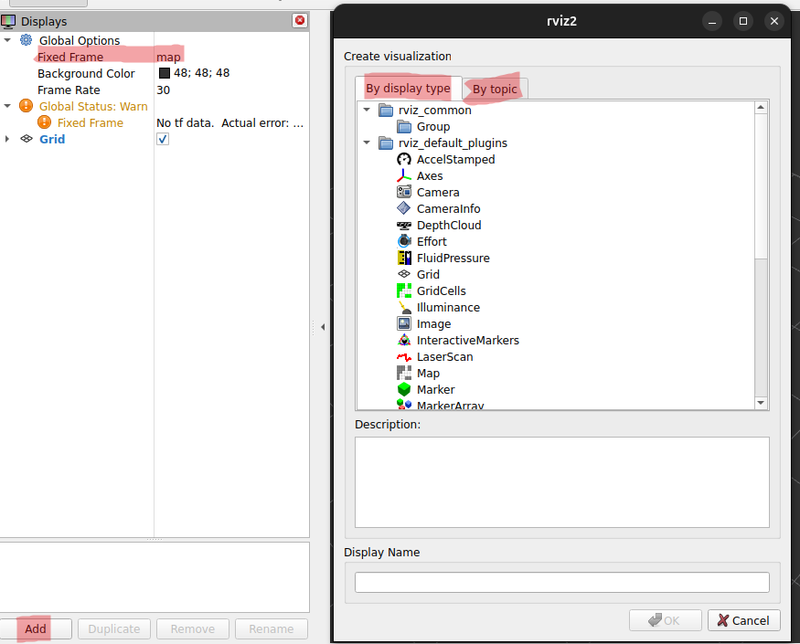
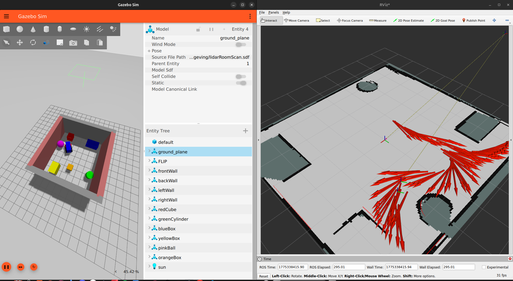
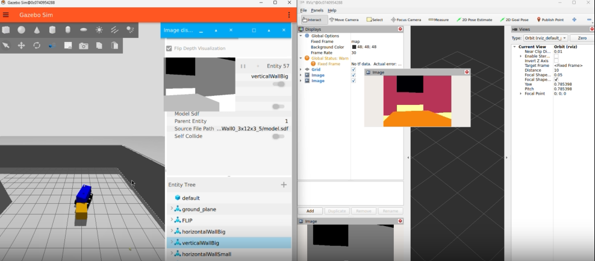

# RViz Visualisation

RViz is an application that visualises multiple sensor outputs in the app. Inside RViz it's possible to choose to show **every topic** that is being published from the Python files. This app might seem sifficult to understand, but it's actually pretty simple.

# Running RViz
*RViz can only be useful if the Gazebo environment **and** Python scripts are running.*


In order to make sure RViz can receive the data from the publishers, one must first bridge ROS2 to RViz:
```bash
source /opt/ros/jazzy/setup.bash
ros2 run ros_gz_bridge parameter_bridge \
/camera/image@sensor_msgs/msg/Image@gz.msgs.Image \
/FLIP/thermal_camera@sensor_msgs/msg/Image@gz.msgs.Image \
/front/image@sensor_msgs/msg/Image@gz.msgs.Image \
/rear/image@sensor_msgs/msg/Image@gz.msgs.Image
```
*Keep in mind this is the example that is used inside this project, topics might change based on different sensores and/or names.*

Next open RViz in a **different** Terminal:
```bash
source /opt/ros/jazzy/setup.bash
rviz2
```

# What to do in Rviz
Now once RViz is running it's possible to visualise the data that is being published.



**In RViz UI:**

1. Click Add
2. Select Image
3. Set topic to the topic wished to be shown: <br>
        `/thermal/heatmap_image/image`

Do this for every topic needed to be visualized and/or shown. Below is an example image of one of the earlier prototypes with the LiDAR sensor and the thermal camera:



