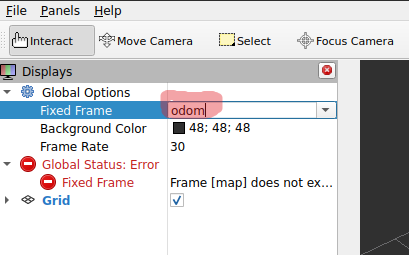
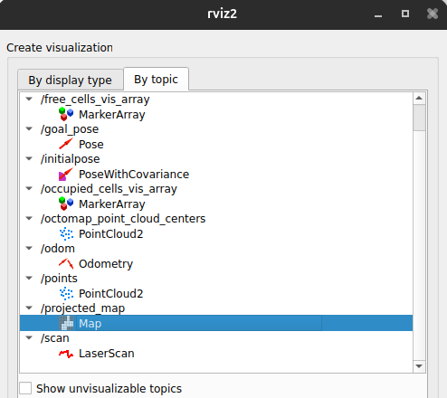
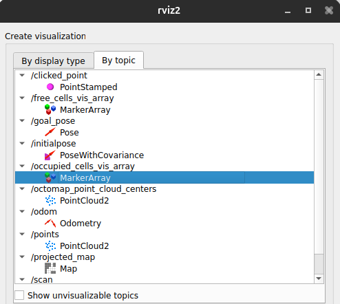
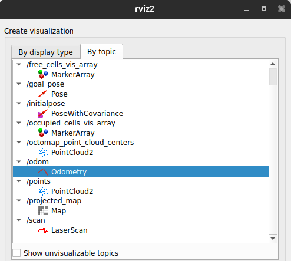
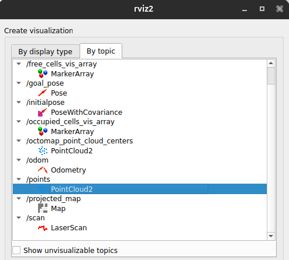
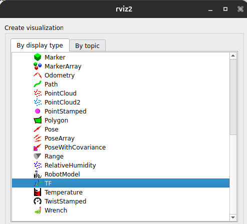

# OctoMap
*13/06/2026*<br>
*Radeiaan Nandoe*

# Table of Contents
- [Context](#context)
- [Structure](#structure)
  - [Description](#description)
- [Reasoning](#reasoning)
- [Implementation](#implementation)
  - [1. PointCloud2 bridge](#1-pointcloud2-bridge)
  - [2. Launch file](#2-launch-file)
  - [Conclusion](#conclusion)
- [Setup](#setup)
  - [Installation](#installation)
  - [Running files](#running-files)
  - [Visualizing map in RViz](#visualizing-map-in-rviz)
- [Advice](#advice)
- [Sources](#sources)


# Context
This folder contains the first prototype for 3D mapping of the simulated environment, built on top of the existing LiDAR sensor setup from [lidarSensorOmgeving](../lidarSensorOmgeving/). After establishing a working LiDAR integration in Gazebo, the next step was to produce a 3D occupancy map. OctoMap was chosen as the starting point for this.

# Structure
```md
3D-Octomap/
├── Screenshots/
│   ├── add.png
│   ├── fixedFrameOdom.png
│   ├── map.png
│   ├── markerArray.png
│   ├── odometry.png
│   ├── pointcloud2.png
│   └── tf.png
├── teleop/
│   ├── CMakeLists.txt
│   ├── CMakeTeleopGuide.md
│   ├── teleop.cc
│   └── teleop (binary)
├── lidarRoomScan.sdf
├── octomap_gazebo.launch.py
├── octomap.mp4
├── ReadME.md
└── rosBridge.yaml
```

## Description

- **Screenshots/:** screenshots used to guide RViz setup
- **teleop/:** custom teleop package for driving the robot
- **lidarRoomScan.sdf:** SDF environment file with the FLIP robot and a room to scan
- **octomap_gazebo.launch.py:** launch file for ros_gz_bridge, static TF publisher, and octomap_server_node
- **octomap.mp4:** screen recording of the OctoMap prototype in action
- **ReadME.md:** this file
- **rosBridge.yaml:** bridges Gazebo topics to ROS2 topics


# Reasoning
After getting the LiDAR sensor working in simulation it was time to start building a 3D map of the environment. OctoMap was selected as one of the first approaches because it is a well-established and lightweight 3D occupancy mapping library with solid ROS2 support via `octomap_server`. Its octree-based data structure efficiently represents free, occupied, and unknown space in 3D, making it a natural fit for LiDAR point cloud data. The low setup overhead (a single installable ROS2 package) made it an attractive starting point before committing to more complex SLAM pipelines.


# Implementation
The core of this prototype is bridging the LiDAR point cloud from Gazebo into ROS2 and feeding it into `octomap_server_node`.

## 1. PointCloud2 bridge
In [rosBridge.yaml](./rosBridge.yaml) a bridge was added to forward the 3D LiDAR point cloud from Gazebo to ROS2:
```yaml
- ros_topic_name: "/points"
  gz_topic_name: "/lidar/points"
  ros_type_name: "sensor_msgs/msg/PointCloud2"
  gz_type_name: "gz.msgs.PointCloudPacked"
  direction: GZ_TO_ROS
```

The following existing bridges were also kept:
```yaml
- ros_topic_name: "/odom"
  gz_topic_name: "/model/FLIP/odometry"
  ros_type_name: "nav_msgs/msg/Odometry"
  gz_type_name: "gz.msgs.Odometry"
  direction: GZ_TO_ROS

- ros_topic_name: "/tf"
  gz_topic_name: "/model/FLIP/tf"
  ros_type_name: "tf2_msgs/msg/TFMessage"
  gz_type_name: "gz.msgs.Pose_V"
  direction: GZ_TO_ROS

- ros_topic_name: "/clock"
  gz_topic_name: "/clock"
  ros_type_name: "rosgraph_msgs/msg/Clock"
  gz_type_name: "gz.msgs.Clock"
  direction: GZ_TO_ROS

- ros_topic_name: "/cmd_vel"
  gz_topic_name: "/model/FLIP/cmd_vel"
  ros_type_name: "geometry_msgs/msg/Twist"
  gz_type_name: "gz.msgs.Twist"
  direction: ROS_TO_GZ
```

## 2. Launch file
[octomap_gazebo.launch.py](./octomap_gazebo.launch.py) starts three nodes:

1. **ros_gz_bridge** — loads `rosBridge.yaml` to forward all topics between Gazebo and ROS2
2. **static_transform_publisher** — publishes a fixed TF from `chassis` to `FLIP/chassis/gpu_lidar` so the point cloud has a known position relative to the robot
3. **octomap_server_node** — receives the `/points` PointCloud2 topic and builds a 3D OctoMap at 5 cm resolution, anchored in the `odom` frame

## Conclusion
Although a map was produced and visible in RViz, the prototype suffered from severe odometry drift. As the robot moved, accumulated drift caused the LiDAR datapoints to scatter across incorrect positions, resulting in a fuzzy and unreliable 3D map. Because OctoMap is a purely occupancy-based approach with no loop closure or pose graph correction, it has no mechanism to compensate for drift. Addressing this would have required additional hardware such as an RGB-D camera or wheel encoders, so the decision was made to move on to SLAM-based approaches such as [RTAB-Map](../3D-Lidar-Mapping-RTAB/). There was also little documentation available for ROS2 Jazzy specifically, which made configuration and troubleshooting more time-consuming.


# Setup
## Installation
1. Follow the setup guide in [lidarSensorOmgeving](../../../setup/ROS2/README.md) first to update the container and add the necessary repositories, then install OctoMap:
```bash
source /opt/ros/jazzy/setup.bash
apt update
apt install -y ros-jazzy-octomap-server
```

2. Verify the installation:
```bash
ros2 pkg executables octomap_server
```

You should see something like:
```
octomap_server color_octomap_server_node
octomap_server octomap_eraser_cli.py
octomap_server octomap_saver_node
octomap_server octomap_server_multilayer_node
octomap_server octomap_server_node
octomap_server octomap_server_static_node
octomap_server tracking_octomap_server_node
```


## Running files
Open terminals and run:

### Terminal 1 — start Gazebo
```bash
cd /workspace/prototypes/3D-Octomap/
gz sim lidarRoomScan.sdf
```

### Terminal 2 — start bridge, TF, and OctoMap
```bash
cd /workspace/prototypes/3D-Octomap/
source /opt/ros/jazzy/setup.bash
ros2 launch octomap_gazebo.launch.py
```

### Terminal 3 — drive the robot
```bash
source /opt/ros/jazzy/setup.bash
ros2 run teleop_twist_keyboard teleop_twist_keyboard --ros-args -r /cmd_vel:=/cmd_vel
```


## Visualizing map in RViz

### Terminal 4 — open RViz
```bash
source /opt/ros/jazzy/setup.bash
rviz2
```

In RViz:
1. Set **Fixed Frame** (top left) to `odom`
   

2. Click **Add** and add the following displays:
   - `Map` with topic `/projected_map` from **By Topic**
     
   - `MarkerArray` with topic `/occupied_cells_vis_array` from **By Topic**
     
   - `Odometry` with topic `/odom` from **By Topic**
     
   - `PointCloud2` with topic `/points` from **By Topic**
     
   - `TF` from **By display type**
     


# Advice
OctoMap is a good tool for static 3D occupancy mapping when the robot's pose is already accurately known, but it is not a SLAM solution. If your robot has any odometry drift (which is common in simulation without ground-truth pose data), the resulting map will degrade quickly as the robot moves. Before using OctoMap, ensure you have reliable odometry or pair it with a localization system. For a moving robot that needs to build a map from scratch, use a full SLAM pipeline such as RTAB-Map or Cartographer that can detect and correct drift through loop closure. Also be aware that documentation for ROS2 Jazzy is sparse — most available examples and guides target older ROS2 distributions, so expect to spend extra time adapting configurations and troubleshooting compatibility issues.


# Sources
- AIRLab-POLIMI/active-vision by [michelelagreca](https://github.com/AIRLab-POLIMI/active-vision/commits?author=michelelagreca) https://github.com/AIRLab-POLIMI/active-vision/blob/main/av_octomap/launch/extended_octomap_creation.launch.py
- Google AI mode for launch file https://share.google/aimode/8xkCYUWeVNt3yZhrn
- octomap_server by ROS.org https://wiki.ros.org/octomap_server#Parameters
- ChatGPT — Octomap https://chatgpt.com/share/6a01811d-fc7c-83eb-bdb2-38881a21a26c
- [3D-mapping Research](../../../docs/onderzoek/3D-mapping/links.md)