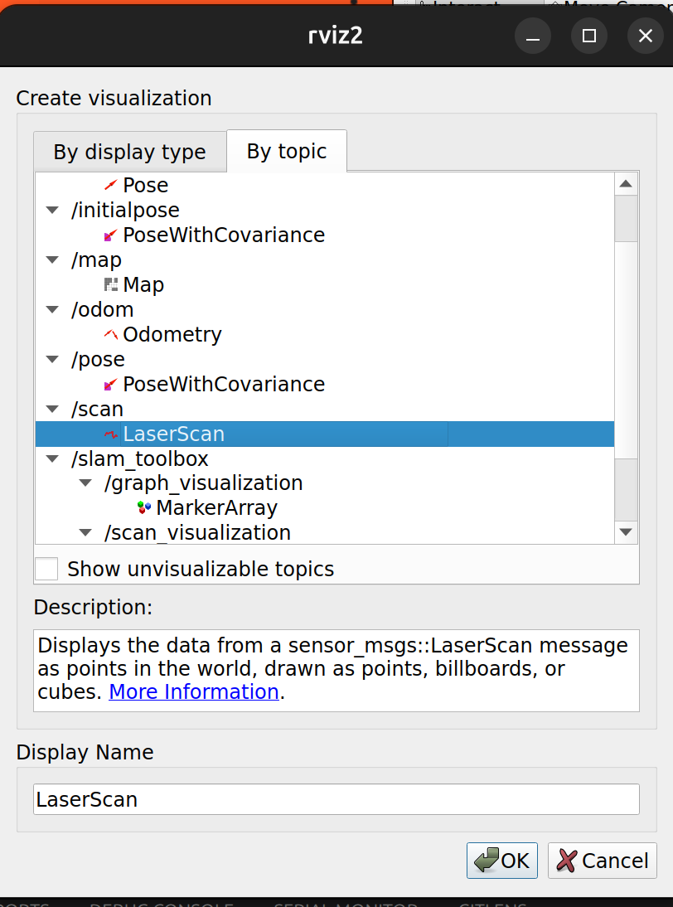
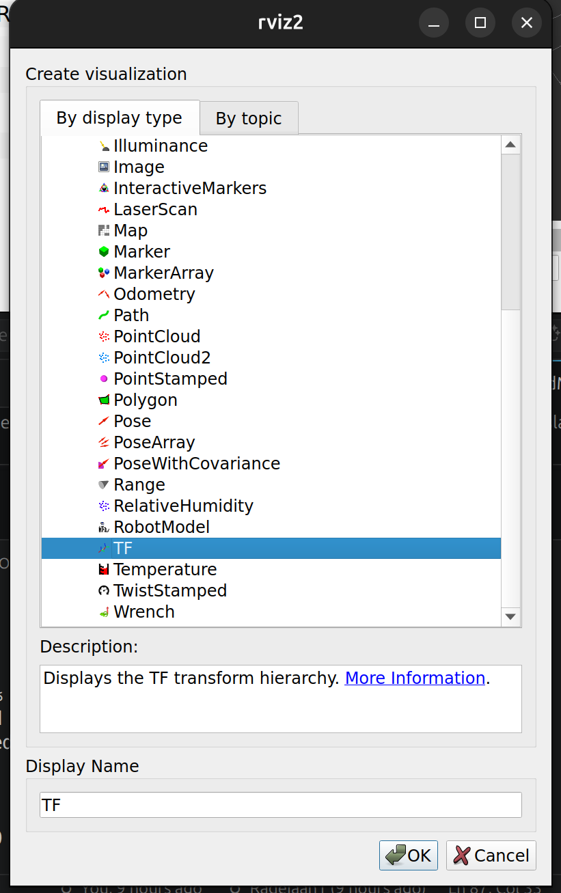

# LiDAR Sensor Environment — 2D SLAM Prototype
*13/06/2026*<br>
*Radeiaan Nandoe*

# Table of Contents
- [Context](#context)
- [Structure](#structure)
  - [Description](#description)
- [Reasoning](#reasoning)
- [Implementation](#implementation)
  - [1. Modular SDF structure](#1-modular-sdf-structure)
  - [2. Topic bridges](#2-topic-bridges)
  - [3. Launch file](#3-launch-file)
  - [Conclusion](#conclusion)
- [Setup](#setup)
  - [Installation](#installation)
  - [Running files](#running-files)
    - [2.1 Teleop only](#21-running-sdf-file-with-teleop-for-driving-only)
    - [2.2 LiDAR mapping — 4 terminals](#22-running-files-for-lidar-mapping-using-4-terminals)
    - [2.3 LiDAR mapping — 6 terminals](#23-running-files-for-lidar-mapping-with-6-commands)
  - [Options](#options)
- [Advice](#advice)
- [Sources](#sources)


# Context
This folder documents the steps taken to achieve 2D mapping using a LiDAR sensor, ROS2, and RViz in a simulated environment. It was developed during sprint 3 as agreed upon with the stakeholder (opdrachtgever).

This prototype holds two firsts in the project:
- It was the **first LiDAR prototype** developed for FLIP, using SLAM Toolbox to generate a 2D occupancy map of a simulated environment.
- It was the **first prototype to use modular SDF files** for the environment splitting the world, robot&sensors, and obstacles into separate reusable files rather than one monolithic `.sdf`. This allowed for shapes and obstacles to be simply included. The sensors were still in the main .sdf file which is in this case the `lidarRoomScan.sdf`

ROS2 was chosen because it is widely used for processing and managing simulation data, making it the natural fit for this prototype. RViz was selected as the visualisation tool based on findings during [initial research](../../../docs/onderzoek/ROS2/bridge.md), as it integrates well with ROS2 and supports real-time display of LiDAR and map data.

This prototype builds on the earlier `workspace/prototypes/omgeving-met-obstakels` by introducing a more realistic simulated environment with obstacles. The goal was to test how well the robot and its sensors handle a populated environment, rather than an empty room.


# Structure
```md
lidarSensorOmgeving/
├── Screenshots/
│   ├── addButton.png
│   ├── laserScan.png
│   ├── map.png
│   ├── odometry.png
│   └── tf.png
├── lidarRoomScan.sdf
├── mapper_params_online_async.yaml
├── ReadME.md
├── rosBridge.yaml
├── roomWithObjects.sdf
└── slam_gazebo.launch.py
```

## Description
- **lidarRoomScan.sdf:** first version of the Gazebo world used for LiDAR scan testing where the obstacle models were split into `shapes/` (boxes, spheres, cylinders) and `walls/` (room segments) and simply included when and where necessary.
- **Screenshots/:** RViz screenshots showing display configuration steps
- **mapper_params_online_async.yaml:** SLAM Toolbox configuration parameters
- **ReadME.md:** this file
- **rosBridge.yaml:** bridges Gazebo topics to ROS2 topics
- **slam_gazebo.launch.py:** launch file that starts the bridge, static TF, and SLAM Toolbox in one command


# Reasoning
SLAM Toolbox was chosen because it is the widely used standard for 2D mapping in ROS2. After researching its availability and community resources via ChatGPT and Google, it was confirmed to be well-documented, actively maintained, and available as an official ros-jazzy-slam-toolbox package — making it the straightforward choice for generating a 2D map of the environment.


# Implementation
SLAM Toolbox itself was straightforward to integrate. The main challenges were wiring up the correct TF frames so SLAM Toolbox could localise the robot, and bridging all necessary Gazebo topics to ROS2.


## 1. Topic bridges
The [rosBridge.yaml](./rosBridge.yaml) file bridges the following Gazebo topics to ROS2:

### LaserScan (LiDAR data)
```yaml
- ros_topic_name: "/scan"
  gz_topic_name: "/lidar"
  ros_type_name: "sensor_msgs/msg/LaserScan"
  gz_type_name: "gz.msgs.LaserScan"
  direction: GZ_TO_ROS
```

### Odometry
```yaml
- ros_topic_name: "/odom"
  gz_topic_name: "/model/FLIP/odometry"
  ros_type_name: "nav_msgs/msg/Odometry"
  gz_type_name: "gz.msgs.Odometry"
  direction: GZ_TO_ROS
```

### TF, clock, and cmd_vel
```yaml
- ros_topic_name: "/tf"
  gz_topic_name: "/model/FLIP/tf"
  ros_type_name: "tf2_msgs/msg/TFMessage"
  gz_type_name: "gz.msgs.Pose_V"
  direction: GZ_TO_ROS

- ros_topic_name: "/clock"
  gz_topic_name: "/clock"
  ros_type_name: "rosgraph_msgs/msg/Clock"
  gz_type_name: "gz.msgs.Clock"
  direction: GZ_TO_ROS

- ros_topic_name: "/cmd_vel"
  gz_topic_name: "/model/FLIP/cmd_vel"
  ros_type_name: "geometry_msgs/msg/Twist"
  gz_type_name: "gz.msgs.Twist"
  direction: ROS_TO_GZ
```

## 2. Launch file
[slam_gazebo.launch.py](./slam_gazebo.launch.py) launches the full pipeline in one command:
- `ros_gz_bridge` — using the `rosBridge.yaml` topic config
- Static TF publisher — linking `base_link` to `FLIP/chassis/gpu_lidar`
- `slam_toolbox` — online async SLAM using `mapper_params_online_async.yaml`

## Conclusion
SLAM Toolbox successfully produced 2D occupancy maps of the simulated environment using only the GPU LiDAR. This first LiDAR prototype validated the modular SDF approach and established the ROS2 + Gazebo + RViz pipeline that all subsequent LiDAR prototypes built upon. The 3D mapping work that followed (see [3D-Lidar-Mapping-RTAB](../3D-Lidar-Mapping-RTAB/)) reused the modular environment structure introduced here.


# Setup
## Installation
1. Prepare the container:
    ```bash
    apt update
    apt install -y locales curl gnupg2 lsb-release software-properties-common

    locale-gen en_US en_US.UTF-8
    update-locale LC_ALL=en_US.UTF-8 LANG=en_US.UTF-8
    export LANG=en_US.UTF-8
    ```

2. Add ROS2 Jazzy repository:
    ```bash
    add-apt-repository universe -y
    apt update

    curl -sSL https://raw.githubusercontent.com/ros/rosdistro/master/ros.key \
    -o /usr/share/keyrings/ros-archive-keyring.gpg

    echo "deb [arch=$(dpkg --print-architecture) signed-by=/usr/share/keyrings/ros-archive-keyring.gpg] \
    http://packages.ros.org/ros2/ubuntu noble main" \
    > /etc/apt/sources.list.d/ros2.list
    ```

3. Install ROS2 Jazzy Desktop, SLAM Toolbox, and other tools:
    ```bash
    apt update && apt install -y ros-jazzy-desktop ros-jazzy-ros-gz ros-jazzy-ros-gz-bridge ros-jazzy-ros-gz-sim ros-jazzy-slam-toolbox ros-jazzy-teleop-twist-keyboard ros-jazzy-rviz2 ros-jazzy-nav2-map-server
    ```

4. Source ROS2. Note: you will need to type this every time you open a new terminal to use `ros` commands:
    ```bash
    source /opt/ros/jazzy/setup.bash
    ```

5. Optional additional tools:
    ```bash
    apt update && apt install ros-jazzy-joint-state-publisher ros-jazzy-joint-state-publisher-gui ros-jazzy-xacro
    ```

---

## Running files

### 2.1 Running SDF file with teleop for driving only

**Terminal 1 — start Gazebo**
```bash
cd /workspace/prototypes/lidarSensorOmgeving/
gz sim lidarRoomScan.sdf
```

**Terminal 2 — bridge Twist messages**
```bash
source /opt/ros/jazzy/setup.bash
ros2 run ros_gz_bridge parameter_bridge \
/model/FLIP/cmd_vel@geometry_msgs/msg/Twist@gz.msgs.Twist
```

**Terminal 3 — run teleop**
```bash
source /opt/ros/jazzy/setup.bash
ros2 run teleop_twist_keyboard teleop_twist_keyboard \
  --ros-args -r cmd_vel:=/model/FLIP/cmd_vel
```

---

### 2.2 Running files for LiDAR mapping using 4 terminals

**Terminal 1 — start Gazebo**
```bash
cd /workspace/prototypes/lidarSensorOmgeving/
gz sim lidarRoomScan.sdf
```

**Terminal 2 — start bridge + static TF + SLAM**
```bash
cd /workspace/prototypes/lidarSensorOmgeving/
source /opt/ros/jazzy/setup.bash
ros2 launch /workspace/prototypes/lidarSensorOmgeving/slam_gazebo.launch.py
```

**Terminal 3 — start RViz**
```bash
cd /workspace/prototypes/lidarSensorOmgeving/
source /opt/ros/jazzy/setup.bash
rviz2
```

In RViz:
- Set **Fixed Frame** to `map`
- **Add**:
  - `Map` from under `By Topic`
  
  - `LaserScan` with topic `/scan` from under `By Topic`
  
  - `Odometry` with topic `/odom` from under `By Topic`
  
  - `TF` from under `By display type`
  

**Terminal 4 — drive the robot**

If your bridge YAML includes `/cmd_vel` → `/model/FLIP/cmd_vel`:
```bash
source /opt/ros/jazzy/setup.bash
ros2 run teleop_twist_keyboard teleop_twist_keyboard --ros-args -r /cmd_vel:=/cmd_vel
```

If you bridged directly to `/model/FLIP/cmd_vel`:
```bash
source /opt/ros/jazzy/setup.bash
ros2 run teleop_twist_keyboard teleop_twist_keyboard --ros-args -r /cmd_vel:=/model/FLIP/cmd_vel
```

---

### 2.3 Running files for LiDAR mapping with 6 commands

**Terminal 1 — start Gazebo**
```bash
cd /workspace/prototypes/lidarSensorOmgeving/
gz sim roomWithObjects.sdf
```

Press **Play** in Gazebo if needed.

**Terminal 2 — start ROS ↔ Gazebo bridge**
```bash
cd /workspace/prototypes/lidarSensorOmgeving/
source /opt/ros/jazzy/setup.bash

ros2 run ros_gz_bridge parameter_bridge \
--ros-args -p config_file:=/workspace/prototypes/lidarSensorOmgeving/rosBridge.yaml
```

**Terminal 3 — static TF for LiDAR**
```bash
cd /workspace/prototypes/lidarSensorOmgeving/
source /opt/ros/jazzy/setup.bash

ros2 run tf2_ros static_transform_publisher \
0.6 0 0.3 0 0 0 base_link FLIP/chassis/gpu_lidar
```

This creates: `base_link → FLIP/chassis/gpu_lidar`

**Terminal 4 — start SLAM Toolbox**
```bash
cd /workspace/prototypes/lidarSensorOmgeving/
source /opt/ros/jazzy/setup.bash

ros2 launch slam_toolbox online_async_launch.py \
slam_params_file:=/workspace/prototypes/lidarSensorOmgeving/mapper_params_online_async.yaml \
use_sim_time:=true
```

**Terminal 5 — start RViz**
```bash
cd /workspace/prototypes/lidarSensorOmgeving/
source /opt/ros/jazzy/setup.bash

rviz2
```

In RViz:
- Fixed Frame → `map`
- **Add:** Map, LaserScan → `/scan`, TF, Odometry

**Terminal 6 — drive the robot**
```bash
cd /workspace/prototypes/lidarSensorOmgeving/
source /opt/ros/jazzy/setup.bash

ros2 run teleop_twist_keyboard teleop_twist_keyboard \
--ros-args -r /cmd_vel:=/cmd_vel
```

---

## Options

Permanent sourcing (**not recommended**) so you don't need to type `source /opt/ros/jazzy/setup.bash` before every `ros` command:
```bash
echo 'source /opt/ros/jazzy/setup.bash' >> ~/.bashrc
source ~/.bashrc
```
This will probably cause errors in your container since sourcing is prioritized at startup which can cause Gazebo launches to fail and python scripts not to be run.


# Advice
SLAM Toolbox is the recommended choice for 2D LiDAR mapping in a ROS2 + Gazebo setup. It is actively maintained, ships as an official ROS2 Jazzy package, and has solid documentation. The modular SDF structure introduced in this prototype — separating robot, sensors, obstacles, and environment into individual files — proved to be a valuable convention and was carried forward into all subsequent prototypes and the final `workspace/models/` setup. If 3D mapping is required, see [3D-Lidar-Mapping-RTAB](../3D-Lidar-Mapping-RTAB/) which builds directly on this prototype.


# Sources
- Easy SLAM with ROS using slam_toolbox by Articulated Robotics, 10 Dec 2022 YouTube https://www.youtube.com/watch?v=ZaiA3hWaRzE
- SLAM Toolbox ROS2 — https://github.com/SteveMacenski/slam_toolbox
- ROS2 Jazzy documentation — https://docs.ros.org/en/jazzy/
- ChatGPT — Research: https://chatgpt.com/share/69d0f87b-45e4-838c-94b0-efe0e829e8b6
- ChatGPT — ROS2 Setup: https://chatgpt.com/share/69d0cd11-8ca0-8393-882a-e5a7e2e762e5
- ChatGPT — ROS2 LiDAR Setup: https://chatgpt.com/share/69d11c85-56a4-8385-b038-4376ad1532e0