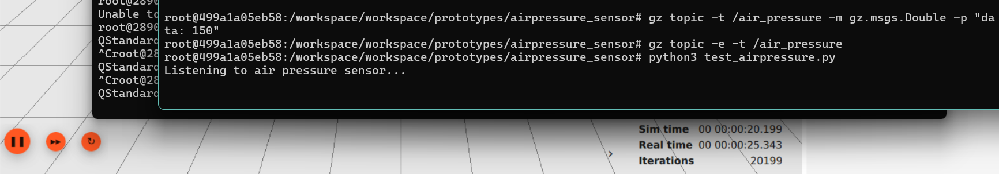

# Air Pressure Sensor
*11/06/2026* <br>
*Freya van den Berg*

## Table of contents

* [What's in this folder](#whats-in-this-folder)
* [Reasoning](#reasoning)
* [Implementation](#implementation)
* [How to monitor Air Pressure data](#how-to-monitor-air-pressure-data)
* [Errors](#errors)
* [Advice](#advice)
* [Source](#source)

### What's in this folder

This directory contains the air pressure sensor simulation and monitoring pipeline for the robotic system. It connects Gazebo's air pressure topic to a Python monitoring script, allowing live pressure data to be read and processed without requiring physical hardware.

### Reasoning

The simple reason we have an air pressure sensor is **so the robot can detect changes in atmospheric pressure.** Monitoring pressure levels can help identify unusual environmental conditions and potential hazards such as explosion. By continuously checking the pressure values, the system can warn users when pressure exceeds safe operating limits.

Using a simulated sensor allows testing and development to take place before physical hardware is available. It also makes experimentation safer and easier because sensor conditions can be reproduced consistently.

### Implementation

The script achieves:

* Live Monitoring: Reads air pressure values directly from Gazebo.
* Continuous Data Processing: Uses Python and subprocess to continuously monitor incoming sensor messages.
* Safety Feedback: Displays warning messages when pressure exceeds a predefined threshold.
* Lightweight Design: No ROS bridge is required because the script reads directly from Gazebo topics.

The script works by breaking down data processing into separate roles:

The node starts a subprocess running the following Gazebo command:

```
gz topic -e -t /air_pressure
```

As raw text streams out from Gazebo, the script continuously reads each line and extracts the pressure value.

The pressure value is converted into a floating-point number and compared against a predefined safety threshold.

```
value = float(line.split(":")[1])

if value > 102000:
    print("WARNING: Possible explosion detected!")
```

If the pressure rises above **102000 Pa**, the system immediately displays a warning message. Otherwise, the current pressure value continues to be displayed in the terminal.

### How to monitor Air Pressure Data

First you have to make sure a virtual environment is created by:

```
python3 -m venv /workspace/venv --system-site-packages
```

You activate the venv with:

```
source /workspace/venv/bin/activate
```

To visualize the data we will first run the Gazebo environment: <br>

**Terminal 1:**

```
cd models/gazebo
gz sim airpressure_plugin.sdf
```

Then we will run the Python Processing Node: <br>

**Terminal 2:**

```
cd models/scripts/airpressure-sensor/

source /workspace/venv/bin/activate

python3 test_airpressure.py
```

If everything worked correctly you should now see live pressure values appearing in the terminal.

Example output:

```
Current pressure: 101325
```

If the pressure exceeds the configured threshold:

```
WARNING: Possible explosion detected!
```


### Errors

**Command Not Found: gz**

This error happens because Gazebo has not been installed correctly or the environment variables have not been sourced. Verify that Gazebo is installed and available from the command line before running the simulation.

**No Data Appears in the Listener Script**

This issue usually occurs when the simulation is not running or when the topic name is incorrect. Verify that the Gazebo world is running and confirm that the topic `/air_pressure` exists.

**Python Script Stops Unexpectedly**

This can happen if incoming messages are not formatted as expected. Adding additional error handling around the pressure value conversion can help prevent crashes caused by malformed data.

### Advice

It would have been ideal to use a dedicated Gazebo AirPressureSensor plugin instead of relying on manually processed topic data. However, for educational purposes and rapid prototyping, directly reading the Gazebo topic provides a simple and effective solution.

The main recommendation for future projects is to integrate the pressure sensor data with ROS 2, allowing it to be visualized and monitored through standard robotics tools such as RViz2 and diagnostic nodes.

Additional improvements could include for example: logging pressure data to a file or database or even supporting multiple pressure sensors. Maybe even creating a real-time dashboard.

### Source

- Gazebo Sensors: AirPressureSensor Class Reference. (n.d.). https://gazebosim.org/api/sensors/9/classgz_1_1sensors_1_1AirPressureSensor.html
- Python Documentation. (2026). https://docs.python.org/3/
- GitHub Repository. (2026, February). https://github.com/2025-TICT-TV2SE4-24-3-V/team-waterbenders
