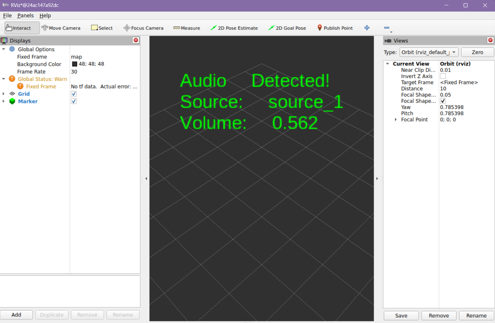

# Logical Audio Sensor
*13/06/2026* <br>
*Sarah Gbagi*

## Table of contents
- [What's in this folder](#whats-in-this-folder)
- [Reasoning](#reasoning)
- [Implementation](#implementation)
- [How to visualize Logical Audio data in RViz2](#how-to-visualize-logical-audio-data-in-rviz2)
- [Errors](#errors)
- [Advice](#advice)
- [Source](#source)

### What's in this folder
This directory contains the custom audio integration pipeline for the robotic system. It bridges the gap between Gazebo's text-based sound detection topic and ROS 2 Jazzy, transforming raw data streams into visual feedback in RViz2.

### Reasoning
The simple reason for the implementation of the audio sensor is **so the robot can detect sounds.** While cameras and LiDAR let the robot "see" what is in front of it, they cannot see through walls or around dark corners. Adding a microphone gives the robot "hearing," which lets it detect important things it might otherwise miss. Turning these sounds into floating text inside RViz makes it easy to see exactly what the robot is hearing instantly.

### Implementation
The script achieves:
- ROS Visuals: It converts invisible audio signals into a 3D visualization_msgs/msg/Marker message.
- Dual Threading Setup: One thread constantly captures data using subprocess so it doesn't lag while a second "watchdog" thread monitors for sensor timeouts.
- Feedback: The text floats at coordinates (0, 0, 2.5) in the world map and dynamically shifts colors:
- Green: Active sound source detected (displays the specific sound source name and current decimal volume).
- Orange: No audio detected for over 2 seconds.

The script works by breaking down data processing into separate roles:

The node starts a background thread running a bash command via Python's subprocess:

```
gz topic -e -t /model/FLIP/model/car_mic/sensor/mic_1/detection
```
As raw text streams out from Gazebo the script checks each line to find two things: the name of the sound source (key:) and how loud it is (data:).

To stop the RViz screen from showing old information when a sound stops, a watchdog timer checks the system every 0.5 seconds. If no new sound data comes in for over 2.0 seconds, the script automatically clears the screen and changes the text to an orange message that says "No Audio Detected."

### How to visualize Logical Audio Data in RViz2

First you have to make sure a virtual environment is created by:

```
python3 -m venv /workspace/venv --system-site-packages
```

You active the venv with:
```
source /workspace/venv/bin/activate
```

To visualize the data, first run the Gazebo environment: <br>
**Terminal 1:**
```
cd models/gazebo
gz sim environment.sdf&
```

Then preform the Python Processing Node: <br>
**Terminal 2:**
```
cd models/scripts/logical-audio-sensor/

source /workspace/venv/bin/activate

source /opt/ros/jazzy/setup.bash

python3 audio.py
```

At last, set up the RViz2 Visualization: <br>
**Terminal 3:**
```
source /opt/ros/jazzy/setup.bash
ros2 run rviz2
```

Here, add the Logical Audio Sensor topic to visualize the data.

Within RViz you should chick on **add**, and then you should select **By topic**.
The topic you should click on is named **/robot_audio_status**, then click on **marker**, and then finnally press Ok.

If everything worked correctly you should now be able to see the data in a green font on the screen!



The highest the detected audio can go is 1.0. The further away the car is, the lower the value is.

When the audio that is being detected is lower than 0.100, you will see *No Audio Detected*. This is because the Logical Audio Sensor cannot detect lower than 0,100.


### Errors
**Command Not Found: gz or ros2**
This error happens because the terminal environment variables have not been sourced yet. To fix it, ensure that source /opt/ros/jazzy/setup.bash is run in every single new terminal before typing any other commands

**RViz2 Shows Nothing or Status Error**
This issue occurs when the fixed frame configuration inside RViz2 is wrong, or when the underlying script is not running at all. To solve this, look at the Global Options panel at the top left of the RViz2 window and make sure the Fixed Frame field is set to world or map instead of map_static.

**Missing Python Modules or Permission Issues**
This problem is caused by running the script outside of the configured python virtual environment. To resolve this, always check that source /workspace/venv/bin/activate was executed successfully in Terminal 2 before launching python3 audio.py.

### Advice
It would have been ideal to use the standard ros_gz_bridge package to handle the audio streams, but connecting the two systems proved to be quite difficult. There is very little documentation available regarding audio data transfer between Gazebo and ROS.

The main recommendation for future projects is to check which exact versions of ROS and Gazebo have the most documentation for the required sensors before starting. Using a different simulation software entirely could prevent these compatibility issues and save time.

### Source
Gazebo rendering: Marker Class reference. (n.d.). https://gazebosim.org/api/rendering/3/classignition_1_1rendering_1_1Marker.html

Gazebo SIM: Logical Audio Sensor. (n.d.). https://gazebosim.org/api/sim/7/logicalaudiosensor.html

Subprocess — Subprocess management. (n.d.). Python Documentation. https://docs.python.org/3/library/subprocess.html

Writing a simple publisher and subscriber (Python). (n.d.). https://docs.ros.org/en/foxy/Tutorials/Beginner-Client-Libraries/Writing-A-Simple-Py-Publisher-And-Subscriber.html
