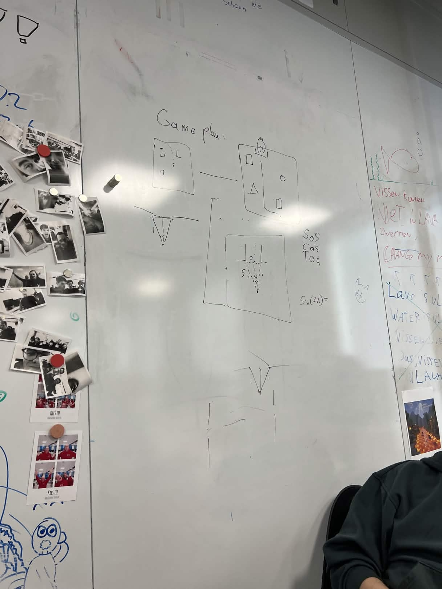
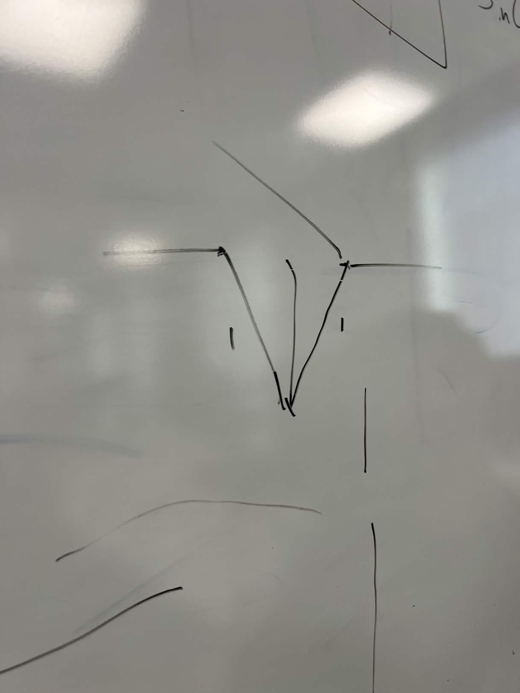

Het Doel van de robot is om een deur te vinden en er doorheen te rijden. Pas als dat is gelukt heeft die zijn doel bereikt en gaat die eventueel door in de volgende kamer opzoek naar een andere deur. Een kamer met bijvoorbeeld 2 deuren waarin de robot moet kijken welke deur groot genoeg is voor hem. 

Om de robot loodrecht voor de deur te krijgen moet de robot zich zo positioneren dat de afstand tussen de punten van de deur-framen exact hetzelfde is. Zie schets:

