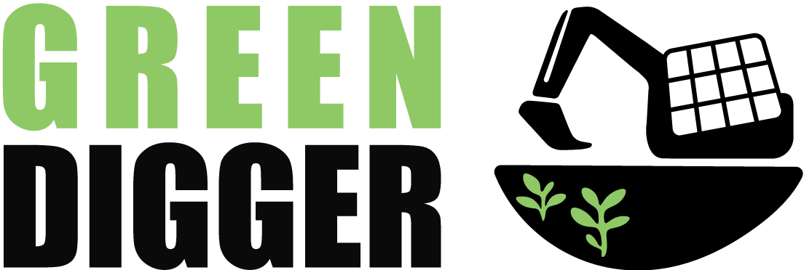
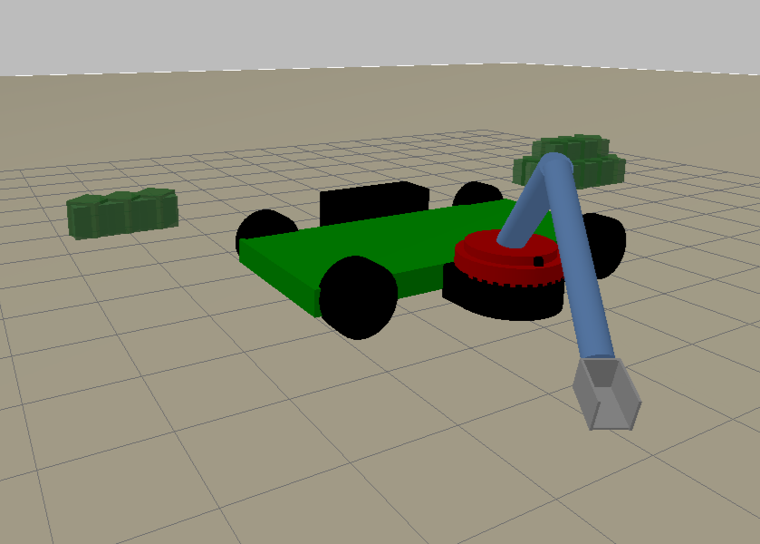
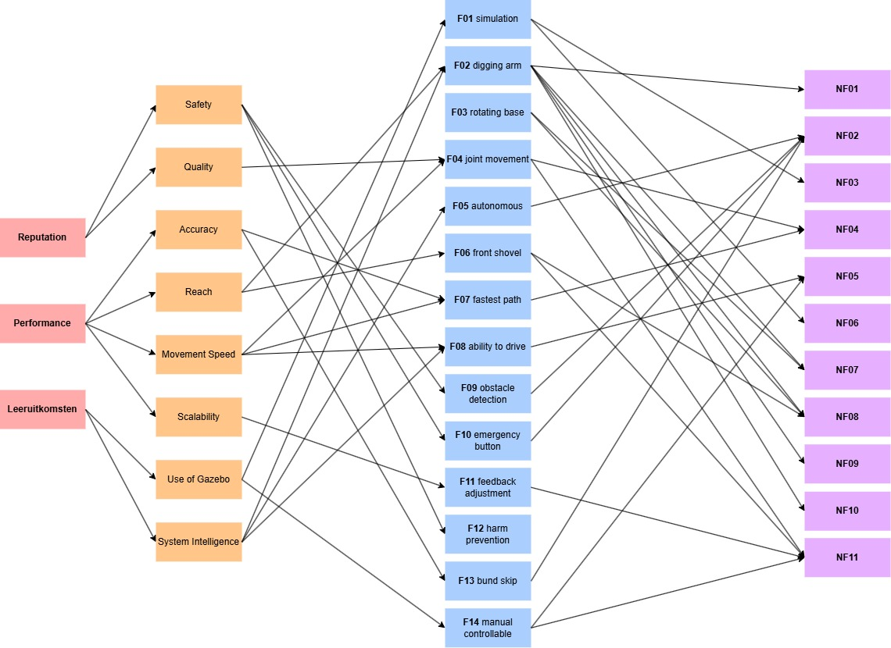
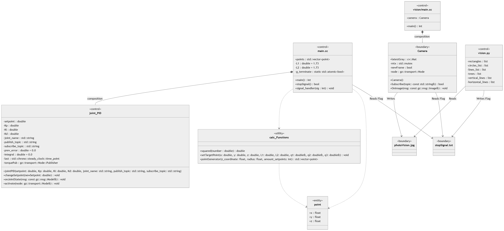

[Green Diggers](https://www.greendigger.org/) is a company focused on restoring degraded land by making it green again. They create bunds, which act as small dams that retain water and give it time to soak into the soil. To support this process, they require autonomous excavators that can drive to the correct location and dig these bunds automatically.

Our contribution to this project is the simulation of the excavator arm movements and ensuring that the digging process stops whenever a tree is detected.

## Functionality
- Simulation in Gazebo
- arm movements via inverse kinematics
- detection system for trees
- communication between the systems

# File Structure

| Folder        | Functionality                    | Link     |
| ------------- | -------------------------------- | -------- |
| models        | Models of excavator in sdf       | [link](./models/) |
| vision        | Camera + detection of trees      | [link](./vision/) |
| controller    | movement and calculations of arm | [link](./controller/) |
| Documentation | diagrams and research            | [link](./documentation/) |

## Models
This inlcudes models of what is shown in gazebo. We have different types of srubs and a tree in there [read more...](../EindProduct/models/README.md) 

## Vision
Here we have a class for our camera. It takes pictures that we use in "Vision.py" to find out if trees are closeby [read more...](../Vision/README.md)

## Controller
The calulations and movements of our excavator arm, you find in here. This also includes a "stopSignal.txt". In there you will find a boolean, sent by "Vision.py" (0 for "no tree", 1 for "tree") [read more...](../EindProduct/controller/README.md)

## Documentation
In here we put all the diagrams and documentation relevant to this project. The diagrams include: "klassendiagram" and "keydriver chart" [read more...](../EindProduct/documentation/README.md)

# Design
To provide a clear overview of the project structure and organization, several diagrams and schematics were created. First, we designed a schematic showing what the excavator would look like within the context of this project:

---

This schematic shows that the shovel moves forward as the arm operates. The movement is different from that of most excavators. The goal is to push the soil forward, creating the bund in the process. This bund acts as a small dam that retains water, allowing it to slowly soak into the ground and help restore soil fertility.

---

Above is the Keydriver chart. This diagram provides a clear overview of the relationships between our requirements and keydrivers.

---

Here you can see the Class Diagram. It clearly illustrates the structure of our code.

# Recommendations
Getting the joint movements to work correctly took the most time during development. In Gazebo, it is challenging to achieve smooth and reliable arm movements, so this part of the project requires significant effort. Additionally, Gazebo itself can run quite slowly, which means the movements will never appear perfectly smooth.

Using Vision with OpenCV can also be challenging. Creating the system is not the main issue; rather, achieving reliable detection is difficult. If you want accurate tree detection, it is recommended to use a neural network. This allows the system to recognize actual trees instead of simply detecting a collection of shapes that resemble a tree [read more...](../Vision/README.md)
