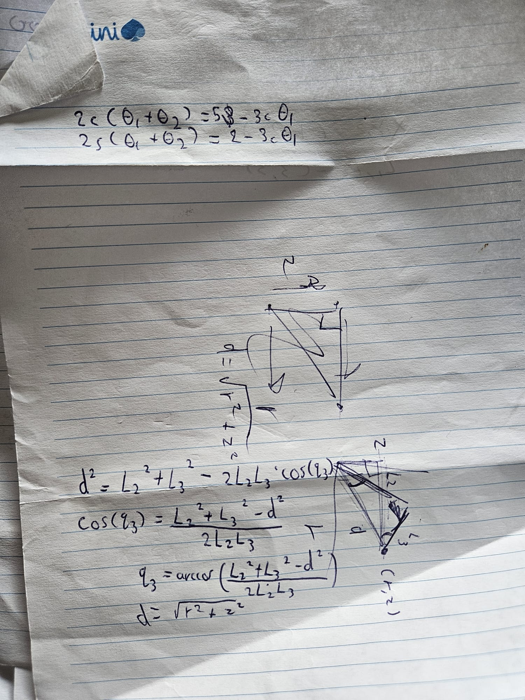
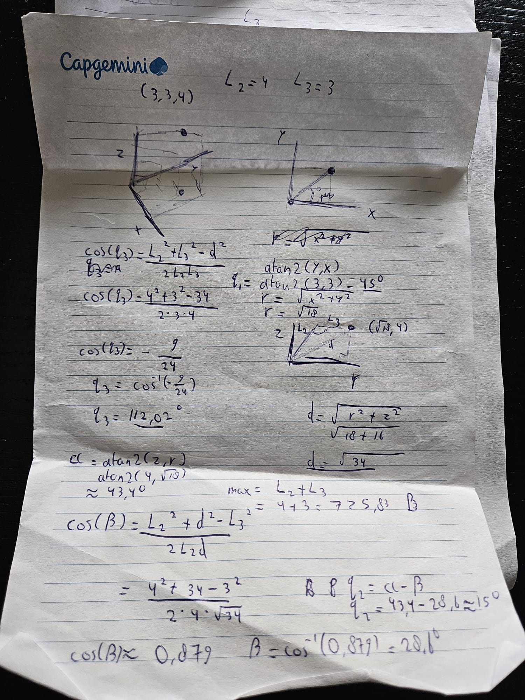
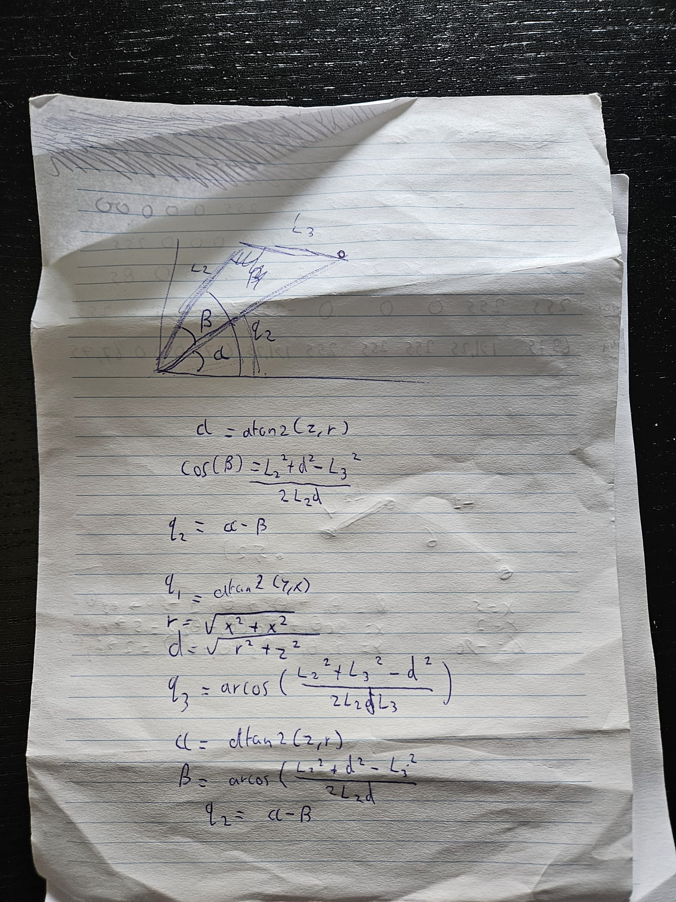
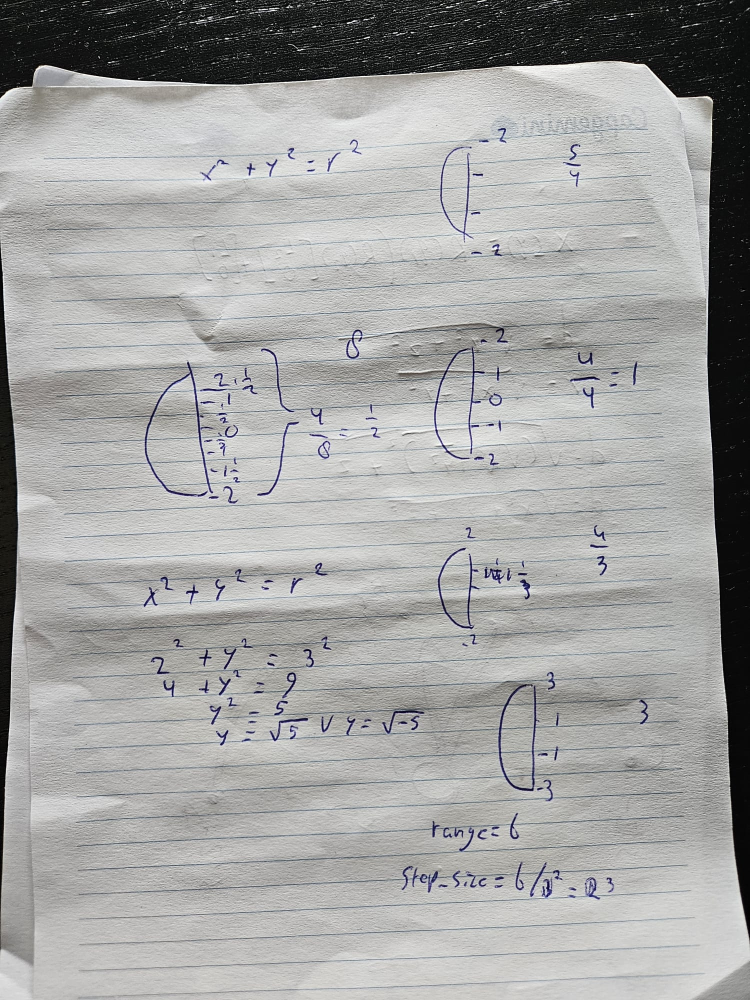

# Research CalcFunctions

This file is dedecated to research behind the angle calculations needed for the digging arm. These calculations are shown in file [calc_Functions.cc](./Gazebo%20Graafmachine/Componenten/EindProduct/controller/calc_Functions.cc).

Explanation behind the math is further noted in [controller-main](./Gazebo%20Graafmachine/Componenten/EindProduct/controller/README.md). This file is only the process.

## Research Inverse Kinematics

When first starting out, we begun with familiar geometry:

These pictures show me trying to calculate the angles from a desired x,y,z coordinate. This ultimately worked and was easily converted to code. However, this method is pretty primitive and not up to real inverse kinematics standards. So we needed to implement a more complex solution, which also had more safe returns in special cases. The new method worked great and ended up in the final version you see in calc_functions.cc.

## Research Pointgenerator

For the pointGenerator function, we first had the idea to convert the custom amount of setpoints and radius to evenly spread out x-coordinates. With these x-coordinates you can calculate the corresponding y-coordinate using the radius and the circle function: x'2+y'2=r'2 (with the 2's meaning squared). This method, however, spread the points out evenly along the x-axis, but not evenly along the actual circle. So this method caused the points to accur more at the 90-degree point. 

We further perfected this function, using the amount of setpoints to compute evenly spread points using the radians rather than x- or y-coordinates. This method worked best ofcourse and became the final version in calc_functions.cc.