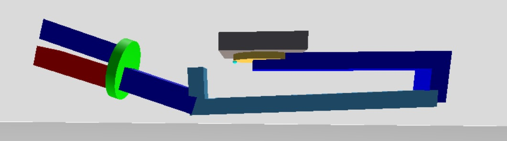

# Theoretisch Kader & Implementatie: Basisopbouw en Verbindingen in Gazebo

## Aanleiding
Dit document dient als overdracht voor de volgende ontwikkelaar die aan dit project werkt. Het behandelt de theoretische basis van kinematische ketens binnen simulatoren en de concrete implementatie van basisvormen en gewrichten in Gazebo voor de RoboSub robotarm.


## Theoretisch Kader: De Basis van Gazebo
Om de robotarm in Gazebo te simmuleren moeten er 3D vormen gemaakt worden. Deze vormen moeten vervolgens aan elkaar gezet worden. 

### Vormen maken in Gazebo
Het maken van basisvormen in Gazebo wordt gedaan met links.
Een link is een los, massief onderdeel van de robot . Een link heeft in de code altijd drie lagen nodig om te kunnen functioneren:
* __Visual:__ Dit bepaalt de vorm die je met het blote oog ziet in de simulator, zoals een cylinder of kubus.
* __Collision:__  Dit is een onzichtbare fysieke box om de vorm heen. Dit zorgt ervoor dat twee onderdelen met elkaar botsen in   plaats van dwars door elkaar heen bewegen.
* **Inertial:** Dit bepaalt hoe zwaar het onderdeel is. Zonder gewicht snapt de simulator de natuurkunde niet, en zal de arm oncontroleerbaar wegschieten.

_([make a model, Gazebo Tutorials](https://classic.gazebosim.org/tutorials?tut=build_model))_

### 2. Verbindingen tussen Vormen
Voor het verbinden van twee vormen wordt er een joint gebruikt. Een joint is het gewricht dat twee links aan elkaar koppelt. Een joint bepaalt hoe het bewegende onderdeel mag bewegen ten opzichte van het basisonderdeel. 

Er zijn verschillende soorten joints besschikbaar binnen Gazebo. Hieronder is de volledige lijst,hoe elke joint beweegt en het bereik van elke joint: 

Type Joint | Werking & Bereik
|--| -- | 
| revolute | Een scharniergewricht dat om een enkele as draait. Heeft een continu bereik, tenzij anders aangegeven. |
| prismatic | Een schuifgewricht dat linear langs een as glijdt. Heeft een vaste boven en ondergrens. |
| ball | Een kogelgewricht zoals een menselijke schouder dat vrij kan roteren in alle drie de dimensies. |
| universal | Soortgelijk aan een kogelgewricht. Kan vrij roteren in twee dementies en wordt gelimiteerd in de derde. | 
| gearbox | Een tandwielverbinding. Dit zorgt ervoor dat als het ene onderdeel draait, het andere onderdeel automatisch sneller of langzamer meedraait. Heeft een continu bereik, tenzij anders aangegeven. |
| revolute2 | Twee revolute joints die direct in serie achter elkaar zijn geschakeld. |
| piston | Een zuigergewricht. vergelijkbaar met een schuifgewricht, maar staat ook rotatie om de schuifas toe.

_([What are the various joint types available in gazebo?, Gazebo Answers NickPD](https://robotics.stackexchange.com/questions/27237/what-are-the-various-joint-types-available-in-gazebo))_


_([SDF Specifications - Joint Element, SDFormat](http://sdformat.org/spec?ver=1.11&elem=joint))_


## Onderbouwing Gemaakte Keuzes
Tijdens de onderzoeksfase is gekeken naar de makkelijkste en meest stabiele manier om de arm te laten bewegen. Er is gekozen voor de ingebouwde Joint Control van Gazebo in combinatie met revolute joints:
- __Match met fysieke hardware:__ De fysieke robotarm van RoboSub is opgebouwd uit segmenten die ten opzichte van elkaar scharnieren. Hierdoor is de revolute joint het dichtste bij de realiteit. 
- __Hoekbegrenzing:__ In een revolute joint kun je heel makkelijk harde grensen instellen in radialen. Hiermee kunnen we de limiten aanpassen naar de werkelijke limiten van de hardware. 
- __Voorkomen van clipping (Offset):__ Op advies van de opdrachtgever zijn de gewrichten met een structurele offset (`<pose>`) gecentreerd binnen de links geplaatst. Door deze overlap snijden de 3D vlakken elkaar niet tijdens het buigen, wat instabiliteit en trillingen in de physics engine voorkomt.

## Implementatie van Basisvormen en Gewrichten

### Implementatie van Vormen

In het SDF bestand van de Robosub_arm is elke link opgebouwd uit de drie basiselementen: `<visual>`, `<collision>` en `<inertial>`. Om de simulatie simpel en overzichtelijk te houden, is er gewerkt met geometrische basisvormen.

Dit is een voorbeeld van het maken van een cylindeer in gazebo:
```xml
<link name="robosub_rotating_base">
  <visual name="top_visual">
    <geometry><cylinder><radius>0.35</radius><length>0.08</length></cylinder></geometry>
    <material><ambient>0.90 0.65 0.10 1</ambient></material> </visual>
  <collision name="top_collision">
    <geometry><cylinder><radius>0.35</radius><length>0.08</length></cylinder></geometry>
  </collision>
</link>

```
### Implementatie van Gewrichten

In het SDF-bestand worden de losse links met elkaar verbonden via `<joint>` elementen. Binnen dit project is er uitsluitend gekozen voor `revolute` joints om de draaibewegingen van de arm en de grijper te realiseren. Een joint heeft in de code altijd een `<parent>` (het basisonderdeel) en een `<child>` (het bewegende onderdeel) nodig, gecombineerd met een draai-as (`<xyz>`) en bewegingslimieten (`<limit>`).

Dit is een voorbeeld van het maken van een roterend gewricht in Gazebo:

```xml
<joint name="robosub_base_to_robosub_rotating_base" type="revolute">
  <parent>robosub_base</parent>
  <child>robosub_rotating_base</child>
  
  <pose relative_to="robosub_base">0 0 0.10 0 0 0</pose>
  
  <axis>
    <xyz expressed_in="__model__">0 0 1</xyz>
    <limit>
      <lower>-2.35619</lower> <upper>2.35619</upper>  </limit>
  </axis>
</joint>

```

## Resultaat
Het volgende model is ontstaan:



### Requirements
De volgende requirements zijn behaald:
Requirement | Beschrijving | Resultaat
---| ---- | ----- |
__F01.1__ Robotarm - Uitstrekken van robotarm  | De robotarm moet een uitstrekkende beweging kunnen maken. | __Behaald__
__F01.2__ Kop - Vastpakken van een valve |    De robotarm moet een valve kunnen vastpakken     | __Behaald__  
__NF01.1__ Robotarm - Structuur robotarm| De simulatie van de robotarm moet bestaan uit een basis, drie segmenten en een roterende kop. | __Behaald__
__NF01.2__ Kop - Rotatie van de kop |  De kop van de robotarm moet minimaal 90 graden kunnen | __Behaald__


## Bronvermelding
- _[make a model, Gazebo Tutorials](https://classic.gazebosim.org/tutorials?tut=build_model)_
- _[What are the various joint types available in gazebo?, Gazebo Answers NickPD](https://robotics.stackexchange.com/questions/27237/what-are-the-various-joint-types-available-in-gazebo)_
- _[SDF Specifications - Joint Element, SDFormat](http://sdformat.org/spec?ver=1.11&elem=joint)_


