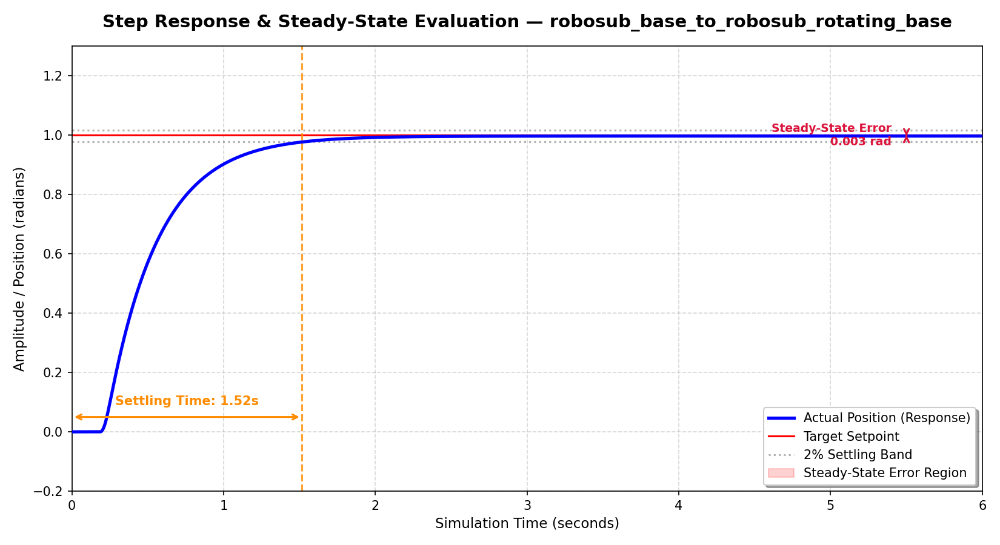
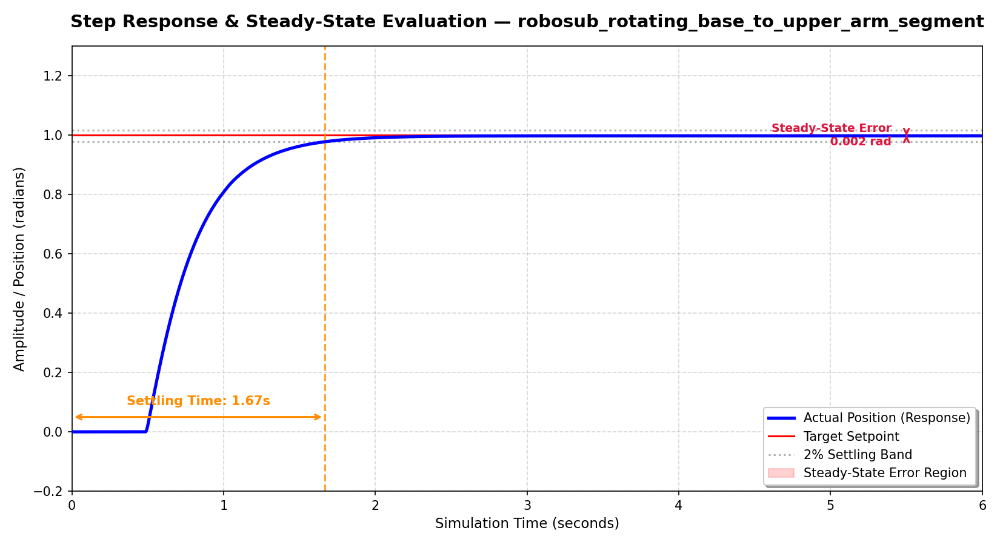
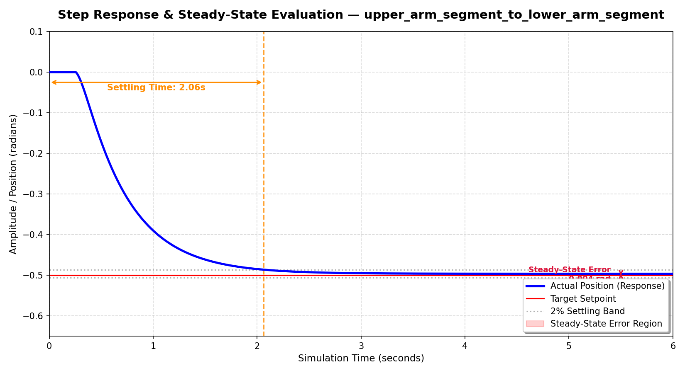
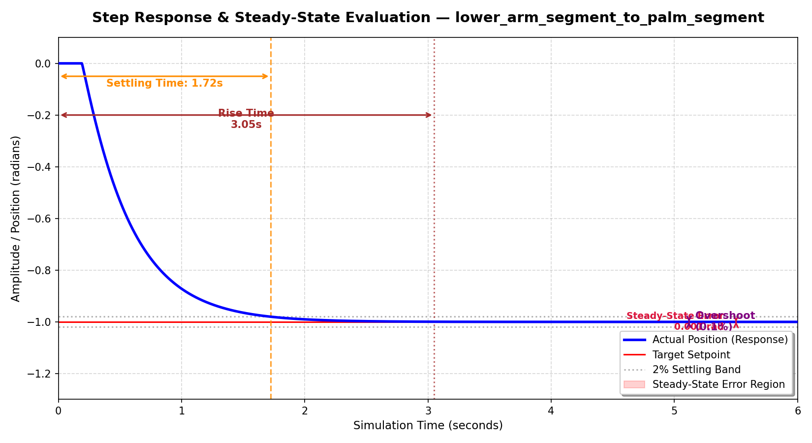
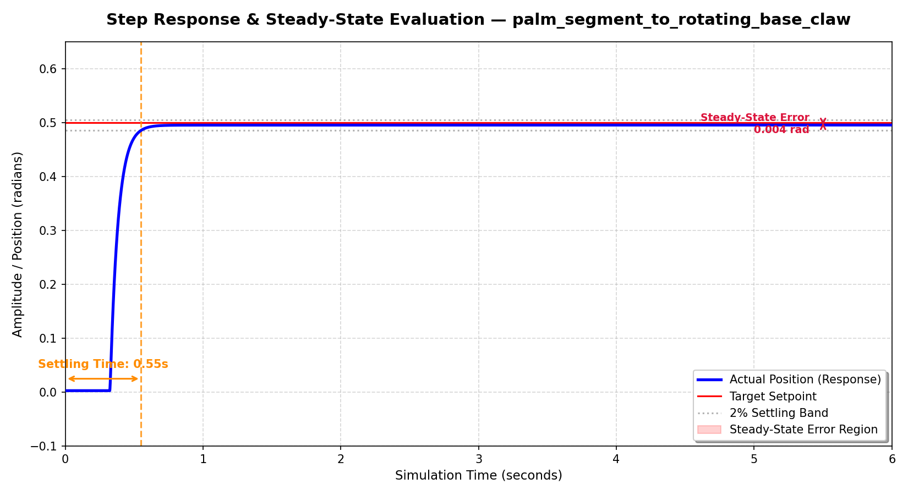
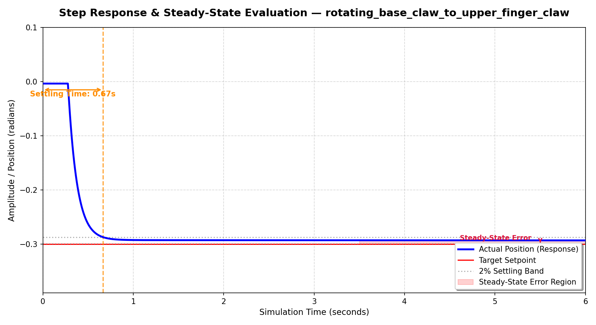
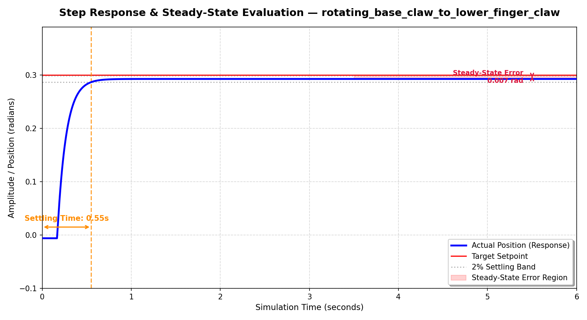

# Theoretisch Kader & Implementatie: PID-Regeling in de Robosub Robotarm

## Aanleiding

Dit document dient als overdracht voor de volgende ontwikkelaar die aan dit project werkt. Het behandelt de theoretische basis van PID-regelaars en de toepassing van PID-regelaars binnen dit project.


Voor de RoboSub robotarm is de harde eis gesteld dat de onderwater robotarm autonoom naar een speciafiek punt moet kunnen bewegen. De arm moet hierbij een valve naderen, het handvat met de grijper vastpakken en deze een halve kwartslag draaien. Vanuit de opleiding is voorgeschreven dat deze nauwkeurige positionering wordt gerealiseerd door middel van een PID controller. Als aanvullende wens werd er gevraagd het mogenlijk te maken de arm live te besturen met een fysieke controller. 


## Theoretisch Kader: Wat is een PID-Controller?

Een PID-controller (Proportional-Integral-Derivative) is een feedbackmechanisme dat een actuator aanstuurt op basis van het verschil tussen een gewenste waarde (setpoint) en de werkelijk gemeten waarde (process variable). Dit verschil noemen we de error._([PID - de ideeën, Bart Bozon](https://www.youtube.com/watch?v=PJKI_-K5iGk))_

$$e(t) = \text{Setpoint} - \text{Process Variable}$$

De controller berekent continu een correctie aan de hand van drie componenten:

* **P (Proportioneel) :** Levert een kracht die recht evenredig is met de fout van dit moment. Hoe verder de arm van zijn doel is, hoe harder de P-term trekt. 
* **I (Integraal) :** Kijkt naar hoe lang de fout al duurt en sommeert deze over de tijd. Dit is cruciaal om constante tegenkrachten (zoals zwaartekracht of waterstroming onder water) te overwinnen. Het geeft de motor net dat extra zetje als hij vlak voor het doel blijft hangen.
* **D (Afgeleide/Derivative) :** Kijkt naar de snelheid waarmee de fout verandert en werkt als een actieve schokdemper. Als de arm te snel op het doel afvliegt, remt de D-term de motor af om overshoot te voorkomen.
_([PID regelaar uitgelegd: zo stel je PID regelaars goed in als operator, Jigler](https://www.jigler.nl/blog/pid-regelaar-uitgelegd/))_

Dit wordt gedaan met de volgende standaard formule:
$$u(t) = K_p e(t) + K_i \int_{0}^{t} e(\tau) d\tau + K_d \frac{de(t)}{dt}$$

_([PID-regelaar, Wikipedia](https://nl.wikipedia.org/wiki/PID-regelaar))_


## Onderbouwing gemaakte keuzes

In de vroege fase van dit project werd er binnen de SDF configuratie geëxperimenteerd met Velocity Control (snelheidsaansturing). Dit is om meerdere redenen omgezet naar Position Control (positie aansturing):

*  **Nauwkeurigheid:** Bij Velocity Control moet de code exact timen wanneer de snelheid naar 0 moet. Door netwerklatency of trage hardware schiet de arm hierdoor snel zijn doel voorbij. Position control accepteert een harde eindbestemming in radialen. _([Differences Between Velocity Mode and Position Mode in Motion Control](https://maxicrane.com/blogs/news/differences-between-velocity-mode-and-position-mode-in-motion-control))_ 
*  **Compensatie van Externe Krachten:** Hoewel de fysieke robotarm in de realiteit neutrally buoyant is ontworpen en de zwaartekracht in deze specifieke simulatie op 0 is gezet, blijft de I-term essentieel. Waar een arm bij Velocity Control slap meebeweegt met externe krachten, functioneert de Position Controller als een actieve vergrendeling. _([How Underwater Robots Stay Stable: Control Systems in Underwater Robotics, Ebad Sayed](https://medium.com/@sayedebad.777/how-underwater-robots-stay-stable-control-systems-in-underwater-robotics-0ee75e1f39eb))_
*  **Numerieke Stabiliteit:** Gazebo berekent de natuurkunde intern stabieler als het rechtstreeks de doelpositie krijgt . Wanneer positiecontrole handmatig in een trage Python loop via snelheden wordt nagebootst, ontstaan er krachtige schokken waardoor het virtuele model kan trillen, glitchen of omvallen. _([Gazebo Sim Architecture, Gazebo](https://gazebosim.org/docs/latest/architecture/))_
* **Ingebouwde PID-regeling van Gazebo:** Gazebo heeft een ingebouwde PID controller die werkt op basis van position control. Hierdoor voert Gazebo de PID berekeningen intern uit op de hoogst mogelijke frequentie van de physics engine. Bovendien is er hierdoor minder realtime communicatie nodig tussen Gazebo en Python, wat anders voor grote vertragingen kan zorgen. _([Joint Controllers, Gazebo ](https://gazebosim.org/api/sim/9/jointcontrollers.html))_


## Implementatie van PID-Regeling in de Robosub Robotarm met toetsenbord input

Oorspronkelijk werdt er gevraagd om de onderwater robotarm live bestuurbaar te maken met een fysieke controller met joystick (Zoals een Xbox controller). Tijdens de beginfase van de ontwikkelen liep het team echter tegen hardware problemen aan. De gebruikte laptop support namenlijk geen controller input. Er is gekozen om de arm als tussenoplossing aan te sturen via toetsenbord inputs. 

De besturing van de Robosub arm met toetsenbord input is opgedeeld in twee lagen: de SDF configuratie, waar de virtuele hardware en de PID regelaar in Gazebo worden gedefinieerd, en het Python script, dat de gebruikersinput vertaalt naar commando's.

Hieronder is de datastroom afgebeeld:


___Diagram 1:__ Datastroom RoboSub arm met toetsenbord input.<br >Opmaak van deze diagram is gegenereerd met behulp van Gemini AI en handmatig geverifieerd._


### SDF-configuratie
In de SDF-configuratie worden de virtuele hardware en de PID-regelaar in Gazebo gedefinieerd. In het datastroomdiagram is dit weergegeven onder "Gazebo Simulator". Zodra er een nieuwe positie wordt binnengestuurd, berekent Gazebo het draaimoment dat nodig is om dit punt te bereiken. Tevens houdt Gazebo de arm in de gegeven positie op zijn plek.

Elk beweegbaar gewricht (``joint``) is in het SDF bestand uitgerust met een ingebouwde ``JointPositionController`` plugin _([JointPositionController Class Reference, Gazebo](https://gazebosim.org/api/sim/9/classgz_1_1sim_1_1systems_1_1JointPositionController.html))_. De parameters zijn kritisch afgestemd voor een stabiel systeem. 

Hieronder is een voorbeeld van een ``joint`` met ``JointPositionControl``:

```xml
<plugin 
        filename="gz-sim-joint-position-controller-system" 
        name="gz::sim::systems::JointPositionController">
        <joint_name>robosub_base_to_robosub_rotating_base</joint_name>
        <p_gain>500</p_gain><i_gain>0.1</i_gain><d_gain>100</d_gain>
      </plugin>
```

### Python aansturing
De Python-aansturing wordt in het datastroomdiagram weergegeven onder "Python Script". Het script reageert direct op een ingedrukte toets.


Voor de communicatie met Gazebo is in de Python code momenteel gebruikgemaakt van ``os.system``. Dit is een laagdrempelige en snelle manier om te testen of de Robosub arm reageert op toetsenbord input. Het script opent het ``/cmd_pos`` topic en stuurt de gewenste hoek in radialen door:

```python
def send_position(joint_key):
    joint_name = JOINTS[joint_key]
    angle = targets[joint_key]
    topic = f"/model/Robosub_arm/joint/{joint_name}/0/cmd_pos"
    cmd = f"gz topic -t {topic} -m gz.msgs.Double -p 'data: {angle}'"
    os.system(cmd)
```

os.system start echter voor elk afzonderlijk bericht een nieuw terminalproces op. Dit kost veel processorkracht en veroorzaakt netwerklatency, waardoor de arm in de simulatie op dit moment haperend beweegt.

## Resultaten

Er zijn testen uitgevoerd om de PID waardes zo stabiel mogenlijk te maken op basis van de eisen. Deze testen zijn per joint uitgevoerd met minstens zes verschillende PID waarden, tot de waarden binnen de marges vielen.

#### Rotating base:

___Grafiek 1:__ accuraatheid van PID van de robosub_base_to_robosub_rotating_base joint met PID waardes p_gain = 3000, i_gain = 50, d_gain = 1000._ 

#### Shouder:

___Grafiek 2:__ accuraatheid van PID van de robosub_rotating_base_to_upper_arm_segment joint met PID waardes p_gain = 4000, i_gain = 100, d_gain = 1200._ 

#### Elbow:

___Grafiek 3:__ accuraatheid van PID van de robosub__upper_arm_segment_to_lower_arm_segment joint met PID waardes p_gain = 2500, i_gain = 60, d_gain = 1200._

#### Wrist:

___Grafiek 4:__ accuraatheid van PID van de robosub_lower_arm_segment_to_palm_segment joint met PID waardes p_gain = 1500, i_gain = 20, d_gain = 600._

#### Claw rotation:

___Grafiek 5:__ accuraatheid van PID van de robosub__palm_segment_to_rotating_base_claw joint met PID waardes p_gain = 2500, i_gain = 20, d_gain = 100._

#### Upper claw:

___Grafiek 6:__ accuraatheid van PID van de robosub_rotating_base_claw_to_upper_finger_claw joint met PID waardes p_gain = 1500, i_gain = 20, d_gain = 100._

#### Lower claw:

___Grafiek 7:__ accuraatheid van PID van de robosub_rotating_base_claw_to_lower_finger_claw joint met PID waardes p_gain = 1500, i_gain = 20, d_gain = 100._

### Requirements
De volgende Requirements zijn bereikt:
| Requirement | Beschrijving | Resultaat | 
----- | --- | --- |
__F06.1__ PID - Controller input | De robotarm moet aangestuurd kunnen worden via een fysieke controller met gebruik van een PID. | __Niet behaald__: keyboard in plaats van Controller gebruikt in verband met hardware limitaties |
__NF06.1__ PID - Overshoot | De arm moet een ingestelde positie bereiken en stabiel blijven (binnen een foutmarge van 2% van het setpoint) binnen maximaal 10 seconden na het commando. | __Behaald__|
__NF06.2__ PID - Settling time | De arm moet een ingestelde positie bereiken en stabiel blijven (binnen een foutmarge van 2% van het setpoint) binnen maximaal 10 seconden na het commando | __Behaald__ | 
__NF06.3__ PID - Steady-State Error | Na het bereiken van de doelpositie mag de permanente afwijking niet groter zijn dan 0.05 radialen. | __Behaald__ |


## Advies

De huidige toetsenbordbesturing via os.system was een snelle test om te controleren of de ingebouwde PID regelaars goed werken. Nu dit is bewezen, zijn er twee vervolgstappen nodig om van deze testfase over te stappen naar een soepel werkend eindproduct. Deze stappen richten zich op het verbeteren van de besturing en het oplossen van de vertraging in de software.

### Migratie naar controller input

De eerste logische vervolgstap is om te migreren naar controller input. De logica voor toetsenbord input kan direct worden vervangen door analoge joystick input. In plaats van discrete stappen bij een toetsaanslag, leest het script continu de waarde van de joystick uit. Deze waarde bepaalt vervolgens direct de richting en de snelheid van de hoekverandering.

### Implementatie van een permanente API koppeling

Een andere verbetering om te overwegen is het implementeren van een permanente API koppeling (zoals gz-transport of een ROS 2 node) om de communicatielijn open te houden en een vloeiende beweging te garanderen.


## Bronvermelding

- _[PID - de ideeën, Bart Bozon](https://www.youtube.com/watch?v=PJKI_-K5iGk)_

- _[PID regelaar uitgelegd: zo stel je PID regelaars goed in als operator, Jigler](https://www.jigler.nl/blog/pid-regelaar-uitgelegd/)_

- _[PID-regelaar, Wikipedia](https://nl.wikipedia.org/wiki/PID-regelaar)_

- _[Differences Between Velocity Mode and Position Mode in Motion Control](https://maxicrane.com/blogs/news/differences-between-velocity-mode-and-position-mode-in-motion-control)_ 
- _[How Underwater Robots Stay Stable: Control Systems in Underwater Robotics, Ebad Sayed](https://medium.com/@sayedebad.777/how-underwater-robots-stay-stable-control-systems-in-underwater-robotics-0ee75e1f39eb)_
- _[Gazebo Sim Architecture, Gazebo](https://gazebosim.org/docs/latest/architecture/)_
- _[Joint Controllers, Gazebo ](https://gazebosim.org/api/sim/9/jointcontrollers.html)_
-  _[JointPositionController Class Reference, Gazebo](https://gazebosim.org/api/sim/9/classgz_1_1sim_1_1systems_1_1JointPositionController.html)_
- _Gemini AI_