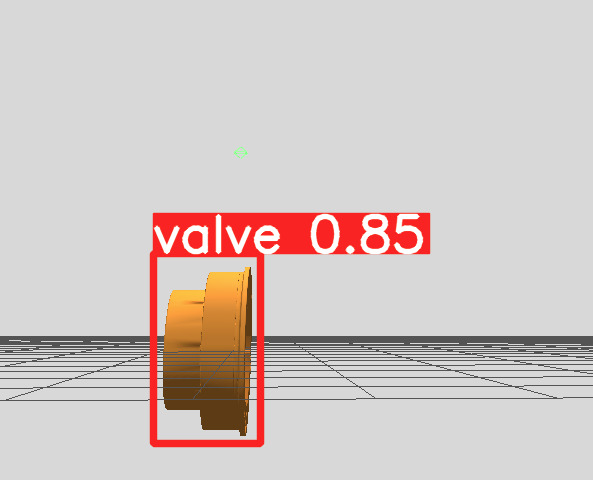

# Theoretisch Kader & Implementatie: Vision in de Robosub Robotarm

## Aanleiding

Dit document dient als overdracht voor de volgende ontwikkelaar die aan dit project werkt. Het behandelt de theoretische basis van ai en vision en de toepassing van deze binnen dit project.

Voor de stimulaite bestaan de requirements dat er camara beelden beschikbaar zijn in de stimulatie en dat we het kunnen gebruiken om objecten te kunnen detecteren. Er is vanuit het team gekozen om het behulp van een ai model de valves die de robot arm moet kunnen draaien te detecteren zodat er in een later stadium van het project naartoe bewogen kan worden. 

## Requirements

1. De simulatie moet camerabeelden beschikbaar stellen die gebruikt kunnen worden voor detectie.
2. De pipeline moet automatisch een valve kunnen detecteren zonder handmatige invoer tijdens runtime.
3. Het systeem moet de valve ten minste 75% correct herkennen.
4. In de uitgevoerde tests is deze eis gehaald, met een gemiddelde herkenning die ruim boven de 80% lag.
5. De detectie moet betrouwbaar blijven bij kleine verschillen in hoek, afstand en belichting.
6. Het model moet een confidence-score teruggeven zodat onzekere detecties kunnen worden gefilterd.
7. De oplossing moet geschikt zijn voor integratie met de robotarm of een volgende controllerstap.
8. De inference moet snel genoeg zijn om in een simulatie-omgeving bruikbaar te blijven.
9. De dataset en labels moeten duidelijk genoeg zijn om het model later opnieuw te kunnen trainen of verbeteren.

Alles is gelukt volgens deze requirements.

## Afweging tussen OpenCV en AI

Binnen dit project is ook gekeken naar een klassieke computer vision-aanpak met OpenCV. Dat onderzoek laat zien dat OpenCV vooral interessant is wanneer de omgeving goed gecontroleerd is en het doelobject een duidelijke vorm heeft. De valve in Gazebo voldoet daar in veel gevallen aan: de vorm is redelijk voorspelbaar en de simulatie biedt een stabiele achtergrond.

OpenCV heeft als voordeel dat er geen trainingsdata nodig is en dat detectie direct kan starten op basis van contouren, randen, thresholds en vormherkenning. Voor een simpele en afgebakende omgeving kan dat sneller te implementeren zijn dan een volledig AI-model.

Tegelijkertijd heeft OpenCV ook duidelijke beperkingen. De detectie hangt sterk af van handmatig ingestelde parameters en wordt minder robuust zodra de camerahoek, belichting of achtergrond verandert. In dit project is het doel niet alleen om een valve te vinden, maar ook om er in een later stadium betrouwbaar naartoe te bewegen. Daarvoor is een stabiele detectie met confidence-score en bounding boxes praktischer. Daarom is ervoor gekozen om de uiteindelijke oplossing te baseren op een AI-model, terwijl OpenCV vooral relevant blijft als referentie of als mogelijke fallback voor eenvoudige tests in de simulatie.

## Theoretisch kader: Wat is een AI?

Kunstmatige Intelligentie (AI) is een verzameling computersystemen die in staat zijn om taken uit te voeren die normaal gesproken menselijke intelligentie vereisen. Machine Learning (ML), een subset van AI, stelt computers in staat om van data te leren zonder expliciet geprogrammeerd te worden. *([What is Artificial Intelligence?, IBM](https://www.ibm.com/think/topics/artificial-intelligence))*

In dit project gebruiken we **Deep Learning** en **Computer Vision** (een onderdeel van AI) om automatisch valves (doelwitten) in camerafoto's te detecteren via het YOLO-model (You Only Look Once).

### Core Componenten van een Neural Network

Een neuraal netwerk bestaat uit drie essentiële componenten die samenwerken om patronen in data te herkennen:

- **Input Layer:** Ontvangt de ruwe data (in ons geval: pixelwaarden van het camerafoto)

- **Hidden Layers:** Transformeert de input door multiple niet-lineaire functies heen. Elk neuron berekent een gewogen som van inputs en geeft deze door een activatiefunctie.

- **Output Layer:** Geeft de eindvoorspelling af (in ons geval: coördinaten en classifcatie van gedetecteerde valves)

*([Neural Networks Explained, TensorFlow](https://www.tensorflow.org/guide/basics))*

### De Fundamentele Trainingsvergelijking

Tijdens het trainingsproces minimaliseren we het verschil tussen voorspelde output en werkelijke output (ground truth) via het volgende process:

Het model berekent een **loss function** (verliesfunctie):

$$L(\theta) = \frac{1}{n} \sum_{i=1}^{n} \text{Loss}(y_i^{\text{pred}}, y_i^{\text{true}})$$

Waarbij:
- $\theta$ = alle trainbare parameters (gewichten en biases)
- $y_i^{\text{pred}}$ = voorspelde output van het model
- $y_i^{\text{true}}$ = werkelijke output (ground truth)
- $n$ = aantal trainingssamples

Via **backpropagation** en optimalisatie (bijv. SGD, Adam) worden de parameters $\theta$ stap voor stap aangepast:

$$\theta_{t+1} = \theta_t - \eta \nabla_{\theta} L(\theta_t)$$

Waarbij:
- $\eta$ = learning rate (stapgrootte)
- $\nabla_{\theta} L(\theta_t)$ = gradiënt van de verliesfunctie

*([Backpropagation, Deep Learning Book](https://www.deeplearningbook.org/))*

### Transfer Learning in YOLO

In plaats van een model vanaf nul te trainen, gebruiken we **Transfer Learning**: we nemen een voorgetraind model (YOLOv5s in ons geval, getraind op miljoenen objecten) en passen dit aan voor onze specifieke taak (valve detection). Dit is veel efficiënter en vereist minder trainingsdata.

Het finetuning proces werkt hetzelfde als hierboven beschreven, maar start met al geoptimaliseerde gewichten in plaats van willekeurige initialisatie.

*([Transfer Learning in Computer Vision, PyTorch](https://pytorch.org/tutorials/beginner/transfer_learning_tutorial.html))*

## Dataset & Annotatie

Voor deze toepassing gebruiken we camerabeelden uit de simulatie en (indien beschikbaar) echte beelden van tests. Belangrijke punten bij datasetopbouw:

- **Structuur:** Volg de `workspace/dataset` indeling: mappen `train/`, `val/`, `test/` met corresponderende labels in YOLO-formaat (één `.txt` per afbeelding met `class x_center y_center width height` als relatieve coördinaten).
- **Klassen:** Begin met één klasse `valve`; als er meerdere types valves zijn kun je meerdere labels toevoegen en `classes.txt` bijwerken.
- **Annotatie-tooling:** Gebruik LabelImg, CVAT of Roboflow voor annotatie. Exporteer naar YOLO-format.
- **Quality:** Zorg voor variatie in hoek, verlichting en achtergrond; verwijder dubbelingen en corrupte beelden.

Zie ook: [workspace/config/data_template.yaml](workspace/config/data_template.yaml) voor voorbeeldconfiguratie.

## Preprocessing & Augmentatie

Augmentatie helpt generalisatie bij weinig data. Aanbevolen augmentaties:

- horizontale/verticale flips (indien valide)
- schaalveranderingen en willekeurige crops
- kleurverschuivingen (hue, saturation, brightness)
- geometrische transformaties (rotatie, shear) voorzichtig gebruiken

In YOLO-training kun je veel augmentaties inschakelen via de training config (`hyp.yaml` / `opt.yaml`). Controleer `runs/` voorbeelden voor instellingen.

## Trainingsprocedure (kort)

Voorbeeldcommando met YOLOv5 (in een Python-omgeving met vereiste packages):

```bash
python train.py --img 640 --batch 16 --epochs 50 --data workspace/config/data_template.yaml --cfg yolov5s.yaml --weights yolov5s.pt --name valve_experiment
```

Belangrijke opties:

- `--img`: inputresolutie
- `--batch`: batchgrootte (afhankelijk van GPU-geheugen)
- `--epochs`: aantal trainingsrondes
- `--data`: pad naar dataset-config
- `--weights`: start met `yolov5s.pt` voor transfer learning

Voor multi-run experimenten ziet u voorbeelden in `runs/train/exp*`.

## Evaluatie & Metrics

Gebruik de volgende metrics om modelkwaliteit te beoordelen:

- **Precision / Recall:** maat voor fout-positieven en gemiste detecties.
- **mAP (mean Average Precision):** standaard metric voor objectdetectie, vaak weergegeven als mAP@0.5 en mAP@0.5:0.95.
- **Confusion matrix:** helpt bij het analyseren van class-specifieke fouten.

Bewaar checkpoints (`best.pt`, `last.pt`) en gebruik de validatieset voor hyperparameter tuning.

## Inference & Integratie met Gazebo / Robosub

Na training kun je het model gebruiken voor inferentie in de simulatie of op de robot:

1. Zet het getrainde model in `runs/weights/best.pt`.
2. Gebruik een detect-script om bounding boxes en confidence-scores te verkrijgen:

```bash
python detect.py --weights runs/weights/best.pt --source path/to/image_or_video --img 640 --conf 0.25 --save-txt --save-conf
```

3. Voor integratie met de Robosub-arm: stuur de gedetecteerde centroid-coördinaten naar de controller die verantwoordelijk is voor positionering. In de simulatie kan dit via een ROS-topic of RPC-call naar de Gazebo plugin.

Voorbeeld (vereenvoudigd) Python-snippet om detectieresultaten te verwerken:

```python
from pathlib import Path
import numpy as np

# parse saved YOLO txt-results: each line -> class, x_center, y_center, w, h, conf
def load_yolo_txt(path: Path):
	detections = []
	with path.open() as f:
		for line in f:
			parts = line.split()
			if len(parts) >= 6:
				cls, x, y, w, h, conf = parts[:6]
				detections.append({'class': int(cls), 'x': float(x), 'y': float(y), 'w': float(w), 'h': float(h), 'conf': float(conf)})
	return detections

# stuur centroid naar controller (pseudo)
def centroid_to_world(cx, cy, image_w, image_h, camera_model):
	# converteer pixel coords naar wereldcoördinaten via camera model / calibratie
	return camera_model.project_pixel_to_world(cx * image_w, cy * image_h)

```

Let op dat camera-calibratie en extrinsieke transformaties nodig zijn om beeldcoördinaten naar wereldcoördinaten te converteren.

## Dataset Capturing (aanbevolen workflow)

- Gebruik `workspace/scripts/capture_dataset.py` om frames uit de simulatie te dumpen.
- Annotateer met LabelImg en bewaar TXT-files naast de afbeeldingen.
- Controleer `workspace/dataset/metadata.json` voor dataset-metadata και `classes.txt` voor klassedefinities.

## Praktische tips & Best Practices

- Begin met kleinere modellen (yolov5s) voor snelle iteratie, stap later op naar grotere modellen indien nodig.
- Monitor overfitting: als trainingsloss veel lager is dan validatieloss, voeg augmentatie of regularisatie toe.
- Gebruik mixed-precision training (`--half`) om GPU-geheugen efficiënter te gebruiken.
- Versioneer data en modellen (bijv. DVC of eenvoudige map-naming met datum/commit-id).

## Verdere bronnen over de software

- [YOLOv5 repository](https://github.com/ultralytics/yolov5)
- [PyTorch transfer learning tutorial](https://pytorch.org/tutorials/)
- [LabelImg annotatie-tool](https://github.com/tzutalin/labelImg)

## Gemaakte Keuzes

### AI model

Er zijn veel verschillende basis AI-modellen die gebruikt kunnen worden voor het detecteren van valves. Na onderzoek naar zowel OpenCV als deep learning is gekozen voor een YOLO-implementatie. Die keuze is gemaakt omdat YOLO een bewezen objectdetectiemodel is, goed gedocumenteerd is en in de praktijk relatief eenvoudig te integreren is in een bestaande pipeline.

De belangrijkste reden om niet uitsluitend op OpenCV te vertrouwen, is dat de detectie dan te veel afhankelijk wordt van vaste instellingen zoals thresholds, contourregels en filters. Dat werkt vaak goed in een strakke simulatie, maar wordt minder betrouwbaar zodra de invalshoek, verlichting of achtergrond verandert. YOLO is daar beter tegen bestand, omdat het model leert op basis van voorbeelden in plaats van handmatig vastgelegde regels.

Binnen de YOLO-familie is bovendien voor een licht basismodel gekozen, zodat training en inferentie snel blijven en het model ook op minder zware hardware bruikbaar is. Dat past bij de iteratieve werkwijze van dit project: eerst een betrouwbaar werkend model neerzetten, en daarna pas verder optimaliseren als dat nodig blijkt.

### Vergelijking met andere modellen

Naast YOLO zijn er ook andere modellen die geschikt kunnen zijn voor objectdetectie. Hieronder staat een korte vergelijking van relevante opties:

- **YOLOv5 / YOLOv8 / YOLO11**
	- Positief: snel, goed geschikt voor real-time detectie en relatief eenvoudig te gebruiken.
	- Negatief: nauwkeurigheid hangt sterk af van de kwaliteit van de dataset en de gekozen modelgrootte.

- **Faster R-CNN**
	- Positief: vaak nauwkeuriger bij complexe detectietaken en kleinere objecten.
	- Negatief: trager dan YOLO en daardoor minder geschikt voor real-time toepassingen.

- **SSD (Single Shot MultiBox Detector)**
	- Positief: eenvoudiger en sneller dan sommige zwaardere detectiemodellen.
	- Negatief: in de praktijk vaak minder nauwkeurig dan moderne YOLO-varianten.

- **OpenCV met contourdetectie**
	- Positief: geen trainingsdata nodig, snel op te zetten en bruikbaar in een goed gecontroleerde omgeving.
	- Negatief: minder robuust bij variatie in belichting, achtergrond en camerahoek, en daardoor gevoeliger voor fouten.

Voor dit project is YOLO de beste balans tussen snelheid, eenvoud en betrouwbaarheid. Daardoor blijft het model bruikbaar in de simulatie en is het later ook beter uit te breiden naar realistische tests.

### Dataset

Voor de dataset is gekozen voor een minimale omvang van ongeveer 200 afbeeldingen. Daarmee is bewust gezocht naar een praktische balans tussen kwaliteit en haalbaarheid: de dataset moet groot genoeg zijn om nuttige resultaten te kunnen opleveren, maar ook klein genoeg blijven om binnen een redelijke tijd te kunnen verzamelen, annoteren en trainen.

Een grotere dataset zou in theorie kunnen zorgen voor betere prestaties en meer robuustheid, maar vraagt ook aanzienlijk meer werk in de voorbereiding. Vooral het handmatig labelen kost veel tijd en maakt het iteratieproces trager. In deze fase van het project is daarom gekozen voor een compacte dataset, zodat sneller getest kan worden of de gekozen aanpak werkt. Wanneer het model daarna stabiel genoeg blijkt, kan de dataset stapsgewijs worden uitgebreid om de nauwkeurigheid verder te verbeteren.
## Resultaten
Als resultaat kan er een valve herkend worden met behulp van Yolo.


___Afbeelding 1:__ Resultaat valve herkenning_

### Requirements
De volgende requirements zijn gehaald: 

|Requrement | Beschrijving | Resultaat |
|----|----|----|
| __F04.1__ Vision - Camara voor Vision | De simulatie moet een continue videostroom beschikbaar stellen die geschikt is als input voor objectdetectie. | __Behaald__
| __F04.2__ Vision - Automatische Detectie | De vision pipeline moet in staat zijn om de valve automatisch te detecteren en te lokaliseren zonder dat er tijdens runtime handmatige invoer of selectie nodig is. | __Behaald__
| __F04.3__ Vision - Output met Confidence Score | Het detectiemodel moet bij elke detectie een confidence-score genereren.             | __Behaald__
| __NF04.1__ Vision - Camera Positie | Positie van camera moet zo dicht mogelijk bij de werkelijkheid zitten.          | __Behaald__
| __NF04.2__ Vision - Detectienauwkeurigheid  | Het model moet de valve met een nauwkeurigheid van minimaal 75% correct herkennen.detecteren zitten.          | __Behaald__
| __NF04.3__ Vision - Robuustheid | De detectie moet betrouwbaar blijven bij variaties in de opnamehoek, afstand en belichting binnen de gesimuleerde omgeving.         | __Behaald__
| __NF04.4__ Vision - Inference Snelheid   | De verwerkingstijd (inference) van het model moet laag genoeg zijn om real-time bewegingen in de simulatie mogelijk te maken.         | __Behaald__
| __NF04.5__ Vision - Maintainability  | De gebruikte dataset, de gelabelde beelden en de configuratiebestanden moeten volledig gedocumenteerd zijn.          | __Behaald__


## Advies

### Trainings data

In de huidige vorm werkt deze ai alleen op eigen traingsdata. Dit komt omdat onderandere de dataset niet zo groot is en er fouten zijn gemaakt bij het maken van de dadta zelf. Eigenlijk is deze ai alleen maar goed in het herkennen van de groundplane van gazebo ommdat die in alle traingdata is verwerkt. De aanbeveling is dan ook om deze data opnieuw te maken en deze data meer punten te laten bevatten en er voor zorgen dat de datainet "gesloopt" word door iets al een groundplane.

### Het basis model

Er is voor gekozen om YOLOv5 te gebruiken omdat dit een bijzonder goed gedocumenteerde en bewezen basismodel is. Voor een volgende implementatie raad ik aan om een nieuwer model te gebruiken. Dit voornamelijk omdat de nieuwere modellen veel lichter zijn om draaien op een computer en ze daarbij ook nog een [accurater](https://www.ultralytics.com/blog/comparing-ultralytics-yolo11-vs-previous-yolo-models#benchmarking-yolo-models-on-the-coco-dataset) zijn. (Zie ook [dit](https://www.sciencedirect.com/science/article/pii/S2215098625002162) artikel)
