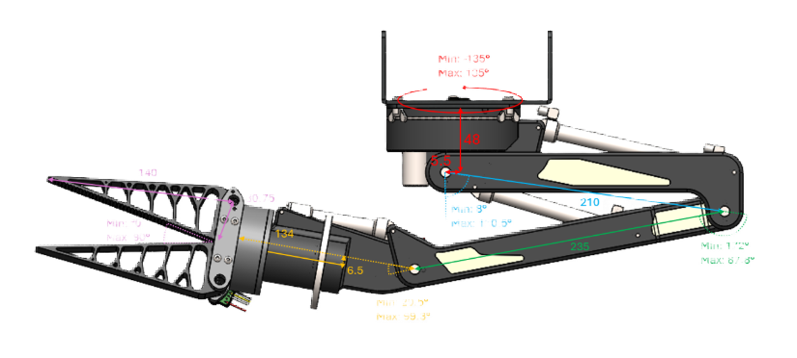

<!-- markdown-link-check-disable -->

  
  
  

 

# Robosub Arm

Dit project is uitgevoerd in samenwerking met [RoboSub](https://robosub.nl). Binnen de missie van Robosub staat het verkennen en beschermen van de onderwaterwereld centraal, waarbij de nadruk ligt op de ontwikkeling van autonome onderwaterrobots (AUVs) voor complexe onderzoekstaken en onderhoud. Een belangrijk onderdeel van de huidige competitie is de volgende operatie: de AUV moet volledig zelfstandig naar een onderwater valve navigeren, het handvat van deze valve grijpen en deze exact een kwartslag draaien. 

Wij hebben de opdracht gekregen om de arm module voor de robosub, die de actie moet uitvoeren, realistisch te modelleren in Gazebo zodat er in een digitale omgeving getest kan worden. 

## Rolverdeling

* Jente (Software engineer): PID-controller, onderzoek PID, gazebo en documentatie.
* Erin (Tech lead): Maken van de devcontainer. Robot arm, vision camera, yolo model, modelleren van gazebo sdf-fle. Onderzoek naar Opencv vs Yolo, documentatie package install en sdf uitleg.
* Adriaan (Software engineer): Base voor de arm, YOLO model onderzoek en training. Het maken van data voor training. Docker format gemaakt. Uitleg van yolo en bijbehorende keuzes gemaakt.
* Tim (Software engineer): Segmenten van de robotarm gebouwd, key drivers gefinetuned, onderzoek gedaan naar gazebo joints, deels inverse kinematics en afstand tussen valve en robotarm + tests gedaan voor inverse kinematics in combinatie met de robotarm (maar staan niet in de overdracht).
* Joni (Scrum master): Onderzoek naar beweging en joints in gazebo. Onderzoek naar Inverse en Forward kinematics. Opstellen en afwerken sprintverslagen. Uitwerken van inverse kinematica in code. Key-drivers.

 
 
 

# Wegwijzer
<ul>
  <li style="display: flex; justify-content: space-between; align-items: baseline; margin-bottom: 8px;">
    <strong><a href="Samenvatting.MD">Samenvatting</a></strong>
    De belangrijkste onderdelen in een oogopslag
  </li>

  <li style="display: flex; justify-content: space-between; align-items: baseline; margin-bottom: 4px; margin-top: 16px;">
    <strong><a href="\Systeemspecificaties_&_Eisen">Systeemspecificaties & Eisen</a></strong>
    De harde kaders en criteria van de opdrachtgever
  </li>
  <ul style="list-style-type: none; padding-left: 20px;">
    <li style="margin-bottom: 4px;"> <a href="Systeemspecificaties_&_Eisen/Key_Drivers.md">Key Drivers</a></li>
    <li style="margin-bottom: 4px;"> <a href="Systeemspecificaties_&_Eisen/Requirements.md">Requirements</a></li>
    <li style="margin-bottom: 4px;"> <a href="Systeemspecificaties_&_Eisen/Use_Cases.md">Use Cases</a></li>
  </ul>

  <li style="display: flex; justify-content: space-between; align-items: baseline; margin-bottom: 4px; margin-top: 16px;">
    <strong><a href="\Onderzoek">Onderzoek</a></strong>
    Theoretische achtergrond en analyse
  </li>
  <ul style="list-style-type: none; padding-left: 20px;">
    <li style="margin-bottom: 4px;"> <a href="Onderzoek/Gazebo_Basics.md">Gazebo Basics</a></li>
    <li style="margin-bottom: 4px;"> <a href="Onderzoek/PID.MD">PID</a></li>
    <li style="margin-bottom: 4px;"> <a href="Onderzoek/Vision.md">Vision met AI </a></li>
    <li style="margin-bottom: 4px;"> <a href="Onderzoek/Inverse_Kinematics.md">Inverse Kinematica </a></li>
  </ul>

  <li style="display: flex; justify-content: space-between; align-items: baseline; margin-bottom: 4px; margin-top: 16px;">
    <strong><a href="\Groepsproces">Groepsproces</a></strong>
    Projectvoortgang en documentatie
  </li>
  <ul style="list-style-type: none; padding-left: 20px;">
    <li style="margin-bottom: 4px;"> <a href="Groepsproces/Notities/">Notulen</a></li>
    <li style="margin-bottom: 4px;"> <a href="Groepsproces/Sprint_verslagen/">Sprint verslagen</a></li>
  </ul>
  <li style="display: flex; justify-content: space-between; align-items: baseline; margin-bottom: 4px; margin-top: 16px;">
    <strong><a href="/Documentatie/Doorgeef_Documentatie/Code/">Code</a></strong>
    Scripts van het project
  </li>
</ul>