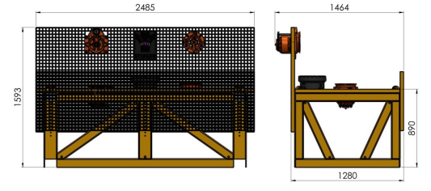
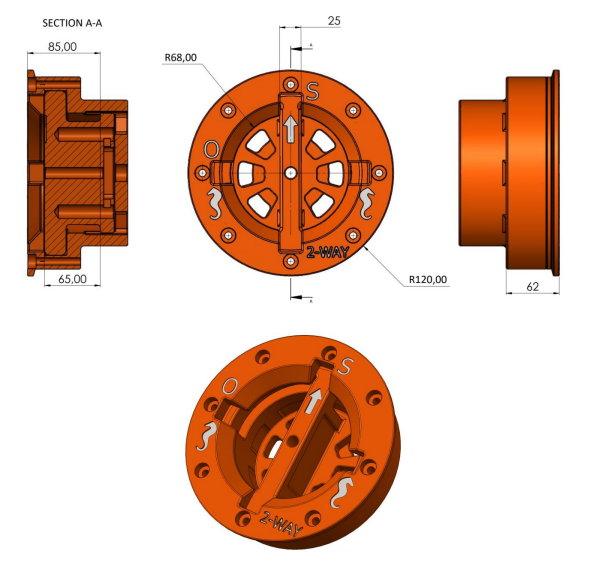

## Samenvatting Mission-booklet-2026 (RoboSub)
<small>Jorn Bransen</small>

## Relevante hoofdstukken in de mission booklet
- [4 - Visual Inspection (4.1 t/m 4.2.1)](#visual-inspection)
- [5 - Valve Intervention](#valve-intervention)

## Visual Inspection
Dit hoofdstuk is voornamelijk voor het visueel scannen van markers (niet relevant voor ons), maar geeft wel inzicht over de kleur van de structuur waarop de valves zijn geplaatst (zie voorbeeld 1). De **RGB waarde** voor de structuur is **[228, 158, 0]**. 

<small>Voorbeeld 1</small>

## Valve Intervention
Zoals in voorbeeld 1 te zien, zijn er 2 valves op de structuur. Er zitten echter ook 2 objecten met dezelfde kleur op die gemarkeert staan als "not in use". We kunnen dus niet alleen kleur gebruiken voor object recognition, maar moeten echt de vorm bekijken. De valve draait 90 graden naar links, en dit is ook hoe ver hij gedraait moeten worden om als open gezien te worden. Hoe ver de valve is open gedraait is niet bekend voor de competitie, hij kan tussen de open en shut position zitten, of open, of shut. De torque die nodig is voor het opendraaien van de valve staat gelijk aan de torque die nodig is om een deur hendel te openen. De valve moet of naar open, of naar shut gedraait worden. 

Er zit 1 valve op de muur van de structure, en de andere zit op de vloer. De **RGB waarde** voor de **valve** is **[226, 83, 3]**. De dimensies voor de valve zijn als volgt (zie ook voorbeeld 2):

- Outer radius: 120mm
- Inner radius: 68mm
- Valve bucket depth: 85mm
- Handle depth: 65mm
- Handle thickness: 25mm

