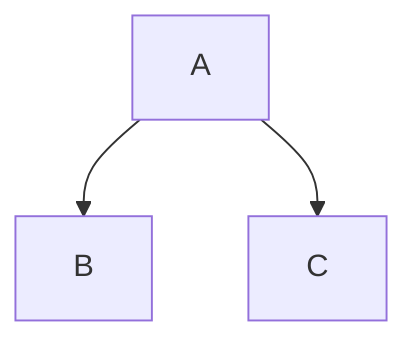

# TechnicalContract

#### naamgevingsconventies
C++: 
classes PascalCase
functies camalCase
  
python:  
alles snake_cas

#### Documentatie
Voor code gebruiken we binnen onze files doxygen documentatie, elk file begint met een korte brief daarnaast heeft ook elke functie en class een korte beschijving van wat ze doen.

#### ontwikkeldocumenten
De code die wij schrijven word gebaseerd op de bestaande ontwikkeldocumenten, als er veranderingen in de code worden gemaakt die niet staan gedocumenteerd in het corresponderende ontwikkeldocument dienen deze ontwikkeldocumenten worden aangepas.

Deze ontwikkeldocumenten schrijven we in Mermaid, dit doen we zodat veranderingen aan deze documenten direct worden vertoont in de afbeeldingen. 
Hieronder een kort voorbeeld van hoe Mermaid word gebruikt.

Diagram


Source
```
  graph TD;
    A-->B;
    A-->C;
```

#### file structure
voor onderdelen nog niet die nog niet deel zijn van het grote project bestand sub directory maken met een readme er in dus als volgt
```
module_dev/
--- Gripper/
----------- README.md
----------- Gripper.sdf
--- Underarm/
--- base/
```

#### Branches 
Voor elke sprint word een eigen branch aangemaakt dan in die sprints hebben we voor grote features ook weer subbranches denk bijvoorbeeld aan UAV vision.
De genen die begint aan zo een feature is verantwoordelijk voor het aanmaken van de branch

Voor pull request moeten er minimum 2 mensen naar de pull request kijken of die ok is. 

voorbeeld
```
main
--Sprint1
----UAV vision
```


