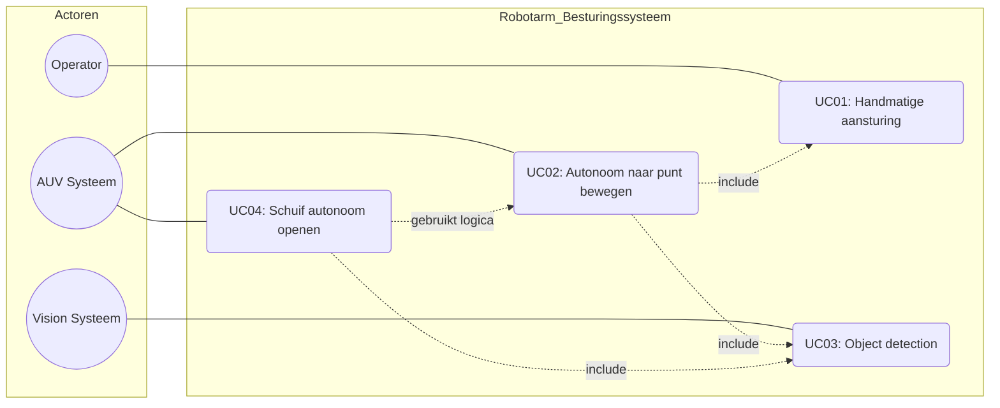
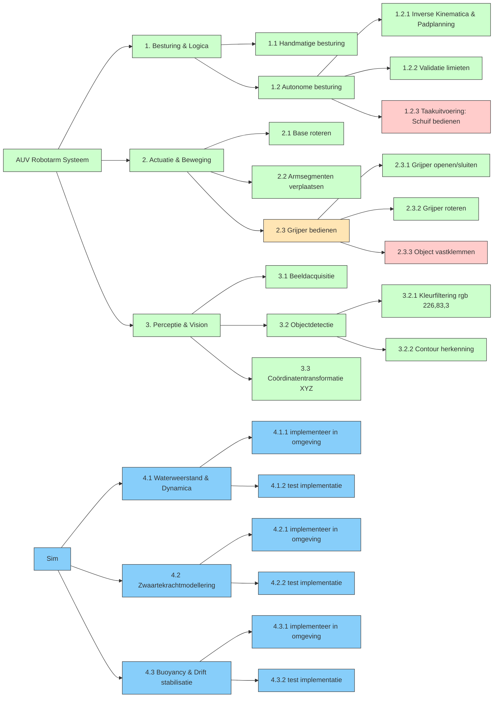
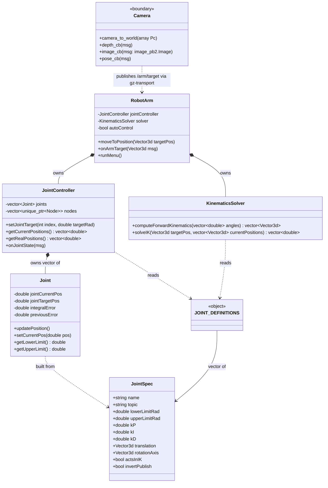

# Ontwikkeldocument Team Nautilus

<!-- TOC -->
* [Ontwikkeldocument Team Nautilus](#ontwikkeldocument-team-nautilus)
  * [Keydrivers](#keydrivers)
  * [Requirements](#requirements)
    * [Functional](#functional)
    * [Non Functional](#non-functional)
  * [Use cases](#use-cases)
    * [UC01 – Handmatige besturing](#uc01--handmatige-besturing)
    * [UC02 – Autonoom naar punt bewegen](#uc02--autonoom-naar-punt-bewegen)
    * [UC03 – Object detectie](#uc03--object-detectie)
    * [UC04 – Schuif autonoom openen](#uc04--schuif-autonoom-openen)
  * [Usecasediagram](#usecasediagram)
  * [Functionele Decompositie](#functionele-decompositie)
  * [Klassendiagram](#klassendiagram)
<!-- TOC -->

## Keydrivers

| Key driver                                                 | Beschrijving                                                                                                                                                                                                                                                                                |
| ---------------------------------------------------------- | ------------------------------------------------------------------------------------------------------------------------------------------------------------------------------------------------------------------------------------------------------------------------------------------- |
| KD01: Technische kennisvergaring binnen maritieme robotica | Het ontwikkelen van een simulatieomgeving die de fysieke realiteit van onderwaterrobotarm-besturing bijna getrouw nabootst, inclusief hydrodynamica, zwaartekracht en object-interactie. Dit vormt de basis voor betrouwbare autonome aansturing en overdraagbare kennis binnen het domein. |
| KD02: Inspectie en veiligheid                              | De AUV moet in staat zijn om zonder menselijke tussenkomst objecten te detecteren, te grijpen en te bedienen, zoals het openen van een schuif. Dit vereist een samenspel van vision, inverse kinematica en precieze motorbesturing.                                                         |
| KD03: Overdraagbaarheid en onderhoudbaarheid               | Het systeem moet door toekomstige studententeams verder ontwikkeld kunnen worden. Dit vereist gestructureerde documentatie, heldere interfaces en een reproduceerbare ontwikkelomgeving.                                                                                                    |

## Requirements

### Functional

| Naam                            | Beschrijving                                                                                             | Rationale                                                                                                                           | Prioriteit  | Key Driver |
| ------------------------------- | -------------------------------------------------------------------------------------------------------- | ----------------------------------------------------------------------------------------------------------------------------------- | ----------- | ---------- |
| F01 Draaiende base              | Base moet kunnen draaien.                                                                                | Voor een goed bereik van de arm moet die kunnen draaien.                                                                            | Must have   | KD01, KD02 |
| F02 Bewegende segmenten         | De 3 segmenten moeten omhoog en omlaag kunnen bewegen.                                                   | Voor een goed bereik van de arm moeten de segmenten kunnen bewegen.                                                                 | Must have   | KD01       |
| F03 Grijper open en dicht       | De grijper moet open en dicht kunnen gaan.                                                               | Om dingen zoals een handvat vast te kunnen pakken moet de grijper open en dicht kunnen.                                             | Must have   | KD02       |
| F04 Grijper draaien             | De grijper moet kunnen draaien.                                                                          | Om een schuif te kunnen openen moet de grijper kunnen draaien.                                                                      | Must have   | KD02       |
| F05 Balk pakken                 | De arm moet een balk kunnen pakken.                                                                      | Om het handvat van de schuif te kunnen vastpakken moet de grijper een balkvormig object kunnen vastpakken.                          | Must have   | KD02       |
| F06 Handmatige besturing        | Elk onderdeel van de arm moet handmatig bestuurd kunnen worden.                                          | Voor troubleshooting moeten de afzonderlijke onderdelen van de arm handmatig bestuurd kunnen worden.                                | Must have   | KD03       |
| F07 Autonome besturing          | De arm moet zelf op basis van gegeven coordinaten iets op die coordinaten aantikken of oppakken.         | De AUV moet autonoom zijn (AUTONOMOUS underwater vehicle), dus de arm zelf ook.                                                     | Should have | KD01, KD02 |
| F08 Object detection            | De AUV moet objecten kunnen herkennen en de positie van die objecten kunnen omzetten naar coordinaten.   | Om de AUV in staat te stellen autonoom objecten op te pakken, moet deze die objecten ook herkennen.                                 | Should have | KD01       |
| F09 Dynamica                    | De arm moet rekening houden met dynamica zoals water weerstand of druk.                                  | Om de beste representatie te bieden van de realiteit moet er ook rekening gehouden worden met de dynamica.                          | Could have  | KD01       |
| F10 Documentatie                | Alle componenten, use cases en interfaces moeten gedocumenteerd zijn conform een vastgestelde standaard. | Overdraagbaarheid en onderhoudbaarheid van het systeem vereisen goede documentatie.                                                 | Must have   | KD03       |
| F11 Zwaartekrachtmodellering    | De simulatie moet de impact van zwaartekracht op de gewrichten modelleren.                               | Nodig voor een realistische representatie van dynamisch gedrag van de arm.                                                          | Should have | KD01       |
| F012 (Semi)realistische omgeving | De omgeving moet een (versimpelde) representatie bieden van waterweerstand.                              | Om een goede representatieve simulatie van de realiteit te maken zijn bepaalde omgevingsfactoren (zoals waterweerstand) essentieel. | Could have   | KD01       |

### Non Functional

| Naam                           | Beschrijving                                                                                                                                                                                                                                                                                                                | Rationale                                                                  | Corresponding Functional Requirement |
| ------------------------------ | --------------------------------------------------------------------------------------------------------------------------------------------------------------------------------------------------------------------------------------------------------------------------------------------------------------------------- | -------------------------------------------------------------------------- | ------------------------------------ |
| NF01 Base rotatie              | Base moet van -45° tot 45° kunnen draaien.                                                                                                                                                                                                                                                                                  | Dit is de aangeleverde rijkwijdte.                                         | F02 Draaiende base                   |
| NF02 Beweging segment 1        | Het eerste segment moet van 0° naar 104.9° kunnen bewegen.                                                                                                                                                                                                                                                                  | Dit is de aangeleverde rijkwijdte.                                         | F03 Bewegende segmenten              |
| NF03 Beweging segment 2        | Het tweede segment moet van 0° naar 94,5° kunnen bewegen.                                                                                                                                                                                                                                                                   | Dit is de aangeleverde rijkwijdte.                                         | F03 Bewegende segmenten              |
| NF04 Beweging segment 3        | Het derde segment moet van -20° naar 100,4° kunnen bewegen.                                                                                                                                                                                                                                                                 | Dit is de aangeleverde rijkwijdte.                                         | F03 Bewegende segmenten              |
| NF05 Grijper opening           | De grijper moet van 0° (dicht) naar 90° (open) kunnen gaan.                                                                                                                                                                                                                                                                 | Dit is de aangeleverde rijkwijdte.                                         | F04 Grijper open en dicht            |
| NF06 Grijper rotatie           | De grijper moet 270° kunnen draaien.                                                                                                                                                                                                                                                                                        | Dit is de aangeleverde rijkwijdte.                                         | F05 Grijper draaien                  |
| NF07 Balk pakken               | De arm moet een balk van 25mm wijdte met 65mm diepte kunnen pakken.                                                                                                                                                                                                                                                         | Dit zijn de afmetingen van het handvat van de schuif.                      | F06 Balk pakken                      |
| NF08 Object detection          | De AUV moet de rgb(226,83,3)in water herkennen.                                                                                                                                                                                                                                                                             | De schuif is deze kleur.                                                   | F09 Object detection                 |
| NF09 Documentatiestandaard     | Documentatie moet voldoen aan het format zoals beschreven in het technisch contract (vastgesteld als referentie). En moet bevatten: Key Drivers, Requirements (functional en niet functional), Usecases, Usecase-diagram, Klassendiagram en per onderdeel een omschrijving van wat het doet | Consistentie en leesbaarheid voor overdracht.                              | F11                                  |
| NF10 Buoyancy                  | De submarine moet net als in het echt neutrally buoyant zijn. De verticale drift mag dus maximaal X cm/s zijn.                                                                                                                                                                                                              | Dit om de semi-realistische omgeving te waarborgen                         | F01                                  |
| NF11 Beweegsnelheid gewrichten | Elk gewricht moet binnen 10 seconden zijn doelpositie bereiken bij een normale verplaatsing.                                                                                                                                                                                                                                | Realistische en bruikbare armbewegingen vereisen minimale responssnelheid. | F02, F03, F04, F05                   |
| NF12 Positieprecisie           | De arm moet een doelpositie bereiken met een nauwkeurigheid van 2 cm.                                                                                                                                                                                                                                                       | Vereist voor betrouwbaar autonome bediening van de schuif.                 | F08                                  |

## Use cases

### UC01 – Handmatige besturing

| Veld            | Beschrijving                                                                                                                            |
| --------------- | --------------------------------------------------------------------------------------------------------------------------------------- |
| Actor           | Operator                                                                                                                                |
| Gerelateerd aan | F06, F01, F02, F03, F04                                                                                                                 |
| Beschrijving    | De operator stuurt individuele gewrichten handmatig aan via een CLI-interface met Gazebo topics om de arm te testen of te positioneren. |
| Precondities    | Simulatie is actief en de arm bevindt zich in een geldige beginstaat.                                                                   |
| Postcondities   | De arm staat in de door de operator gekozen positie.                                                                                    |

| Stap | Actie                                                              |
| ---- | ------------------------------------------------------------------ |
| 1    | Operator opent de besturingsinterface (programma).                 |
| 2    | Operator selecteert een gewricht (bijv. base, segment 1, grijper). |
| 3    | Operator geeft een doelhoek op binnen de geldige rijkwijdte.       |
| 4    | De simulatie beweegt het gewricht naar de opgegeven hoek.          |
| 5    | Operator herhaalt dit voor andere gewrichten indien gewenst.       |

---

### UC02 – Autonoom naar punt bewegen

| Veld            | Beschrijving                                                                                                                                                           |
| --------------- | ---------------------------------------------------------------------------------------------------------------------------------------------------------------------- |
| Actor           | AUV (autonoom systeem)                                                                                                                                                 |
| Gerelateerd aan | F07, F05, F03, F04, NF07                                                                                                                                               |
| Beschrijving    | De arm navigeert autonoom naar een specifiek XYZ-coördinaat (bijv. de locatie van een schuif of handvat) berekend door het vision systeem of gegeven door de operator. |
| Precondities    | Coördinaten van het handvat zijn bekend (output van UC03).                                                                                                             |
| Postcondities   | De grijper bevindt zich binnen een straal van X mm (NF12) van het doelcoördinaat.                                                                                      |

| Stap | Actie                                                                                            |
| ---- | ------------------------------------------------------------------------------------------------ |
| 1    | Het systeem ontvangt de doelcoördinaten van een positie.                                         |
| 2    | De arm berekent de benodigde gewrichtshoeken via inverse kinematica.                             |
| 3    | Het systeem valideert of deze hoeken binnen de fysieke limieten liggen (zie NF01 t/m NF04).      |
| 4    | De PID-controllers sturen de motoren aan om de arm vloeiend naar de berekende hoeken te bewegen. |
| 5    | Het systeem geeft een signaal "Doel bereikt" zodra de foutmarge klein genoeg is.                 |

---

### UC03 – Object detectie

| Veld            | Beschrijving                                                                                       |
| --------------- | -------------------------------------------------------------------------------------------------- |
| Actor           | AUV (vision systeem)                                                                               |
| Gerelateerd aan | F08, NF08                                                                                          |
| Beschrijving    | De AUV scant de omgeving op objecten met kleur rgb(226,83,3) en berekent de positie van de schuif. |
| Precondities    | De camera is actief en de schuif bevindt zich binnen het gezichtsveld.                             |
| Postcondities   | Het systeem beschikt over de coördinaten van de schuif als input voor UC02.                        |

| Stap | Actie                                                                    |
| ---- | ------------------------------------------------------------------------ |
| 1    | De camera maakt beelden van de omgeving.                                 |
| 2    | Het vision systeem filtert pixels op de doelkleur (rgb(226,83,3)).       |
| 3    | Het systeem identificeert de contour en positie van het herkende object. |
| 4    | De positie wordt omgezet naar 3D-coördinaten relatief aan de AUV.        |
| 5    | De coördinaten worden doorgegeven aan het besturingssysteem.             |

---

### UC04 – Schuif autonoom openen

| Veld            | Beschrijving                                                                                        |
| --------------- | --------------------------------------------------------------------------------------------------- |
| Actor           | AUV (autonoom systeem)                                                                              |
| Gerelateerd aan | F04, F05, F07, NF06, NF07                                                                           |
| Beschrijving    | De AUV pakt het handvat van de schuif vast en draait het om de schuif te openen.                    |
| Precondities    | UC02 is succesvol afgerond; coördinaten van de schuif zijn bekend en de arm is hiernaar toe bewogen |
| Postcondities   | De schuif is gedraaid en de arm is teruggekeerd naar rustpositie.                                   |

| Stap | Actie                                                                         |
| ---- | ----------------------------------------------------------------------------- |
| 1    | De arm navigeert naar de voorbereidingspositie boven het handvat (zie UC02).. |
| 2    | De grijper opent zich.                                                        |
| 3    | De arm positioneert de grijper rond het handvat.                              |
| 4    | De grijper sluit zich om het handvat.                                         |
| 5    | De grijper draait 90° om de schuif te bedienen.                               |
| 6    | De arm trekt terug naar de rustpositie.                                       |

## Usecasediagram

## Functionele Decompositie

## Klassendiagram

