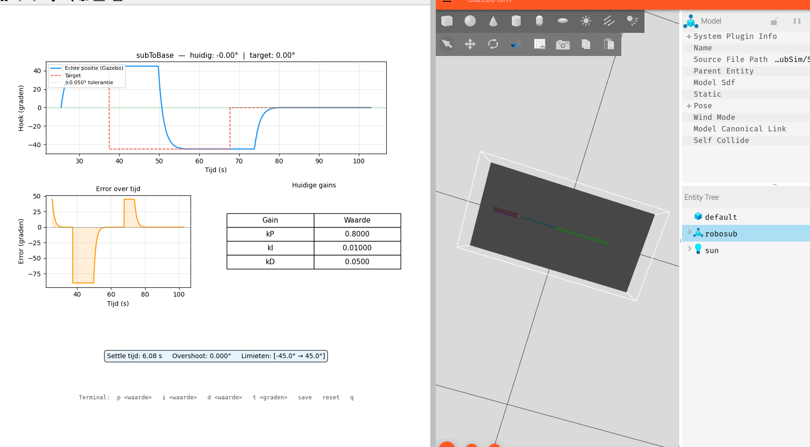
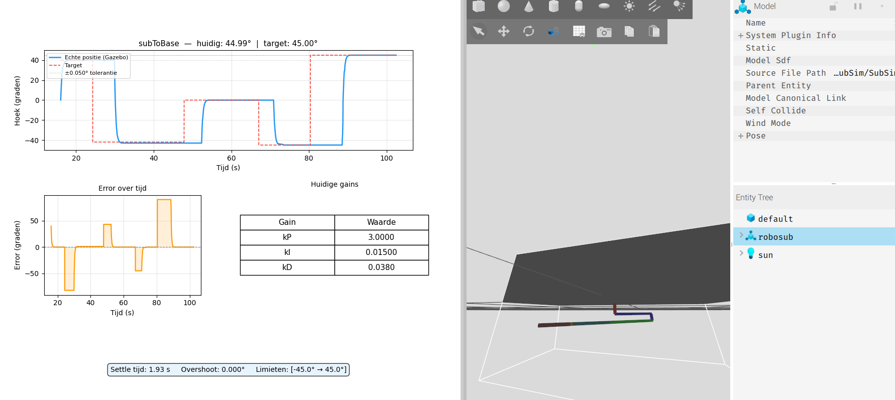
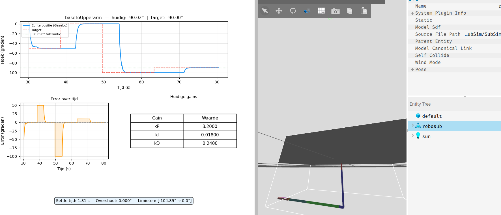
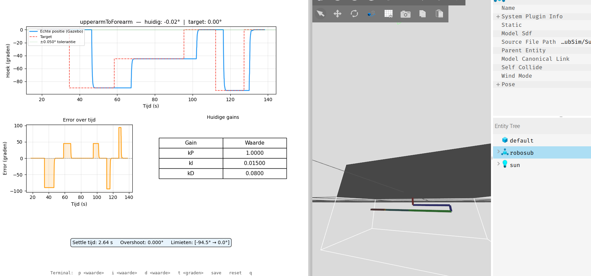
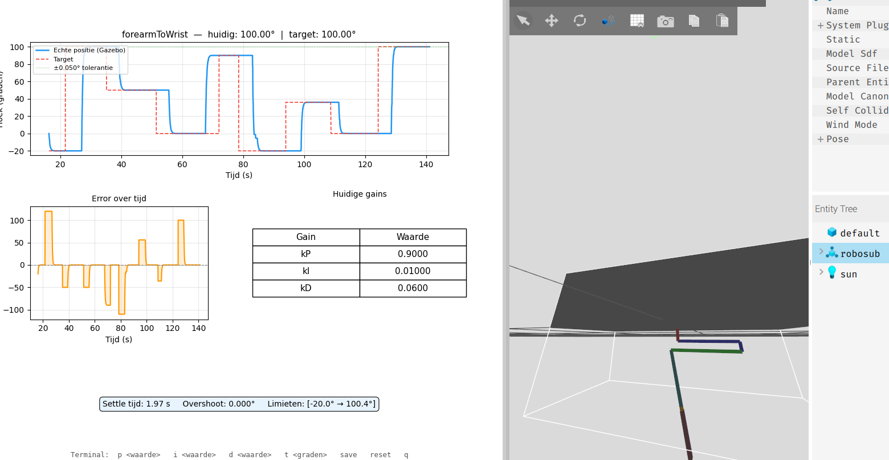
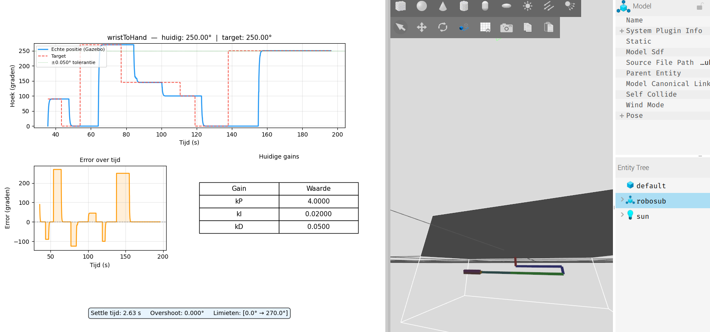
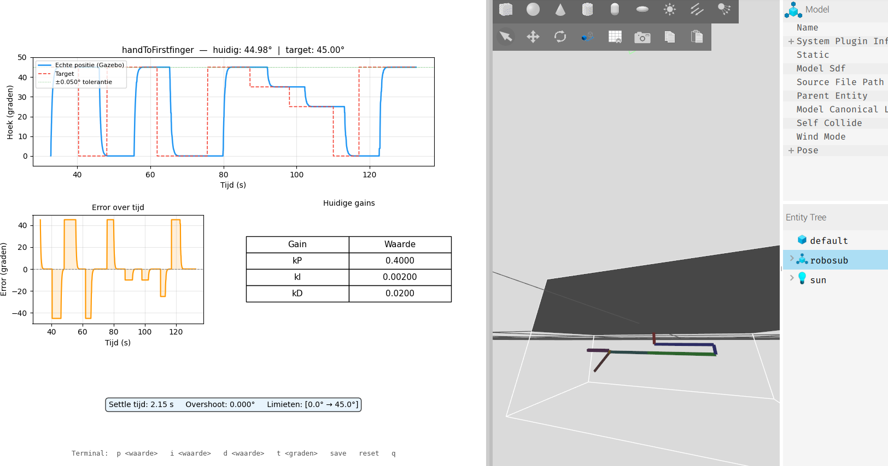

# PID Tuning Rapport — RoboSub Arm

Dit document bevat de resultaten en metingen van het handmatige PID-tuningproces voor de verschillende joints van de RoboSub robotarm.

## Testmethodologie
Alle testen zijn handmatig uitgevoerd. Voor het bepalen van de gemiddelde settle-tijd is per joint de volgende testset gehanteerd:
* **5 testen** met een afwijking van 10 graden
* **5 testen** met een afwijking van 45 graden
* **5 testen** met de maximale grensafwijking (max graden verschil)

> [!WARNING]
> **BELANGRIJKE NOTITIE BIJ DE AFBEELDINGEN:**
> De PID-gain waardes in de onderstaande afbeeldingen kloppen **niet** met de werkelijke testgegevens. Deze screenshots zijn puur bedoeld als visueel voorbeeld uit de vroege ontwikkelfase waarin geëxperimenteerd werd met extreme instellingen.

---

## Tuning Voorbeelden & Extreme Waarden

### Voorbeeld: Instabiel gedrag (Enorm hoge kP)
Gedrag van de arm bij een veel te agressieve Proportionele actie (overshoot en oscillatie).

| Parameter | Actuele Waarde |
| :--- | :--- |
| **kP** | 15.0 |
| **kI** | 0.05 |
| **kD** | 0.15 |

---

## Tuning Resultaten per Joint

### Joint 0: subToBase (Beginstatus vs Eindstatus)

#### Situatie aan het begin
* **Gemiddelde settle-tijd:** ~6.32 seconden

| Parameter | Waarde |
| :--- | :--- |
| **kP** | 0.8 |
| **kI** | 0.01 |
| **kD** | 0.05 |

####  Situatie na tuning (Eindresultaat)
* **Gemiddelde settle-tijd:** ~1.92 seconden

| Parameter | Waarde |
| :--- | :--- |
| **kP** | 3.0 |
| **kI** | 0.015 |
| **kD** | 0.038 |

---

### Joint 1: baseToUpperarm
* **Gemiddelde settle-tijd:** ~1.89 seconden

| Parameter | Waarde |
| :--- | :--- |
| **kP** | 2.95 |
| **kI** | 0.0146 |
| **kD** | 0.037 |

---

### Joint 2: upperarmToForearm
* **Gemiddelde settle-tijd:** ~2.24 seconden

| Parameter | Waarde |
| :--- | :--- |
| **kP** | 3.5 |
| **kI** | 0.015 |
| **kD** | 0.034 |

---

### Joint 3: forearmToWrist
* **Gemiddelde settle-tijd:** ~1.97 seconden

| Parameter | Waarde |
| :--- | :--- |
| **kP** | 3.00 |
| **kI** | 0.013 |
| **kD** | 0.030 |

---

### Joint 4: wristToHand
* **Gemiddelde settle-tijd:** ~2.14 seconden

| Parameter | Waarde |
| :--- | :--- |
| **kP** | 2.55 |
| **kI** | 0.0127 |
| **kD** | 0.028 |

---

### Joint 5: handToFirstfinger
* **Gemiddelde settle-tijd:** ~1.92 seconden

| Parameter | Waarde |
| :--- | :--- |
| **kP** | 2.5 |
| **kI** | 0.0125 |
| **kD** | 0.027 |

---

### Joint 6: handToSecondfinger
* **Opmerking:** Deze joint maakt gebruik van exact dezelfde PID-gains en karakteristieken als **Joint 5**, aangezien de fysieke constructie identiek maar gespiegeld is.