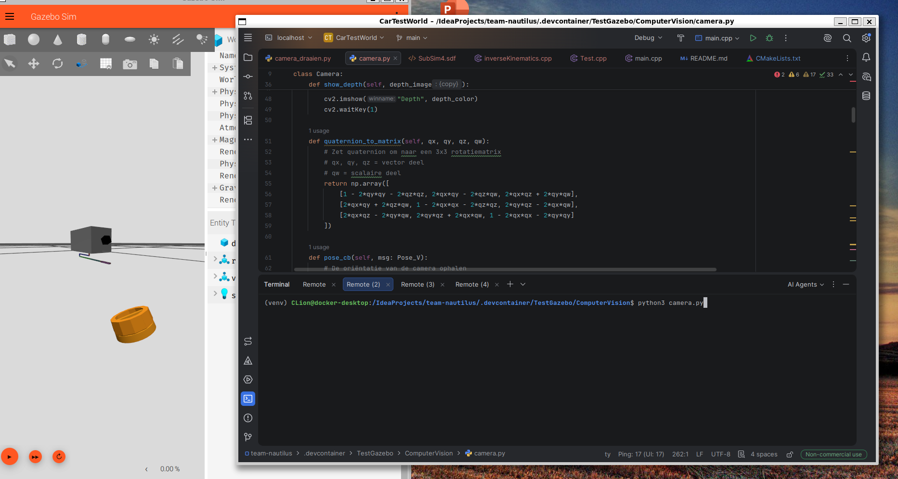
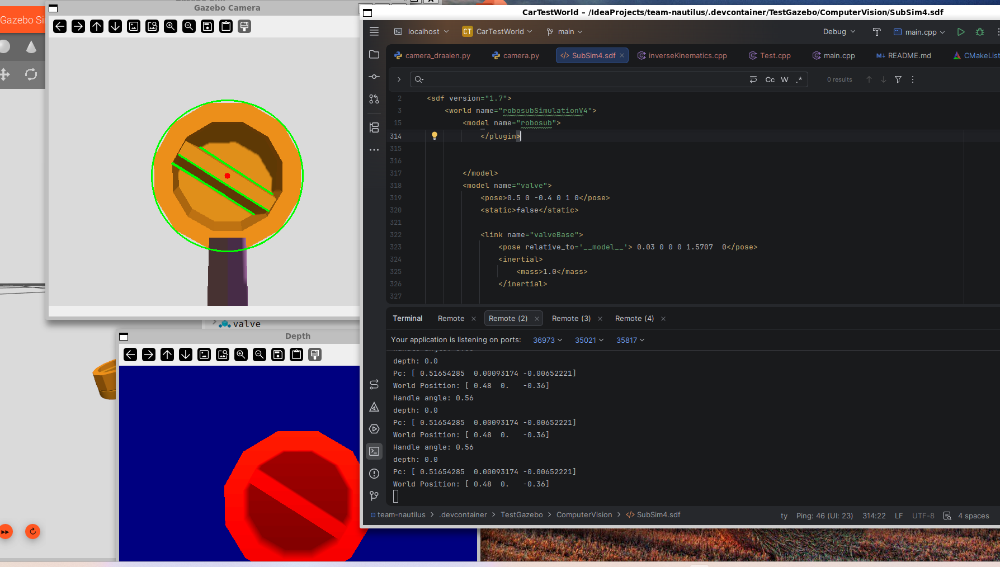

# Computer Vision

## Research

### Vision

For the computer vision component, research was conducted on OpenCV. This included investigating color detection and contour detection. These techniques are used for detecting the valve.

### Camera

For the camera, research was conducted on how a camera sensor can be implemented in Gazebo.

### Distance Calculation

Online information shows that there are three methods for calculating the distance to an object using a camera.

They are: Monocular Camera, Stereo Vision, and Depth Camera.

**Monocular Camera**: With a known object size, the distance can be calculated.
The formula for this is: distance = (actual size × focal length) / size in the image

**Stereo Vision**: With a stereo camera, the distance can be calculated based on the disparity between the two images.
The formula is: distance = (focal length × baseline) / disparity

**Depth Camera**: Each pixel = distance value (in meters).
It works well in simulation.

### From Distance to Coordinates

The position of the object is calculated using a pinhole camera model.

The pixel coordinates and the distance to the object are used to reconstruct a 3D point in the camera frame.

Subsequently, a coordinate transformation is performed using the rotation matrix and translation vector of the camera to obtain the position in the world frame.

## Justification of Choices

OpenCV was chosen for computer vision because it is taught at school and fits well with our project.

For distance calculation, a depth camera was chosen because it is the simplest solution. Therefore, we wanted to try this method first. The solution works well, and the client also approves of this solution.

## Implementation

### Computer Vision

OpenCV was used for object detection. The RGB images from the camera are first converted to the HSV color space. A color filter is then applied to detect orange objects. Based on the resulting masks, contours are detected.

The contours are analyzed to determine the shape of the object. When a contour contains a sufficient number of vertices, it is classified as a circle. A minimum enclosing circle is then calculated. The center point of this circle is used as the position of the valve in the image.

To determine the handle angle the image is cropped to only contain the valve, the contrast is increased, a canny edge filter is applied and the Hough transform is used to determine lines. Subsequently the distance of these lines from the centre of the valve is calculated and if they're found to be sufficiently close to the centre they're considered part of the handle. The angle is then calculated based on the average angle of all the lines belonging to the handle.

### Distance Determination

A depth camera was chosen for determining the distance. This method is easy to implement and provides direct distance information.

A small region around the center point of the valve is selected in the depth image. The median depth value of this region is used as the distance to the object. Using the median reduces measurement errors and noise.

### Position Calculation in the Camera Frame

The position of the object is calculated using a pinhole camera model.

First, the pixel coordinates of the center point of the valve are normalized using the camera settings, such as the image resolution and the horizontal field of view (FOV). The normalized image coordinates are then combined with the measured distance to obtain a 3D position in the camera frame.

### Transformation to World Coordinates

The position of the valve in the camera frame is then converted to world coordinates.

The orientation of the camera is retrieved from Gazebo in the form of a quaternion. This quaternion is converted into a rotation matrix. Together with the position of the camera, this forms the transformation from the camera frame to the world frame.

Using this rotation matrix and translation vector, the position of the object is converted into world coordinates.

### Communication

The calculated coordinates and the handle angle are published via Gazebo Transport topics. This allows other parts of the system to use this information for navigation and task execution.

The following data are published:

- `gz::math::Vector3d` containing XYZ coordinates
- `gz::math::Double` containing handle angle

This enables the RoboSub control system to locate the valve and correctly approach the handle.

## How to Use

1. Run the robot arm SDF file, for example: `gz sim SubSim4.sdf`

2. Run the vision SDF file, for example: `python3 camera.py`
   

3. Result: The coordinates (x, y, z) of the valve and the angle of the handle (in radians where 0 is horizontal (open), 1.57 is vertical (closed)) are published via topics and displayed in the command line.
   

## Deliverables

Within this project, the following components were delivered:

### Software

- A working computer vision system based on OpenCV for detecting the valve.
- An algorithm for determining the position of the valve using a depth camera.
- An implementation of the pinhole camera model for converting image coordinates into 3D coordinates.
- A function for transforming camera coordinates into world coordinates using a rotation matrix and translation vector.
- A communication interface with Gazebo Transport for publishing X, Y, Z coordinates and the handle angle.

### Simulation Environment

- An RGBD camera integrated into the robot model.
- A valve object with a detectable rotatable handle in the simulation.

### System Output

- Real-time detection of the valve in the camera image.
- Real-time calculation of the distance to the valve.
- Real-time calculation of the angle of the valve handle.
- Calculated 3D position of the valve in world coordinates.

### Documentation

- A technical explanation of the system (implementation description).
- A description of the methods used for image processing and coordinate transformation.
- An explanation of the algorithms used, such as contour detection and the Hough transform.

## Sources

Hu-Ti-Dev. (n.d.). TI-S4/hardware_simulatie/gazebo/5_Using_thrusters_and_camera.md at main · HU-TI-DEV/TI-S4. GitHub. https://github.com/HU-TI-DEV/TI-S4/blob/main/hardware_simulatie/gazebo/5_Using_thrusters_and_camera.md

Osrf. (n.d.). Gazebo: Tutorial: Create a Video with a Camera. https://classic.gazebosim.org/tutorials?tut=camera_save

Osrf. (n.d.-b). Gazebo: Tutorial: ROS Depth Camera Integration. https://classic.gazebosim.org/tutorials?tut=ros_depth_camera

Google Search. (n.d.). https://www.google.com/search?sca_esv=8c5990d0ee4e3edf&udm=7&sxsrf=ANbL-n4yXb6XEyx7eQS2IG6zB946j96e8g:1781394171905&q=gazebo+depth+camera+python&sa=X&ved=2ahUKEwi_2ci2soWVAxUS8bsIHVmKDr8Q8ccDKAJ6BAgZEAQ&biw=771&bih=730&dpr=1.25#fpstate=ive&vld=cid:e61a245a,vid:tzN0QT1id0M,st:0

1.2. The Pinhole Camera Matrix — Image Processing and Computer Vision 2.0 documentation. (n.d.). https://staff.fnwi.uva.nl/r.vandenboomgaard/IPCV20162017/LectureNotes/CV/PinholeCamera/PinholeCamera.html

Course notes 1: Camera models. (n.d.). https://3d.bk.tudelft.nl/courses/geo1016/handouts/01-camera_models.pdf

mpr. (2025, March 20). Computer Vision: the Camera Matrix [Video]. YouTube. https://www.youtube.com/watch?v=Hz8kz5aeQ44
