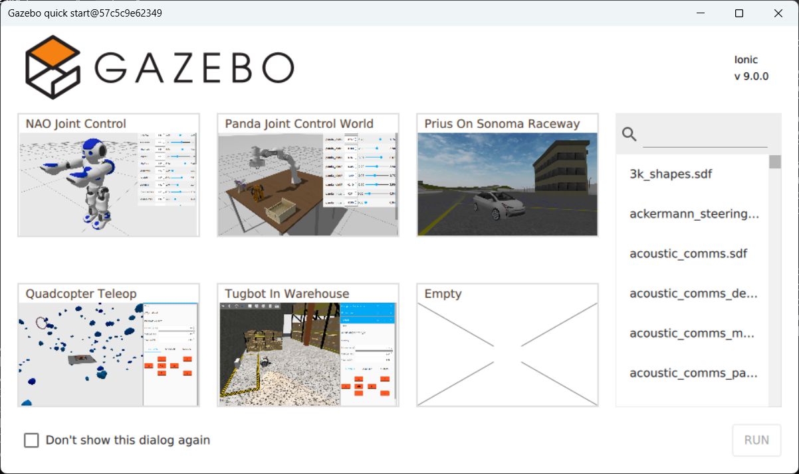
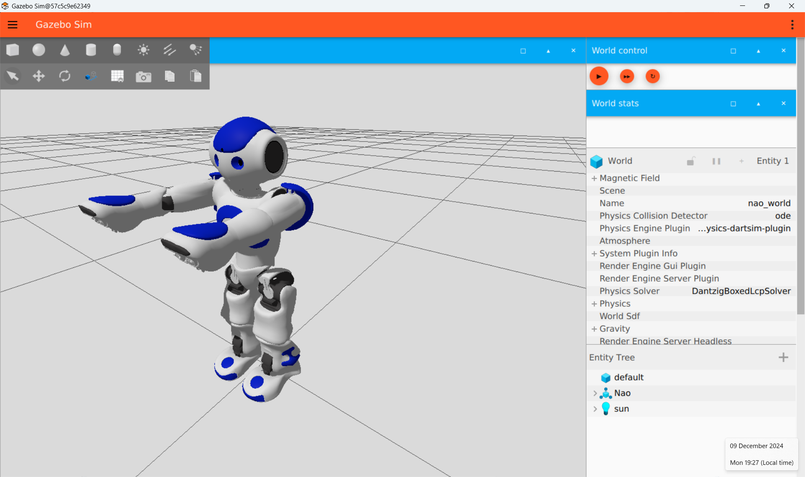

# 1. Installing Gazebo
Gazebo is a modelling/simulation framework. In this guide we will learn how to install it. 

Below the following environments are used: 
1 The prompt of the power shell environment 
2 The prompt of the docker container 

## Installing gazebo in a docker container
Allthough you can install Gazebo on native windows that specific version is broken, it malfunctions. We will install it in a docker container on ubuntu. 

### Install Docker Desktop on Windows:
*Source: https://www.docker.com/products/docker-desktop/ *
First, you need to install Docker Desktop for Windows. You can download it from Docker's official site.
Follow the installation steps to set it up.
Docker Desktop provides a LinuxKit-based virtual machine (VM) that runs Linux inside Windows. 

Make sure docker desktop is running. 
Open the windows powershell prompt and type the following1:

~~~
docker pull ubuntu
docker run -it ubuntu
~~~
We are now inside the container. First we will install all the necessary software tools2:
~~~
apt-get update
apt-get install -y curl
apt-get install -y sudo
apt-get install -y wget
~~~
Please note, on my setup I could paste one sentence at a time. I would copy a sentence and with rightclick I could paste it in the docker container.

### Install Gazebo inside the container:
*Source: https://gazebosim.org/docs/latest/install_ubuntu/ *
To install type the following2:
~~~
sudo apt-get update
sudo apt-get install lsb-release gnupg

sudo curl https://packages.osrfoundation.org/gazebo.gpg --output /usr/share/keyrings/pkgs-osrf-archive-keyring.gpg

echo "deb [arch=$(dpkg --print-architecture) signed-by=/usr/share/keyrings/pkgs-osrf-archive-keyring.gpg] http://packages.osrfoundation.org/gazebo/ubuntu-stable $(lsb_release -cs) main" | sudo tee /etc/apt/sources.list.d/gazebo-stable.list > /dev/null

sudo apt-get update
sudo apt-get install gz-ionic
~~~~
We will now exit the container2:
~~~
exit
~~~
and save it under a different name. First we need to  find the id1:
~~~
docker ps -a
~~~
You need to find the id of the container you just exited (so the last one). 
Copy the id & paste it in the below command1:
~~~
docker commit <container_id> gazebo
~~~
This may take some time. Patience is virtue.

### Installing WSL & X server
*Source: https://learn.microsoft.com/en-us/windows/wsl/install & https://vcxsrv.com/*

We will also have to install WSL1:
~~~
wsl --install
wsl --set-default-version 2
~~~
Configure Docker to use WSL 2:

Open Docker Desktop and go to Settings.
Under the General tab, ensure Use the WSL 2 based engine is checked.
Go to Resources > WSL Integration. Here, you’ll see a list of installed WSL distros.
Enable the WSL 2 integration for your preferred distros (like Ubuntu). This allows Docker to use those distros as Docker hosts.

We also have to install a X server (to enable a graphical user interface in Ubuntu). Go to https://vcxsrv.com/ and install the server on your windows computer. 

Run the X server (via the start menu of windows).

Set the environment display variable1:
~~~
$env:DISPLAY="host.docker.internal:0"
~~~

### First time running

Run our previously commited docker container1:
~~~
docker run -it -e DISPLAY=host.docker.internal:0 -v /tmp/.X11-unix:/tmp/.X11-unix gazebo
~~~

We can test it by running2:
~~~
gz sim
~~~
We should see:

Select the robot and press run. You should see the robot in a new window (some errors/warnings could be present in the container window):

If you want to take a break with this manual this would be a nice time to do so. You've committed the container so everything is nicely saved! 

### Running after a reboot or exiting the powershell:

- start dockers for desktop in your windows environment.
- run vcxsrv in your windows environment.
- run the powershell

In the powershell type1:
~~~ 
docker run -it -e DISPLAY=host.docker.internal:0 -v /tmp/.X11-unix:/tmp/.X11-unix gazebo
~~~

Type2:
~~~
gz sim
~~~
