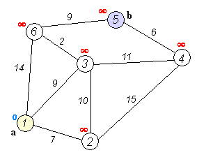

<!DOCTYPE html>
<html lang="nl">
<head>
  <meta charset="UTF-8">
  <title>Frame per Frame Controle</title>
  
</head>
<body>
  <h1>Dijkstra Frame-by-Frame Viewer</h1>
  
Gebruik de linker- en rechterpijl om door de frames te navigeren.

  
  <!-- Afbeelding waarin de frames getoond worden -->
  

  
</body>
</html>
