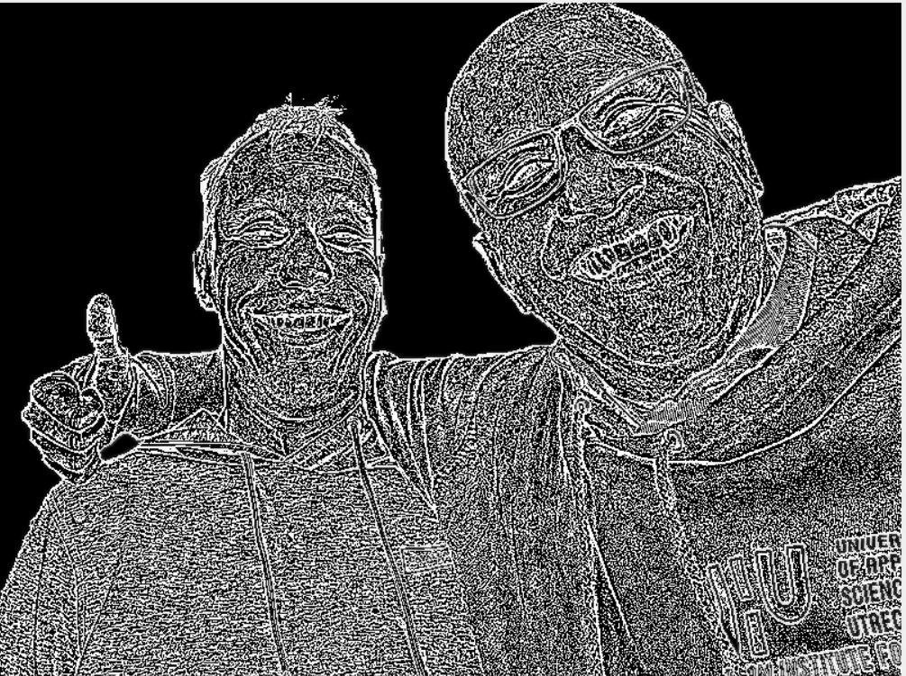
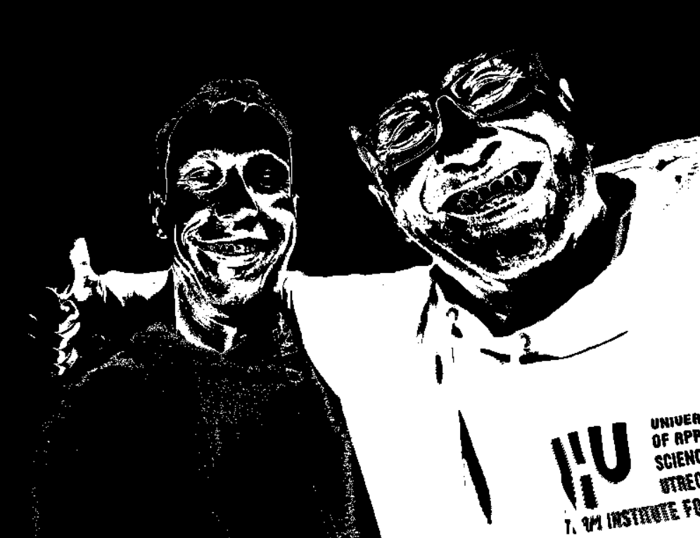

# 1. OpenCV  <!-- omit in toc -->

- [Introduction](#introduction)
- [Installing OpenCV in a Docker container](#installing-opencv-in-a-docker-container)
- [Sobel filter](#sobel-filter)
- [Sharpening filter](#sharpening-filter)
- [Gaussian blur](#gaussian-blur)
- [Color filtering](#color-filtering)
- [Color spaces](#color-spaces)
- [Template matching](#template-matching)
- [Hough lines](#hough-lines)
- [Final assignment](#final-assignment)
- [Extra material](#extra-material)


## Introduction
OpenCV (Open Source Computer Vision Library) is a library of programming functions mainly for real-time computer vision. It focusses on the classical vision methods.

**Machine Learning (AI)**  
 OpenCV does supports machine learning  algorithms, but only the classical ones (Support Vector Machines, K-Nearest Neighbors, Random Forest, etc.). These are useful for tasks like classification, regression, and clustering. 
OpenCV however does **not** include **deep** learning frameworks like TensorFlow or PyTorch.
The present state of the art approach for vision applications (CNN) is better implemented in those modern frameworks.

Below the following environments are used:<br>
<sup>1</sup> The prompt of the cmd<br>
<sup>2</sup> The prompt of the Docker container<br>

## OpenCV
OpenCV is already installed in our image so we can get straight down to business.  
We will first copy the [example1.png](./files/example1.png) file to our container. You could use the following command for it<sup>1</sup>:
```
docker cp <source> <container_id>:<destination>
```
Please note: you run this command in the prompt of the cmd.   
If you have already mounted a hd in your container (or made a coupling in vs code) you could do this probably much easier!

In my case I have put example1.png in the same folder as my gz_transport example<sup>1</sup>:  
```
docker cp example1.png af7ac3bb3d5d:/workspace/gz_transport_tutorial/
```


Go to the folder<sup>2</sup>
```
cd gz_transport_tutorial
```

Use your favorite editor to make an `example1.py` and paste the following:
```python
import cv2

# Read the image
image = cv2.imread("example1.png")

# Convert to grayscale
gray = cv2.cvtColor(image, cv2.COLOR_BGR2GRAY)

cv2.imshow("Processed Image", gray)
cv2.waitKey(0)  # Wait for a key press
cv2.destroyAllWindows()  # Close the window
```

1) Run the example & enjoy:
```
python3 example1.py
```

## Sobel filter
The following code implements a sobel filter:

```python
import cv2
import numpy as np

# Read the image
image = cv2.imread("example1.png")

# Convert to grayscale
gray = cv2.cvtColor(image, cv2.COLOR_BGR2GRAY)
sobel_kernel_x = np.array([[-1, 0, 1],
                            [-2, 0, 2],
                            [-1, 0, 1]])


sobel_x = cv2.filter2D(gray, -1, sobel_kernel_x) 
cv2.imshow("Processed Image", sobel_x)
cv2.waitKey(0)  # Wait for a key press
cv2.destroyAllWindows()  # Close the window
```

2) Upload a picture of your choice, but make sure it is clear it is from YOU (if you do not want to be in the picture make a picture of a piece of paper with your student #).  

3) Implement a sobel filter in the y-direction on your picture.  
**Save the resulting image (you need to upload it to canvas), you can use a screenshot...**.

## Sharpening filter
4) Implement a 3x3 sharpening filter (see https://setosa.io/ev/image-kernels/).  
**Save the resulting image (you need to upload it to canvas)**.


## Gaussian blur

5) Watch the following video [convolution filters](https://www.youtube.com/watch?v=W_p2XQSB9XI)
6) use cv2.getGaussianKernel() to implement a **5 x 5** gaussian blur.   
**Save the resulting image (you need to upload it to canvas)**

substract the previous result from the original image using something like: 
```
result_image=gray-gaussian_blur_image
```

Result should be simular to: 
    

7) Apply it to your image.  
**Save the resulting image (you need to upload it to canvas)**

## Color filtering

8) Try the following code:
```python
import cv2
import numpy as np

# Read the image
img = cv2.imread("example1.png")
img2=cv2.inRange(img, np.array([0, 0, 100]), np.array([100, 100, 255]))
cv2.imshow("Original Image", img)
cv2.waitKey(0) # Wait for a key press
cv2.imshow("Processed Image", img2)
cv2.waitKey(0)  # Wait for a key press
cv2.destroyAllWindows()  # Close the window
```
The result:


9) Apply a color filter on your image.  
**Save the resulting image (you need to upload it to canvas)**.

## Color spaces

10) Watch the following video: [kleurruimtes & filtering](https://www.youtube.com/watch?v=v3x9IHCdM0Y)  
The code: [kleurruimtes.py](./files/kleurruimtes.py)

## Template matching
11) Watch the following video: [Template matching](https://www.youtube.com/watch?v=kyz_5xZmepA)  
The [code](./files/templatematching.py)

## Hough lines
12) Upload [example6.png](./files/example6.png) to your directory and run the following code:

```python
import cv2
import numpy as np

# Load image in grayscale
image = cv2.imread('example6.png', cv2.IMREAD_GRAYSCALE)

# THE FOLOWING LINE SHOULD BE REPLACED BY SOMETHING INTELLIGENT! Maybe filtering? Maybe edge detect? Maybe both? 
image=image

# Hough Line Transform
lines = cv2.HoughLinesP(image, 1, np.pi/180, threshold=100, minLineLength=50, maxLineGap=10)

# Convert grayscale to BGR for colored lines
output = cv2.cvtColor(image, cv2.COLOR_GRAY2BGR)

# Draw lines
if lines is not None:
    for line in lines:
        x1, y1, x2, y2 = line[0]
        cv2.line(output, (x1, y1), (x2, y2), (0, 255, 0), 2)


# Show result
cv2.imshow('Hough Lines', output)
cv2.waitKey(0)
cv2.destroyAllWindows()
```

As you can see in the code the whole preprocessing is missing. Add it, and see if you get a better result!   
**Save the resulting image (you need to upload it to canvas)**.

## Final assignment

13) Experiment with image detection. Inspiration see : [https://pyimagesearch.com/2016/02/08/opencv-shape-detection/](https://pyimagesearch.com/2016/02/08/opencv-shape-detection/) See if you also can implement another OpenCV algorithm, one we have not used before (like hough circles or histogram).    
**Save the resulting images (you need to upload them to canvas)**.    
**Save the python code to canvas**.  

## Extra material

For the aficionados (liefhebbers) I've made the following video's:
- [Star recognition](https://www.youtube.com/watch?v=Ez7qANwAAQw), the [code](./files/starrecognition.py)
